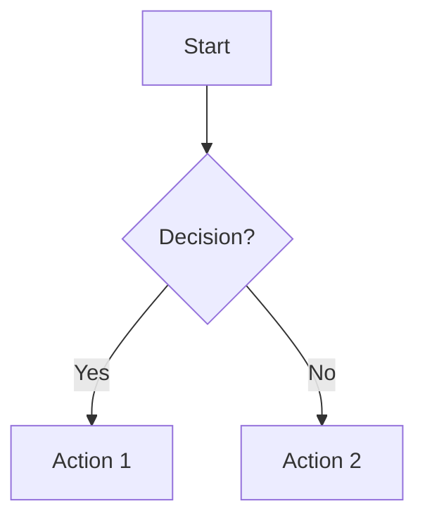
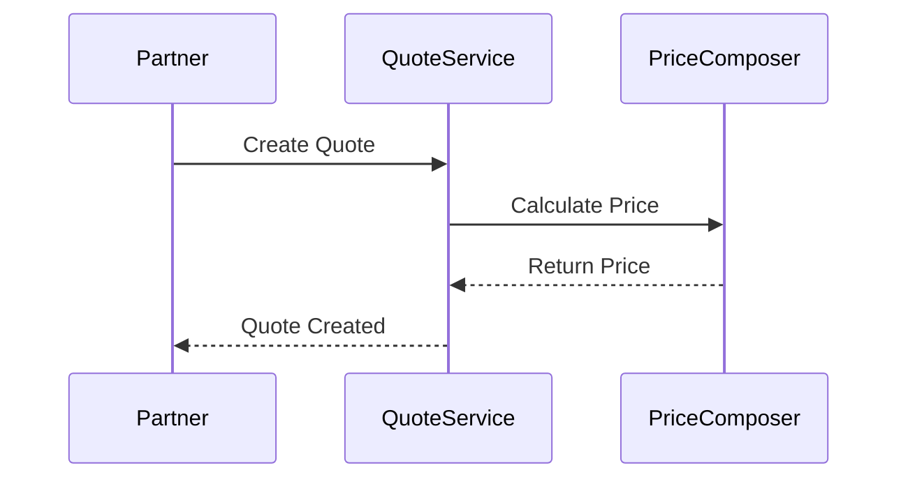
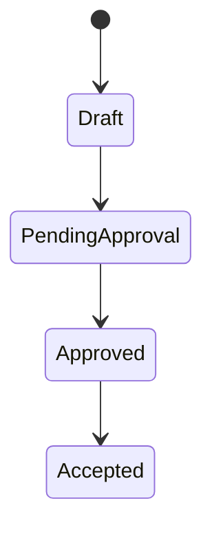
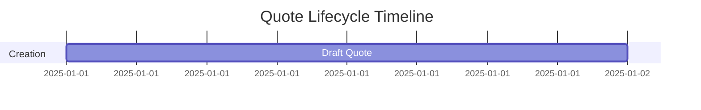

# Design Documentation Standards

When working on design or other documentation use the following guidelines to achieve a high quality result.

## Documentation Philosophy

**Write engaging, narrative-driven documentation that separates business/domain knowledge from technical implementation details.** Documentation should read like well-crafted technical journalism—not dry reference manuals.

**Key Principles**:
- Lead with business context and purpose
- Use focused stories and concrete examples to illustrate concepts
- Create visual storytelling with diagrams, flowcharts, and decision trees
- Progress from foundation → illustration → details → variations
- All content must be verified against other documentation to ensure consistency

---

## Documentation Writing Standards

### Document Structure (MANDATORY)

Every document MUST follow this structure:

```markdown
---
# DocFX Metadata
uid: quotes.section.topic
title: [Clear, Descriptive Title]
description: [One-line summary of business value]
---

# [Title]

## What Is [Concept]?

[1-2 paragraphs: Clear definition and business purpose]
- What is it?
- Why does it exist?
- What problem does it solve?
- What's its role in the larger system?

## Why This Matters

[1-2 paragraphs: Brief, focused scenario that illustrates the concept]
- Shows the "why it matters" through a concrete example
- Grounds abstract concepts in reality
- Use specific personas and situations

## The Big Picture

[Mermaid diagram showing overview]

[1-2 paragraphs: Explain the diagram and mental model]

## [Core Section 1: Main Concept]

[Detailed exploration with subsections, examples, supporting diagrams]

### [Subsection with Supporting Example]

[Content with concrete examples]

> **Example: [Specific Scenario Name]**
> 
> [Brief, focused example with specific details]
> 
> **Result**: [Clear outcome showing why this matters]

## Decision Points and Variations

[Explore scenarios, alternatives, edge cases with decision trees/tables]

## Key Takeaways

- **Key Point 1**: Why it matters
- **Key Point 2**: What to remember
- **Key Point 3**: How to apply it

## Your Next Steps

**To understand related concepts**:
- [Related Topic](link) - How it connects

**To implement or use this**:
- [Implementation Guide](link) - Technical details

**For specific scenarios**:
- [Scenario A](link) - When condition X

---

**Last Updated**: [Date]
**Contributors**: [Names of SMEs]
**Related Topics**: [Links to closely related docs]
```

### Writing Principles

1. **Lead with Business Context** (1-2 paragraphs)
   - Clear explanation of what, why, and business value
   - Set the stage before diving into details

2. **Ground with Focused Stories** (1-2 paragraphs)
   - Brief scenario that illustrates the concept
   - Use specific personas (e.g., "Sarah, a Cloud Solution Provider partner")
   - Keep examples relevant and purposeful, not overly dramatic

3. **Visual Storytelling is MANDATORY**
   - Every document MUST include 2-3 diagrams minimum
   - Use Mermaid for all flowcharts, sequence diagrams, state machines
   - Include comparison tables, decision trees, callout boxes
   - Diagrams should clarify, not decorate

4. **Progressive Disclosure**
   - Foundation → Illustration → Details → Variations
   - Layer information from simple to complex
   - Use clear section headings for navigation

5. **Write for Clarity and Engagement**
   - Active voice: "The system validates" not "is validated"
   - Concrete examples supporting concepts
   - Professional but accessible tone
   - Anticipate reader questions
   - Show impact with data and outcomes
   - Use analogies when they clarify complex concepts

6. **Create Connection Points**
   - Reference how this fits in the bigger story
   - Link to related documents with context
   - Provide "If you're interested in..." navigation hints
   - Multiple entry points for different reader goals

### Code Reference Standards (MANDATORY for Technical Docs)

Every technical document MUST reference actual source code if available initial design docs can omit this step:

```markdown
**Code Location**: `Services/Quotes/QuoteService.cs`, method `CreateQuoteAsync` (lines 145-230)

**Key Implementation**:
```csharp
// File: Services/Quotes/QuoteService.cs
public async Task<QuoteResult> CreateQuoteAsync(CreateQuoteRequest request)
{
    // [Relevant code snippet from actual source]
}
```

**Related Tests**: `Services/Quotes/Test/UnitTests/QuoteServiceTests.cs`
**Configuration**: `appsettings.json` → `Quote:ApprovalThreshold` (default: 0.15)
```

**Requirements**:
- Include full file paths relative to solution root
- Reference specific classes, methods, and line numbers
- Link to related tests that prove the behavior
- Note configuration values and their locations
- Include actual code snippets (not pseudocode)

---

## Visual Standards

### Mermaid Diagrams

Use Mermaid for all diagrams (supported by DocFX):

**Flowcharts**:


**Sequence Diagrams**:


**State Machines**:


**Gantt Charts** (for timelines):


### Tables

Use tables for comparisons, decision matrices, and structured data:

|   Scenario    |  Approach  |     When to Use     |      Outcome       |
| ----------    | ---------- | -------------       | ---------          |
| Standard case | Option A   | Most common         | Expected result    |
| Edge case     | Option B   | Specific conditions | Alternative result |

### Callout Boxes

Use blockquotes for examples and important notes:

> **Example: Specific Scenario Name**
> 
> [Brief, focused example]
> 
> **Result**: [Clear outcome]

> **Behind the Scenes**
> 
> [Technical insight or system behavior]

---

## Business vs. Technical Documentation

### Business Documentation (`Business/` directory)

**Purpose**: Explain concepts for non-technical stakeholders

**Characteristics**:
- Non-technical language (avoid jargon)
- Focus on "what" and "why"
- Business value and outcomes
- Customer/partner perspective
- Workflow and process oriented
- Minimal code references

**Example Topics**:
- Quote lifecycle stages
- Pricing and discounting rules
- Approval workflows
- Quote types (MACC, ACO, etc.)
- Business rules and constraints
- Integration with partner/customer experiences

**Verification**: All business rules MUST be traced to actual code implementation if already implemented

### Technical Documentation (`Design/` directory)

**Purpose**: Explain implementation for developers and engineers

**Characteristics**:
- Technical depth and precision
- Focus on "how" and implementation details
- Architecture patterns and design decisions
- Code references REQUIRED
- API contracts and data models
- Configuration and deployment
- Error handling and troubleshooting

**Example Topics**:
- Service architecture and API surface
- Data models and schemas
- Integration patterns and endpoints
- Publisher/handler catalogs
- Error handling and retry logic
- Configuration and feature flags
- Deployment and operations

**Verification**: Every claim must be verifiable in the codebase with file paths and line numbers

---

## DocFX Integration

### Metadata (YAML Frontmatter)

Every `.md` file MUST include YAML frontmatter:

```yaml
---
uid: quotes.business.domain.quotelifecycle
title: Quote Lifecycle
description: Understanding how quotes move from creation through transaction to fulfillment
---
```

### Table of Contents (`toc.yml`)

Every directory with multiple documents MUST have a `toc.yml` file:

```yaml
- name: Introduction
  href: Introduction/
- name: Domain
  href: Domain/
  items:
    - name: Quote Lifecycle
      href: Domain/QuoteLifecycle.md
    - name: Pricing and Discounting
      href: Domain/PricingAndDiscounting.md
```

### Cross-References

- Use relative links: `[Related Topic](../RelatedTopic.md)`
- Link with context: "See [Approval Workflows](../Workflows/ApprovalWorkflows.md) for detailed approval policies"
- Use descriptive link text, not "click here"

---

## Quality Checklist

Before marking documentation as complete, verify:

### Content Quality
- [ ] Verified against source code (not just existing docs)
- [ ] Includes "What Is [Concept]?" foundation (1-2 paragraphs)
- [ ] Includes "Why This Matters" grounding example (1-2 paragraphs)
- [ ] Has "The Big Picture" visual overview with explanation
- [ ] Progressive disclosure structure (foundation → details → variations)
- [ ] Includes 2-3+ diagrams (Mermaid format)
- [ ] Uses concrete examples with specific scenarios
- [ ] Includes decision points and variations section
- [ ] Has "Key Takeaways" summary
- [ ] Has "Your Next Steps" navigation section

### Technical Accuracy (for Technical docs)
- [ ] References actual source code with file paths
- [ ] Includes method/class names and line numbers
- [ ] Links to related tests
- [ ] Notes configuration values and locations
- [ ] Includes actual code snippets (not pseudocode)
- [ ] All technical claims verified in codebase

### Business Accuracy (for Business docs)
- [ ] Business rules traced to code validation logic
- [ ] Feature flags and configuration verified
- [ ] Approval thresholds/limits verified in code
- [ ] All workflows validated against actual implementation

### Inconsistencies and Clarifications
- [ ] Any inconsistencies documented in `Documentation/QualityGates/Inconsistency-*.md`
- [ ] Any unclear areas documented in `Documentation/QualityGates/Clarification-*.md`
- [ ] SME assigned for each issue
- [ ] No unverified claims or assumptions

### Structure and Navigation
- [ ] YAML frontmatter with uid, title, description
- [ ] Last Updated date and Contributors section
- [ ] Related Topics links at bottom
- [ ] Parent directory has `toc.yml` entry for this doc

### Writing Quality
- [ ] Active voice, professional but accessible tone
- [ ] No jargon without explanation
- [ ] Clear section headings for scanning
- [ ] Consistent formatting (tables, callouts, code blocks)
- [ ] Proper Markdown formatting throughout

---

## Common Pitfalls to Avoid

❌ **DON'T**:
- Make assumptions about how code works
- Use pseudocode or simplified examples when real code is available
- Write dry reference material without narrative structure
- Skip diagrams or visual aids
- Ignore inconsistencies between docs and code
- Use overly dramatic stories that distract from content
- Create docs without clear "What Is" and "Why This Matters" sections

✅ **DO**:
- Verify every claim against actual source code if available
- Create `Inconsistency-*.md` files when you find contradictions
- Create `Clarification-*.md` files when answers are unclear
- Include 2-3+ Mermaid diagrams per document
- Use focused, relevant examples with specific personas
- Lead with business context, then illustrate with brief stories
- Structure content for progressive disclosure
- Link related documents with context
- Include code references with full file paths
