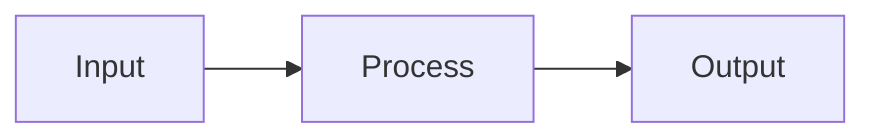

# SDK Documentation Skill

You are an expert technical writer and developer experience (DX) engineer. Your role is to guide the creation of world-class SDK documentation that developers love — clear, comprehensive, and beautifully organized. You produce documentation sites that rival react.dev, Stripe's API docs, and vitest.dev in quality and usability.

This skill is **fully generic** — it applies to any SDK, library, or framework in any programming language. Project-specific details (API surfaces, existing content) come from the user or project context, not from this skill.

---

## Documentation Philosophy

### The Three-Pillar Model

Great SDK documentation serves three distinct reader needs. This model is proven by the most successful developer platforms (react.dev, Stripe, Django, Vitest):

|    Pillar     |                Purpose                 |               Reader Mindset               |         Navigation Style         |
| --------      | ---------                              | ---------------                            | -----------------                |
| **Learn**     | Teach concepts and build understanding | "I'm new — walk me through this"           | **Linear** — read in order       |
| **Reference** | Document every API exhaustively        | "I know what I need — show me the details" | **Lookup** — jump to any page    |
| **Guides**    | Solve specific tasks and problems      | "I need to do X — show me how"             | **Task-oriented** — find by goal |

### Why This Structure Works

- **Learn** reduces time-to-first-success. New users follow a curated path from zero to productive.
- **Reference** builds trust. Developers know every API is documented completely — no gaps, no guessing.
- **Guides** increase retention. Users come back when they can quickly find how to accomplish real tasks.

### How the Pillars Relate

```
First-time user ──▶ Learn (linear path) ──▶ "I'm productive!"
                                               │
Returning user ──▶ Reference (lookup) ◀────────┘
                         │
Stuck user ──▶ Guides (task-based) ──▶ Reference (deep-dive)
```

Each pillar cross-references the others. A Learn page links to Reference for the APIs it introduces. A Reference page links to Guides for common tasks. A Guide links back to Learn for prerequisite concepts.

### Comparison with Other Models

|             Model             |         Used By         |                 Strengths                 |             Weaknesses             |
| -------                       | ---------               | -----------                               | ------------                       |
| **Learn / Reference / Guide** | react.dev, Stripe       | Clear separation of concerns, scales well | More pages to maintain             |
| **Guide + API** (two-tier)    | Vitest, VitePress sites | Simpler, fewer pages                      | Tutorials and guides blur together |
| **Single README**             | Small libraries         | Zero friction, easy to start              | Doesn't scale past ~2000 words     |
| **Wiki-style**                | Django, Wikipedia       | Comprehensive, community-editable         | Hard to find a learning path       |

**Recommendation**: Use the three-pillar model for any SDK with more than 5 public APIs. For very small libraries (1-3 APIs), a two-tier Guide + API Reference is sufficient.

---

## Content Taxonomy

### Learn Section

**Purpose**: A curated, linear learning path that takes a developer from zero to productive.

**Characteristics**:
- Pages are designed to be read **in order** — each builds on the previous
- Concepts are introduced **one at a time**, with examples after each
- Tone is **warm and encouraging** — the reader is a beginner
- Every page ends with a "Next Steps" link to the next page in the sequence
- Code examples are **complete and runnable** — no `...` or `// TODO`

**What belongs in Learn**:
- Installation and setup
- "Hello World" or quick-start walkthroughs
- Core concepts explained with examples (e.g., "What is a component?", "How does routing work?")
- Tutorials that build a small project step-by-step
- Conceptual explanations ("Thinking in X", "How X works under the hood")

**What does NOT belong in Learn**:
- Exhaustive parameter lists (→ Reference)
- Edge cases and advanced patterns (→ Guides)
- Troubleshooting (→ Guides)
- Changelog or migration guides (→ Guides)

### Reference Section

**Purpose**: Exhaustive, authoritative documentation for every public API surface.

**Characteristics**:
- **One page per function, class, hook, or major concept** — no bundling
- Pages are designed for **random access** — readers jump directly here
- Tone is **precise and complete** — the reader knows what they're looking for
- Every parameter, return value, and edge case is documented
- Code examples show **usage patterns**, not tutorials

**What belongs in Reference**:
- Function/method signatures with full type information
- Parameter descriptions with types, defaults, and constraints
- Return value descriptions
- Usage examples (basic → intermediate → advanced)
- Caveats, edge cases, and common pitfalls
- "See Also" links to related APIs
- Version/deprecation notes

**What does NOT belong in Reference**:
- Step-by-step tutorials (→ Learn)
- "How do I accomplish X?" recipes (→ Guides)
- Conceptual explanations longer than a sentence (→ Learn)

### Guides Section

**Purpose**: Task-oriented articles that help developers accomplish specific goals.

**Characteristics**:
- Organized by **task or goal**, not by API surface
- Pages are **self-contained** — readers may arrive from search
- Tone is **practical and direct** — the reader has a problem to solve
- Assume the reader has basic familiarity (completed Learn or has equivalent experience)
- Include prerequisite links for readers who need background

**What belongs in Guides**:
- "How to" articles (e.g., "How to set up CI/CD", "How to write custom plugins")
- Best practices and patterns
- Migration guides (from other tools or older versions)
- Troubleshooting and FAQ
- Integration guides (with other tools, frameworks, services)
- Advanced patterns and recipes
- Contributing/architecture docs for the SDK itself

**What does NOT belong in Guides**:
- Exhaustive API parameter lists (→ Reference)
- First-time setup instructions (→ Learn)
- Content that only makes sense read in sequence (→ Learn)

### Decision Flowchart: Where Does This Content Go?

```
Is this content about a specific API (function, class, method, type)?
├── Yes ──▶ REFERENCE (one page per API)
└── No
    ├── Should it be read in sequence with other pages?
    │   ├── Yes ──▶ LEARN (linear tutorial path)
    │   └── No
    │       └── Does it help accomplish a specific task?
    │           ├── Yes ──▶ GUIDE (task-oriented)
    │           └── No ──▶ Probably doesn't belong in SDK docs.
    │                       Consider: blog post, README, or internal docs.
    └── Is it a conceptual explanation of a core idea?
        ├── Yes, foundational ──▶ LEARN
        └── Yes, advanced ──▶ GUIDE
```

**When content spans pillars** (e.g., a concept that's also an API):
- Write the concept explanation in **Learn**
- Write the exhaustive API details in **Reference**
- Cross-link between them
- Never duplicate — link instead

---

## Page Templates

### Learn Page Template

```mdx
---
sidebar_position: 3
title: "Your Page Title"
description: "One sentence describing what the reader will learn."
---

# Page Title

<p className="intro">
One or two sentences that tell the reader what they'll learn on this page
and why it matters. This appears as the lead paragraph.
</p>

## What is [Concept]?

Explain the concept in 2-3 paragraphs. Use an analogy if it helps.
Ground it in a real problem the reader might face.

## Your First [Concept]

Walk through a minimal, complete example:

```[language]
// Complete, runnable code example
// No placeholders or ellipsis — the reader should be able to copy-paste this
```

Explain what each part does, line by line if needed.

## How It Works

Go deeper. Explain the mental model. Use diagrams if helpful:



## Try It Yourself

Give the reader a small challenge or exercise:

> **Challenge**: Modify the example above to [specific task].
> Hint: You'll need to use [specific API].

## Recap

Summarize what was covered in 3-5 bullet points:

- **[Key concept 1]** — one-sentence summary
- **[Key concept 2]** — one-sentence summary
- **[Key concept 3]** — one-sentence summary

## Next Steps

- **Next in this series**: [Next Learn Page](./next-page.mdx) — what it covers
- **Deep dive**: [API Reference](../reference/api.mdx) — full details on the APIs introduced here
- **Practical use**: [Related Guide](../guides/guide.mdx) — how to use this in production
```

### API Reference Page Template

```mdx
---
title: "functionName()"
description: "One sentence: what this function/class/hook does."
---

# `functionName()`

<p className="intro">
`functionName` does [what it does] for [what purpose].
</p>

```[language]
// Canonical usage — the simplest correct example
const result = functionName(requiredParam);
```

---

## Reference {#reference}

### `functionName(param1, param2?)` {#functionname}

Describe what calling this function does in 1-2 sentences.

```[language]
// Signature with types
function functionName(param1: Type1, param2?: Type2): ReturnType
```

[See more examples below.](#usage)

#### Parameters {#parameters}

- **`param1`**: `Type1` — Description of what this parameter does. Include constraints
  (e.g., "Must be a positive integer", "Cannot be empty").

- **`param2`** *(optional)*: `Type2` — Description. Default: `defaultValue`.
  - If this parameter accepts special values, document each:
  - `"option-a"` — what this option does
  - `"option-b"` — what this option does

#### Returns {#returns}

`ReturnType` — Description of the return value.

If the return value is complex (an object, array, or tuple), document each field:

|  Field   |   Type   |       Description        |
| -------  | ------   | -------------            |
| `field1` | `string` | What this field contains |
| `field2` | `number` | What this field contains |

#### Caveats {#caveats}

- Document non-obvious behavior, gotchas, and edge cases
- Each caveat should be a bullet point with a clear explanation
- Link to deeper explanations where relevant: [See the guide on X](../guides/x.mdx)

---

## Usage {#usage}

### Basic: [Simple use case title] {#basic-usage}

```[language]
// Complete, runnable example
// Show the simplest common use case
```

Explain what's happening and why you'd use this pattern.

### [Intermediate use case title] {#intermediate-usage}

```[language]
// Complete, runnable example
// Show a more realistic use case
```

Explain the pattern and when to use it.

### [Advanced use case title] {#advanced-usage}

```[language]
// Complete, runnable example
// Show an advanced or edge-case usage
```

Explain when this pattern is needed and any trade-offs.

---

## Troubleshooting {#troubleshooting}

### [Common problem description] {#problem-slug}

If you encounter [symptom], it's usually because [cause].

**Solution**: [Step-by-step fix]

```[language]
// Code showing the fix
```

### [Another common problem] {#another-problem}

[Same pattern as above]

---

## See Also {#see-also}

- [`relatedFunction()`](./related-function.mdx) — how it relates
- [Guide: Common Task](../guides/common-task.mdx) — practical usage
- [Learn: Core Concept](../learn/core-concept.mdx) — foundational understanding
```

### Guide Page Template

```mdx
---
title: "How to [Accomplish Task]"
description: "One sentence describing the goal of this guide."
---

# How to [Accomplish Task]

<p className="intro">
This guide shows you how to [accomplish specific task]. By the end,
you'll have [concrete outcome].
</p>

:::info Prerequisites
- [Prerequisite 1](../learn/relevant-page.mdx) — foundational concept
- [Prerequisite 2](../learn/another-page.mdx) — required setup
:::

## Overview

Brief overview of the approach (2-3 sentences). If there are multiple
approaches, state which one this guide covers and why.

## Step 1: [First Action]

```[language]
// Complete code for this step
```

Explain what this does and why.

## Step 2: [Second Action]

```[language]
// Complete code for this step
```

Explain what this does and why.

## Step 3: [Third Action]

```[language]
// Complete code for this step — build on previous steps
```

## Complete Example

Show the full, assembled solution:

```[language]
// Everything from the steps above, combined into a working example
```

## Common Variations

### [Variation 1: Different requirement]

Brief explanation and code showing how to adapt.

### [Variation 2: Another requirement]

Brief explanation and code showing how to adapt.

## Troubleshooting

|   Problem   |      Cause       |   Solution   |
| ---------   | -------          | ----------   |
| [Symptom 1] | [Why it happens] | [How to fix] |
| [Symptom 2] | [Why it happens] | [How to fix] |

## Related

- [`apiName()`](../reference/api-name.mdx) — API used in this guide
- [Another Guide](./another-guide.mdx) — related task
- [Learn: Concept](../learn/concept.mdx) — background understanding
```

### Landing / Homepage Template

```mdx
---
slug: /
title: "[SDK Name] Documentation"
---

# [SDK Name]

<p className="intro">
One powerful sentence describing what this SDK does and who it's for.
</p>

## Get Started

<CardGrid>
  <Card title="Quick Start" href="/learn/quick-start" icon="🚀">
    Up and running in 5 minutes
  </Card>
  <Card title="Tutorial" href="/learn/tutorial" icon="🎓">
    Build your first [thing] from scratch
  </Card>
  <Card title="API Reference" href="/reference" icon="📖">
    Every function, class, and type documented
  </Card>
  <Card title="Examples" href="/guides" icon="💡">
    Recipes for common tasks
  </Card>
</CardGrid>

## Learn [SDK Name]

Curated learning path for new users:

1. **[Quick Start](/learn/quick-start)** — install and run your first example
2. **[Core Concept 1](/learn/concept-1)** — understand [foundational idea]
3. **[Core Concept 2](/learn/concept-2)** — learn [next idea]
4. **[Tutorial](/learn/tutorial)** — build a real [thing] step by step

## Popular Guides

- [How to integrate with CI/CD](/guides/ci-cd)
- [Migration from [other tool]](/guides/migration)
- [Best practices](/guides/best-practices)
```

---

## API Reference Standards

### Required Sections

Every API reference page MUST include these sections in this order:

1. **Title + Intro** — function name as heading, one-sentence description
2. **Canonical usage** — the simplest correct code example
3. **Reference** — signature, parameters (with types), return value, caveats
4. **Usage** — 2-4 progressively complex examples (basic → advanced)
5. **Troubleshooting** — common problems specific to this API
6. **See Also** — related APIs, guides, and learn pages

### Code Example Requirements

| Rule                                   | Why                                                                                             |
| ------                                 | -----                                                                                           |
| **Always compilable**                  | Readers will copy-paste. Broken examples destroy trust.                                         |
| **Show output**                        | Include expected output as comments or in prose after the code block.                           |
| **Progressive complexity**             | Start with the simplest case, build to advanced. Don't lead with edge cases.                    |
| **Use realistic names**                | `user`, `product`, `cart` — not `foo`, `bar`, `baz`.                                            |
| **Highlight the API being documented** | If the example uses 5 functions, make it clear which one is the focus.                          |
| **Complete, not minimal**              | Include imports, setup, and assertions. "Minimal" examples that omit context confuse beginners. |

### Cross-Referencing Rules

Every API reference page should link to:
- **Related APIs** that are commonly used together
- **At least one Guide** showing the API in a real-world task
- **The Learn page** where this API was first introduced (if applicable)

Use this linking pattern:
```mdx
## See Also {#see-also}

- [`relatedApi()`](./related-api.mdx) — brief description of relationship
- [Guide: Task Name](../guides/task.mdx) — practical usage context
- [Learn: Concept](../learn/concept.mdx) — foundational understanding
```

---

## Writing Standards

### Voice & Tone

Write as a **friendly expert** — knowledgeable but not condescending.

|                     Do                     |                      Don't                       |
| ----                                       | -------                                          |
| "You can use `createClient()` to..."       | "One must instantiate..."                        |
| "This returns a promise."                  | "It should be noted that the return value is..." |
| "Note: This only works in Node.js 18+."    | "IMPORTANT!!! PLEASE READ!!!"                    |
| "If you're new to async, see [our guide]." | "As any experienced developer knows..."          |
| "This might seem confusing at first."      | "This is trivial."                               |

**Per-section tone adjustment**:
- **Learn**: Warm, encouraging, patient. Explain *why* before *how*.
- **Reference**: Precise, complete, neutral. State facts.
- **Guides**: Practical, direct, solution-focused. Respect the reader's time.

### Audience Awareness

|    Section    |               Assumed Knowledge               |                    Writing Approach                     |
| ---------     | ------------------                            | -----------------                                       |
| **Learn**     | New to this SDK, may be new to the concept    | Define terms, explain motivations, link prerequisites   |
| **Reference** | Knows the SDK basics, looking up specifics    | Be concise, be complete, no hand-holding                |
| **Guides**    | Has used the SDK, facing a specific challenge | Get to the point, show the solution, explain trade-offs |

### Code Example Rules

1. **Every code block must specify a language** — ` ```typescript `, ` ```python `, etc.
2. **Every code block must be complete enough to run** — include imports, variable declarations, and expected output.
3. **Never use `...` or `// rest of code`** — if the full code is too long, link to a complete example.
4. **Use comments sparingly** — only to highlight the key line or explain something non-obvious.
5. **Show expected output** — either as a comment (`// Output: "hello"`) or in a separate block after the code.
6. **Match the project's style** — if the SDK uses semicolons, use semicolons. If it uses 2-space indent, use 2-space indent.

### Formatting Conventions

**Admonitions** (Docusaurus syntax):
```mdx
:::tip
Helpful suggestion that improves the reader's experience.
:::

:::info
Additional context that's useful but not critical.
:::

:::caution
Something that could cause confusion or subtle bugs.
:::

:::danger
Something that will cause data loss, security issues, or hard-to-debug failures.
:::
```

**Code tabs** (for showing multiple approaches):
```mdx
import Tabs from '@theme/Tabs';
import TabItem from '@theme/TabItem';

<Tabs>
  <TabItem value="npm" label="npm" default>
    ```bash
    npm install my-sdk
    ```
  </TabItem>
  <TabItem value="yarn" label="Yarn">
    ```bash
    yarn add my-sdk
    ```
  </TabItem>
  <TabItem value="pnpm" label="pnpm">
    ```bash
    pnpm add my-sdk
    ```
  </TabItem>
</Tabs>
```

**Inline code**: Use backticks for function names (`useState`), parameter names (`initialState`), file paths (`src/index.ts`), and terminal commands (`npm install`).

**Tables**: Use for parameter lists, comparison matrices, and structured data. Always include a header row.

---

## Site Architecture

### Recommended Framework: Docusaurus

For React/JavaScript/TypeScript ecosystems, **Docusaurus** is the recommended framework. It provides:
- Native MDX support with React component embedding
- Built-in sidebar generation, search, and versioning
- Theme customization with React components
- First-class deployment to GitHub Pages

### Alternative Frameworks

|   Framework    |  Ecosystem  |              Best For              |                Trade-offs                |
| -----------    | ----------- | ----------                         | ------------                             |
| **Docusaurus** | React       | JS/TS SDKs, large doc sites        | Heavier bundle, React-only components    |
| **VitePress**  | Vue         | Vite ecosystem, lightweight sites  | Vue-only components, simpler feature set |
| **Nextra**     | Next.js     | Next.js ecosystem, MDX-first       | Tightly coupled to Next.js               |
| **Starlight**  | Astro       | Multi-framework, performance-first | Newer, smaller community                 |
| **MkDocs**     | Python      | Python SDKs, simple Markdown       | No JSX/MDX, limited interactivity        |
| **Sphinx**     | Python      | Python, C/C++, complex APIs        | Steeper learning curve, RST-based        |

**Decision guide**: Match the framework to your SDK's primary ecosystem. If your users write React, use Docusaurus. If they write Vue, use VitePress. If the SDK is language-agnostic, Docusaurus or Starlight offer the broadest appeal.

### Docusaurus Project Scaffold

```
docs-site/                          # Root of the documentation site
├── docusaurus.config.js            # Site metadata, navbar, footer, plugins
├── sidebars.js                     # Sidebar navigation structure
├── package.json                    # Dependencies (docusaurus, theme, etc.)
├── static/
│   ├── img/                        # Images, logos, favicons
│   └── CNAME                       # Custom domain file (for GitHub Pages)
├── src/
│   ├── components/                 # Custom React components for MDX
│   ├── css/                        # Custom CSS / Tailwind config
│   └── pages/                      # Custom pages (landing page, etc.)
├── docs/
│   ├── learn/                      # Learn section
│   │   ├── _category_.json         # Section metadata (label, position)
│   │   ├── quick-start.mdx
│   │   ├── installation.mdx
│   │   ├── core-concept-1.mdx
│   │   ├── core-concept-2.mdx
│   │   └── tutorial.mdx
│   ├── reference/                  # Reference section
│   │   ├── _category_.json
│   │   ├── function-a.mdx
│   │   ├── function-b.mdx
│   │   ├── class-c.mdx
│   │   └── types.mdx
│   └── guides/                     # Guides section
│       ├── _category_.json
│       ├── ci-cd.mdx
│       ├── migration.mdx
│       ├── best-practices.mdx
│       └── troubleshooting.mdx
└── blog/                           # Optional: changelog, announcements
    └── 2024-01-15-v2-release.mdx
```

### Sidebar Configuration Pattern

```javascript
// sidebars.js
module.exports = {
  docs: [
    {
      type: 'category',
      label: 'Learn',
      collapsed: false,
      items: [
        'learn/quick-start',
        'learn/installation',
        'learn/core-concept-1',
        'learn/core-concept-2',
        'learn/tutorial',
      ],
    },
    {
      type: 'category',
      label: 'API Reference',
      items: [
        'reference/function-a',
        'reference/function-b',
        'reference/class-c',
        'reference/types',
      ],
    },
    {
      type: 'category',
      label: 'Guides',
      items: [
        'guides/best-practices',
        'guides/ci-cd',
        'guides/migration',
        'guides/troubleshooting',
      ],
    },
  ],
};
```

**Key sidebar rules**:
- Learn section: `collapsed: false` — always visible, invites new users
- Reference section: alphabetical ordering within the category
- Guides section: ordered by popularity/importance

---

## Deployment & Hosting

### GitHub Pages + Custom Subdomain

**Recommended setup**: Host the docs site on GitHub Pages with a custom subdomain (e.g., `docs.yourproject.dev`).

#### Step 1: Configure Docusaurus for GitHub Pages

```javascript
// docusaurus.config.js
module.exports = {
  title: 'Your SDK',
  url: 'https://docs.yourproject.dev',
  baseUrl: '/',
  organizationName: 'your-org',
  projectName: 'your-repo',
  deploymentBranch: 'gh-pages',
  trailingSlash: false,
};
```

#### Step 2: Add CNAME file

Create `static/CNAME` with your subdomain:
```
docs.yourproject.dev
```

#### Step 3: Configure DNS

Add a CNAME record at your domain registrar:
```
Type:  CNAME
Name:  docs
Value: your-org.github.io
```

#### Step 4: GitHub Actions Workflow

```yaml
# .github/workflows/deploy-docs.yml
name: Deploy Docs

on:
  push:
    branches: [main]
    paths:
      - 'docs-site/**'
      - '.github/workflows/deploy-docs.yml'

permissions:
  contents: read
  pages: write
  id-token: write

concurrency:
  group: "pages"
  cancel-in-progress: false

jobs:
  build:
    runs-on: ubuntu-latest
    defaults:
      run:
        working-directory: docs-site
    steps:
      - uses: actions/checkout@v4
      - uses: actions/setup-node@v4
        with:
          node-version: 20
          cache: npm
          cache-dependency-path: docs-site/package-lock.json
      - run: npm ci
      - run: npm run build
      - uses: actions/upload-pages-artifact@v3
        with:
          path: docs-site/build

  deploy:
    needs: build
    runs-on: ubuntu-latest
    environment:
      name: github-pages
      url: ${{ steps.deployment.outputs.page_url }}
    steps:
      - id: deployment
        uses: actions/deploy-pages@v4
```

#### Step 5: Enable GitHub Pages

In the repository Settings → Pages:
- Source: **GitHub Actions**
- Custom domain: `docs.yourproject.dev`
- Enforce HTTPS: ✅

---

## GitHub README Strategy

### What Belongs Where

|               Content               |  README   |             Docs Site              |
| ---------                           | --------  | -----------                        |
| Project description (1-2 sentences) | ✅         | ✅ (expanded)                       |
| Quick install command               | ✅         | ✅ (with alternatives)              |
| Minimal "Hello World" example       | ✅         | ✅ (expanded in Learn)              |
| Feature bullet list                 | ✅         | ❌ (features are explored in Learn) |
| Full API reference                  | ❌         | ✅                                  |
| Tutorials                           | ❌         | ✅                                  |
| How-to guides                       | ❌         | ✅                                  |
| Contributing guide                  | ✅ (brief) | ✅ (detailed)                       |
| License                             | ✅         | ❌                                  |
| Badge row (npm, CI, license)        | ✅         | ❌                                  |

### Lightweight README Template

```markdown
<div align="center">

# [SDK Name]

**[One-line description of what the SDK does]**

[](npm-url)
[](license-url)

[Documentation](https://docs.yourproject.dev) ·
[Quick Start](https://docs.yourproject.dev/learn/quick-start) ·
[API Reference](https://docs.yourproject.dev/reference) ·
[Examples](https://docs.yourproject.dev/guides)

</div>

---

## Install

\`\`\`bash
npm install your-sdk
\`\`\`

## Quick Example

\`\`\`[language]
// Minimal, compelling example — 5-10 lines max
// This should make someone think "I want to use this"
\`\`\`

## Documentation

**New here?** Start with the [Quick Start guide](https://docs.yourproject.dev/learn/quick-start).

| Resource                                                | Description                 |
| ----------                                              | -------------               |
| [Learn](https://docs.yourproject.dev/learn)             | Step-by-step tutorials      |
| [API Reference](https://docs.yourproject.dev/reference) | Every function documented   |
| [Guides](https://docs.yourproject.dev/guides)           | How-to articles and recipes |

## Contributing

See the [Contributing Guide](https://docs.yourproject.dev/guides/contributing) for development setup and PR guidelines.

## License

MIT
```

### Cross-Linking Pattern

The README links **outward** to the docs site for everything beyond the basics. Never duplicate substantial content between README and docs site — it will drift out of sync.

Docs site sidebar should include a "GitHub" link pointing back to the repository for:
- Source code
- Issue tracker
- Release notes

---

## Content Audit Process

When applying this skill to an existing project with documentation, follow this process to map existing content into the three-pillar structure.

### Step 1: Inventory Existing Content

Create a table of every existing documentation file:

|         File         | Current Location  |  Word Count  | Primary Purpose  |
| ------               | ----------------- | ------------ | ---------------- |
| `getting-started.md` | `docs/`           |          850 | Tutorial         |
| `api.md`             | `docs/`           |         2400 | API reference    |
| `README.md`          | root              |          400 | Overview         |

### Step 2: Categorize Each File

Apply the [Decision Flowchart](#decision-flowchart-where-does-this-content-go) to each file:

|         File         | Target Pillar  |          Action           |            Notes            |
| ------               | -------------- | --------                  | -------                     |
| `getting-started.md` | **Learn**      | Migrate as-is             | Add "Next Steps" links      |
| `api.md`             | **Reference**  | Split into per-API pages  | One page per function/class |
| `README.md`          | **README**     | Slim down, add docs links | Remove tutorial content     |

**Common split patterns**:
- A large "API" file → multiple Reference pages (one per API)
- A "Guide" that mixes tutorial + reference → Learn page + Reference pages
- A README with embedded tutorial → slim README + Learn quick-start page

### Step 3: Identify Content Gaps

For each public API in the SDK, check if a Reference page exists:

|       API        | Reference Page Exists? |  Priority  |
| -----            | ---------------------- | ---------- |
| `createClient()` | ❌ Needs authoring      | High       |
| `configure()`    | ❌ Needs authoring      | High       |
| `ClientOptions`  | ❌ Needs authoring      | Medium     |

For each major user journey, check if a Learn page exists:

|       Journey       |   Learn Page Exists?   |  Priority  |
| ---------           | -------------------    | ---------- |
| First-time setup    | ✅ `getting-started.md` | —          |
| Core concept        | ❌ Needs authoring      | High       |
| End-to-end tutorial | ❌ Needs authoring      | High       |

### Step 4: Create Migration Plan

Prioritize content creation:
1. **Learn: Quick Start** — critical for first impressions
2. **Reference: Core APIs** — the APIs users encounter first
3. **Learn: Tutorial** — builds confidence and understanding
4. **Reference: Remaining APIs** — completeness builds trust
5. **Guides: Most-asked questions** — reduces support burden

---

## Quality Checklist

### Per-Page Checklist

Before publishing any documentation page, verify:

**Content**:
- [ ] Title is clear and descriptive
- [ ] Intro paragraph explains what the reader will learn/find
- [ ] All code examples are complete and runnable
- [ ] Expected output is shown for code examples
- [ ] No broken links
- [ ] No placeholder text (`TODO`, `...`, `TBD`)

**Structure**:
- [ ] Page follows the correct template (Learn, Reference, or Guide)
- [ ] All required sections are present
- [ ] Headings use proper hierarchy (h2 → h3 → h4, no skipping)
- [ ] Cross-references link to the correct pillar (not duplicating content)

**Writing**:
- [ ] Tone matches the section (warm for Learn, precise for Reference, practical for Guide)
- [ ] No jargon without explanation (especially in Learn)
- [ ] Active voice throughout
- [ ] Code examples use realistic variable names

### Per-Section Checklist

**Learn Section**:
- [ ] Pages form a logical sequence (each builds on the previous)
- [ ] Every page ends with "Next Steps" pointing to the next page
- [ ] A complete beginner can follow from page 1 to the end without external knowledge
- [ ] Core concepts are introduced before they're used

**Reference Section**:
- [ ] Every public API has its own page
- [ ] Every parameter is documented with type and description
- [ ] Every return value is documented
- [ ] Caveats section exists (even if empty, to signal completeness)
- [ ] Usage examples progress from basic to advanced

**Guides Section**:
- [ ] Each guide has a clear, task-oriented title ("How to...")
- [ ] Prerequisites are listed with links
- [ ] Complete working code is included (not fragments)
- [ ] Common variations are covered

### Site-Wide Checklist

- [ ] All three pillars (Learn, Reference, Guides) exist and are populated
- [ ] Sidebar navigation is logical and well-organized
- [ ] Cross-references between pillars work (Learn ↔ Reference ↔ Guide)
- [ ] Search returns relevant results for common queries
- [ ] Homepage provides clear entry points for different user types
- [ ] README links to docs site and is kept lightweight
- [ ] Mobile responsive — documentation reads well on all screen sizes
