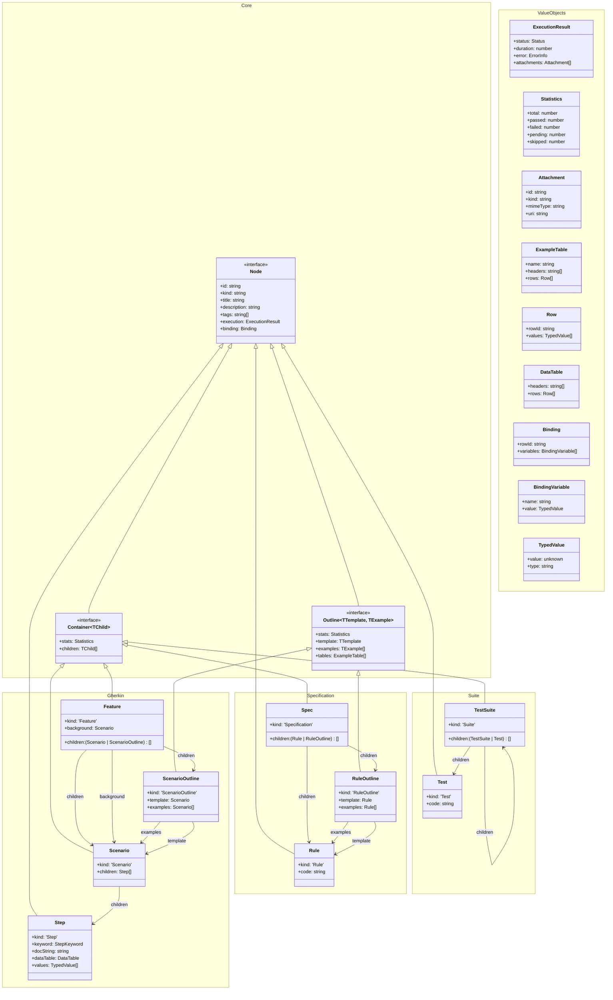

# LiveDoc – Data Protocol Deep Dive (Viewer ↔ SDK)

Date: 2026-01-03

## Executive summary
LiveDoc supports **three distinct testing patterns**:

1. **Features (Gherkin / BDD)** – Feature → Scenario/ScenarioOutline → Step
2. **Specifications** – Specification → Rule/RuleOutline → Rule (examples)
3. **Other (Vitest suites / plain tests)** – Suite → Test

The current viewer+SDK integration does not model these patterns explicitly. Instead, Specifications and Suites are frequently **projected into the Feature/Scenario/Step shape** so the UI can reuse existing views. That projection is the main reason the viewer needs lots of conditional logic.

LiveDoc already contains the beginnings of a good design: a unified schema in `packages/server/src/schema.ts` and a server that “passes through” reporter fields and broadcasts WebSocket events.

However, in practice the system behaves like **three separate protocols**:

1. **Server schema** (`packages/server/src/schema.ts`) – intended canonical model.
2. **Vitest reporter schema** (`packages/vitest/_src/app/reporter/LiveDocViewerReporter.ts`) – **duplicated types** that already diverge from the server schema.
3. **Viewer internal model + transforms** (`packages/viewer/src/client/store.ts` + `useWebSocket.ts`) – a second duplicated model with substantial “interpretation” logic.

This drift is the root driver of the UI complexity you’re seeing: the viewer has to guess intent (feature vs specification vs suite, background vs scenario vs outline, which title to show, which status semantics to apply, which data-table format it received, etc.).

**High-level recommendation:** promote a single canonical protocol package and enforce strict invariants at the producer boundary (SDK/reporters) and the server boundary, so the viewer becomes a simple renderer of “UI-ready” objects.

---

## What “data” is being sent today

### Canonical schema (server)
File: `packages/server/src/schema.ts`

Key concepts:
- `TestRun` (versioned) contains `features` (BDD) and `suites` (non-BDD)
- `Feature` contains `background?: Scenario` and `scenarios: (Scenario | ScenarioOutline)[]`
- `ScenarioOutline` exists as a first-class type with `templateSteps` and `examples: Scenario[]`
- WebSocket event union exists (`WebSocketEvent`)

Notably missing (given the SDK supports it):
- **No first-class `Specification` model in the server schema**, even though the vitest SDK has a dedicated `Specification` / `Rule` / `RuleOutline` model.

API request types exist for incremental posting:
- `POST /api/runs/start` → `StartRunRequest` / `StartRunResponse`
- `POST /api/runs/:runId/features` → `PostFeatureRequest`
- `POST /api/runs/:runId/scenarios` → `PostScenarioRequest`
- `POST /api/runs/:runId/steps` → `PostStepRequest`
- `POST /api/runs/:runId/complete` → `CompleteRunRequest`

### Vitest SDK / reporter payloads
File: `packages/vitest/_src/app/reporter/LiveDocViewerReporter.ts`

Observed behavior:
- Uses the incremental API endpoints above.
- **Duplicates the schema types** in-file “to avoid cross-package imports”.
- Posts (Gherkin Features):
  - Features (`PostFeatureRequest`)
  - Background as a scenario with `typeOverride = 'Background'`
  - Scenario outlines as a scenario with `type='ScenarioOutline'` and `steps = templateSteps` derived from the *first example*
  - Example scenarios as `type='Scenario'` but sets `title = 'Example N'` (not the scenario title)
  - Steps as separate `PostStepRequest`s

- Posts (Specifications): **mapped into viewer “Features”**
  - `postSpecificationAsFeature()` posts a `PostFeatureRequest` with `title = "Specification: ${spec.title}"`.
  - Each `Rule` becomes a posted scenario with `type='Scenario'` and a single virtual step (`Then`) representing the rule.
  - Each `RuleOutline` becomes a posted scenario with `type='ScenarioOutline'` and a placeholder “template step”, then each `RuleExample` becomes a separate scenario linked by `outlineId`.

- Posts (Suites / Other): **mapped into viewer “Features”**
  - `postVitestSuiteAsFeature()` posts a `PostFeatureRequest` with `title = "Suite: ${suite.title}"`.
  - Each collected Vitest test becomes a scenario with a single virtual step.

Notable choices that force UI interpretation later:
- Example scenarios’ `title` defaults to **"Example 1"** rather than a stable “template title + bound display title”.
- Outline `steps` are sent as minimal `{type,title,rawTitle}` entries (template-ish), but are stored in the same field (`Scenario.steps`) as executed steps for regular scenarios.
- `dataTable` is actively converted into object-row format (array of objects), but the viewer still supports multiple legacy shapes.

Specification-specific issues with the current mapping:
- Specifications are **not actually Features**. They have different semantics (Rule/RuleOutline instead of Scenario/Step), but the protocol does not preserve that distinction.
- Rules do not have Given/When/Then steps; representing each rule as a single `Then` step is a UI convenience, not a domain truth.
- RuleOutline examples already materialize placeholders in the vitest SDK (see `livedoc.ts`), but the viewer still does outline grouping and placeholder reconstruction logic intended for Gherkin.

### Server storage + broadcast behavior
File: `packages/server/src/index.ts`

Observed behavior:
- Endpoints accept JSON with minimal validation and “pass through” fields.
- When creating a `Feature`, server sets `duration = 0` and default `statistics` to zero, regardless of what the reporter might know.
- When adding a `Scenario`, server stores `steps: body.steps || []`.
  - For outline definitions, `body.steps` is template steps (not full executed `Step`s).
- Steps are appended later via `/steps`.
- WebSocket events broadcast canonical event names like:
  - `run:started`
  - `feature:added`
  - `scenario:started`
  - `step:completed`
  - `run:completed`

---

## How the viewer uses that data today

### Viewer transport + normalization
File: `packages/viewer/src/client/hooks/useWebSocket.ts`

Observed behavior:
- The viewer primarily uses REST (`/api/hierarchy`, `/api/runs`, `/api/runs/:id`) and then calls `transformRunData`.
- The WebSocket handler includes legacy message types (`runs`, `runStart`, `feature`, etc.) and **does not handle** server-emitted events such as `feature:added`.
- Result: WebSocket is mostly used to trigger expensive refreshes (`fetchProjectHierarchy`) rather than applying incremental patches.

### Viewer internal model diverges from the server model
File: `packages/viewer/src/client/store.ts`

Observed behavior:
- Viewer defines its own types (`Run`, `Feature`, `Scenario`, `Step`) with different enums and shapes than the server schema.
- Viewer `Run` still includes an older `projects: Project[]` model.
  - But `transformRunData` populates `features` directly and sets `projects: []`.
  - “Real-time updates” in the store mutate `run.projects` and appear dead/broken.

This divergence becomes especially painful for Specifications:
- The viewer has no concept of `Specification` / `Rule` / `RuleOutline`. It receives everything as `Feature/Scenario/Step` and then tries to infer meaning from **title prefixes** and ad-hoc `Scenario.type` usage.

### UI interpretation logic (symptoms)
A few concrete examples from the viewer codebase:

1. **Background identification is heuristic-based**
   - `ScenarioView.tsx` and `gherkin-utils.ts` treat background as:
     - `scenario.type === 'Background'` OR
     - `scenario.title === 'Background'` OR
     - `scenario.id.includes('background')`
   - This indicates the incoming data is not reliable enough to identify node types.

2. **ScenarioOutline grouping is reconstructed client-side**
   - `lib/gherkin-utils.ts` builds outline containers by scanning scenarios and linking via `outlineId`.
   - It has fallbacks to “create outline from example” and reconstruct template steps by replacing values with placeholders.
   - This is exactly the type of interpretation that should live in the producer/server.

2b. **Specifications are inferred from strings**
  - `FeatureView.tsx` and `ScenarioView.tsx` contain logic such as:
    - “if title contains ‘specification’ then label it Specification”
    - “if title contains ‘rule’ then label it Rule”
  - This is a symptom that the protocol is missing an explicit top-level `kind` (e.g. `kind: 'Specification'`) and/or first-class `Specification`/`Rule` nodes.

3. **Step types and tables are normalized in the UI**
   - `useWebSocket.ts` normalizes step types and defaults unknown keywords to `Given`.
   - `StepList.tsx` supports multiple `dataTable` shapes (legacy `{rows: string[][]}`; `DataTableRow[]`; `string[][]`).

4. **Status semantics are interpreted**
   - `SummaryView.tsx` computes a “resultStatus” (pass/fail/pending) by aggregating scenario statuses, distinct from run execution status.
   - This is reasonable UX, but today it is mixed with the inconsistent upstream status meanings.

---

## Root causes (maintainability / clean code)

### 1) No single source of truth for the protocol
- Server has “Unified Schema”.
- Vitest reporter duplicates types and already diverges.
- Viewer duplicates types again.

This guarantees drift over time and forces defensive coding.

### 2) Schema is present but not enforced
- Server endpoints accept `any` and store “whatever arrived”.
- A “pass-through” approach avoids losing data, but without validation and invariants it shifts complexity to the UI.

### 3) ScenarioOutline is modeled but not used end-to-end
- `ScenarioOutline` exists in the server schema, but the API/store largely treat outlines as a `Scenario` with `type='ScenarioOutline'`.
- Viewer must group/link and derive template steps.

### 4) The viewer state model is in a half-migrated state
- `Run.projects` and `updateFeature(projectId, feature)` are incompatible with the rest of the UI which reads `run.features`.
- This dead code increases cognitive load and makes “fixes” risky.

### 5) WebSocket protocol mismatch
- Server emits `feature:added`, etc.
- Viewer listens for `feature` and other legacy names.

This reduces quality (stale UI), increases polling/refresh patterns, and adds conditionals.

### 6) Specifications are not modeled in the protocol
The vitest SDK has a real domain model for Specifications:
- `Specification` (container)
- `Rule` (single assertion-like test)
- `RuleOutline` + `RuleExample` (data-driven rules)

But the server schema does not include them, so the integration “jams” Specifications into Feature/Scenario/Step.

This leads to:
- Title-prefix heuristics in the UI ("Specification:", "Rule:")
- Reuse of Gherkin utilities (`groupScenarios`) for non-Gherkin data
- Confusing status/duration aggregation (are we counting “rules” or “scenarios”? The viewer labels fluctuate)

---

## Recommendations (make the data “UI-ready”)

### A) Establish a canonical protocol package and remove type duplication
**Goal:** All producers and consumers compile against the same protocol types.

Options:
1. Create a small `packages/schema` (recommended) exporting:
   - TypeScript types (and optionally runtime validators)
   - Protocol version constants
2. Or, use the already-exported server schema (`@livedoc/server` currently exports schema types) and import it from both viewer and vitest reporter.

Minimum acceptance criteria:
- No duplicated protocol unions/enums (status, step keywords, scenario types).
- Viewer store uses the protocol types directly (or a thin view-model derived from them in one place).

Addendum: the canonical protocol must include **all three patterns** as first-class citizens. If Specifications are left out, they will continue to be “projected” into other shapes and the UI will keep accumulating conditionals.

### B) Define and enforce invariants at the producer boundary
**Principle:** the UI should never need fallback logic like `title || rawTitle || name`.

Proposed invariants (vNext-shaped examples):
- `Node` (all kinds)
  - `id` is a **StabilityID** (deterministic hash of hierarchy + title).
  - `kind`, `title`, and `execution.status` always present.
  - `title` is always a **template** (placeholder-bearing) string.
  - If `binding` exists, the UI applies it to `title` so it can format and highlight bound values.
- `Container<TChild>`
  - `children` is always present (possibly empty).
  - `stats` is always correct (not placeholder zeros) and is computed incrementally by the server.
- `Outline<TTemplate, TExample>`
  - `template`, `examples`, `tables`, and `stats` are always present.
  - Each generated example node includes `binding` (when placeholders exist) so the UI never reconstructs it.
  - Each example row has a deterministic `rowId` (do not rely on order in realtime systems).
- `Step`
  - `keyword` is lowercase (`StepKeyword`);
  - `values` are typed (`TypedValue[]`) when extraction exists.
- `DataTable` / `ExampleTable` have exactly one canonical representation.
  - Table invariant: each row’s `values.length` must match `headers.length` (invalid data should throw).

Where to enforce:
- In the SDK/reporter (best: it knows the intent).
- Additionally in the server (gatekeeper): reject or normalize bad payloads.

### C) Make ScenarioOutline first-class in the data delivered to the viewer
**Goal:** the viewer renders outlines directly; it does not group/link them.

Two practical approaches:
1. **Server-side read model transformation (fastest path)**
   - Keep accepting existing incremental writes.
   - On `GET /api/runs/:runId`, return a canonical outline shape where `ScenarioOutline` is an `Outline<Scenario, Scenario>` with:
     - `template` (the placeholder-bearing `Scenario`)
     - `examples` (the generated `Scenario[]`)
     - `tables` (`ExampleTable[]`)
     - `execution` + `stats` (aggregated)

2. **Write model refactor (more invasive)**
   - Change posting to send explicit outline container + examples (or send full `TestRun` in batch mode).

### D) Normalize and stabilize enums and naming
Current drift examples:
- `StepType` casing differs across layers.
- Status values vary (`pass` vs `passed`, etc.).

Recommendation:
- Pick one canonical set (likely the server schema) and stick to it.
- If the viewer wants `pass/fail/pending`, derive it in a single mapping layer.

vNext note:
- Prefer lowercase `StepKeyword` in the protocol model and let the UI format it for display.

### E) Fix the WebSocket contract (reduce refresh + conditionals)
**Goal:** viewer can apply events directly with no guessing.

Steps:
- Viewer should switch on the canonical `WebSocketEvent` union.
- Server events should include all fields the client needs.
  - Example: `feature:added` already includes full `Feature`.
  - For partial updates, include the minimal patch with strong typing.

### F) Simplify viewer state: store protocol data, not “legacy hybrids”
- Remove or fully migrate `Run.projects` if the UI no longer uses it.
- Centralize normalization in one place (ideally none is needed if the protocol is clean).

### G) Add first-class Specifications to the canonical model (critical)
**Goal:** stop encoding pattern semantics in strings and reuse of Gherkin-only helpers.

Recommended canonical model change (vNext-shaped):

- Introduce top-level `Specification` as `Container<Rule | RuleOutline>` with `kind: 'Specification'`.
- Model data-driven rules as `RuleOutline` = `Outline<Rule, Rule>` (template + generated rules) with `tables: ExampleTable[]`.
- Use `Rule.binding?: Binding` on the generated example nodes, so the UI can always show bound values without guessing.

With this in place:
- The viewer never needs to check `title.toLowerCase().includes('specification')` or `includes('rule')`.
- The viewer never needs to run Gherkin outline logic on `RuleOutline`.
- The protocol can name counts correctly (“rules” vs “scenarios”) without UI guessing.

---

## Suggested incremental refactor plan (low-risk)

1. **Choose canonical protocol location**
   - Decide between `packages/schema` or importing from `@livedoc/server`.

2. **Make the viewer compile against the protocol types**
   - Replace `packages/viewer/src/client/store.ts` model types with protocol types (or a very thin view model).
   - Delete dead paths (`projects`, `updateFeature(projectId, ...)`) if unused.

3. **Update viewer WebSocket handling to match server events**
   - Handle: `run:started`, `feature:added`, `scenario:started`, `step:completed`, `run:completed`, `run:deleted`.
   - Stop relying on periodic hierarchy refresh for correctness.

4. **Server: add runtime validation + normalization**
   - Validate incoming JSON for required invariants.
   - Normalize legacy shapes (e.g., dataTable) at the server boundary.

5. **Server: return a canonical read model**
   - Transform stored “flat scenarios + outlineId” into actual `ScenarioOutline` objects.
   - Ensure background is always returned in `Feature.background`.

6. **SDK/reporters: stop sending ambiguous titles**
  - Outlines should send explicit `template` + `examples` so the UI doesn’t reconstruct structure.
  - Generated examples should carry `binding` (and `Step.values` where available) instead of encoding meaning in titles.
  - Titles remain templates; the UI binds them for styling.
  - Avoid setting `title = 'Example N'` as the primary title; if you need a label, derive it from the example index in the UI.

7. **Add Specifications to server schema + endpoints (or a dedicated read model)**
   - Add `specifications` to `TestRun` and appropriate post endpoints:
     - `POST /api/runs/:runId/specifications`
     - `POST /api/runs/:runId/rules`
     - (rules can include both outline templates and generated examples; examples carry `binding`)
   - Or (lowest disruption) keep write endpoints as-is, but change `GET /api/runs/:runId` to return a canonical read model:
     - a separate `specifications` array derived from currently “jammed” feature/scenario nodes.
   - Once the viewer consumes the read model, remove the legacy projection.

---

## Concrete “conditional logic” hotspots to target
These are good refactoring targets because they exist only due to upstream ambiguity:

- `packages/viewer/src/client/hooks/useWebSocket.ts`
  - `transformRunData` fallback fields (title/description/file/status)
  - Step keyword normalization
- `packages/viewer/src/client/lib/gherkin-utils.ts`
  - Outline inference + placeholder reconstruction
  - Background heuristics
- `packages/viewer/src/client/components/FeatureView.tsx`
  - Title-prefix inference for Feature/Specification/Rule
- `packages/viewer/src/client/components/ScenarioView.tsx`
  - Background detection and title prefix inference
- `packages/viewer/src/client/components/StepList.tsx`
  - Multi-shape dataTable normalization

---

## “Good bones” already present
- The server already exports a unified schema and a WebSocket event union.
- The viewer already has `packages/viewer/src/shared/index.ts` re-exporting `@livedoc/server`.

The main issue is not lack of schema—it’s lack of **schema adoption + invariants + enforcement**.

---

## Appendix: Key files

Protocol / server
- `packages/server/src/schema.ts`
- `packages/server/src/index.ts`
- `packages/server/src/websocket.ts`

SDK / vitest reporter
- `packages/vitest/_src/app/reporter/LiveDocViewerReporter.ts`

Viewer client
- `packages/viewer/src/client/hooks/useWebSocket.ts`
- `packages/viewer/src/client/store.ts`
- `packages/viewer/src/client/lib/gherkin-utils.ts`
- `packages/viewer/src/client/components/ScenarioView.tsx`
- `packages/viewer/src/client/components/StepList.tsx`

---

## Proposed core schema (vNext)

This is the consolidated **single canonical protocol model** built around three reusable concepts: `Node`, `Container<TChild>`, and `Outline<TTemplate, TExample>`.

### Class Diagram

This diagram represents the **reimagined, consolidated vNext model**.

*   **Node**: Base unit. Has `ExecutionResult` (status, duration, error) because *every* node has a result.
*   **Container**: A node that contains other nodes (`children`). Has `Statistics`.
*   **Outline**: A specialized container where the "children" are generated `examples`.
*   **Leaf** nodes are implied: any `Node` that is not a `Container` and not an `Outline`.



### TypeScript Interfaces

```ts
// =============================================================================
// Value Objects
// =============================================================================

export type Status =
  | 'pending'
  | 'running'
  | 'passed'
  | 'failed'
  | 'skipped'
  | 'timedOut'
  | 'cancelled';

// Lowercase in the model; UI can capitalize for display.
export type StepKeyword = 'given' | 'when' | 'then' | 'and' | 'but';

export interface TypedValue {
  // The producer must emit JSON-serializable values.
  // - date: ISO 8601 string (e.g. "2026-01-04T12:34:56.000Z")
  // - object: JSON object/array
  // - undefined: should be avoided over the wire; prefer omitting the field or using null.
  value: unknown;
  type: 'string' | 'number' | 'boolean' | 'date' | 'object' | 'null' | 'undefined';
  displayFormat?: string; // e.g. for dates or currency
}

export interface Binding {
  // Ordered placeholder bindings (producer-defined order; UI preserves it).
  // Example: [{ name: "user", value: { value: "Alice", type: "string" } }]
  variables: Array<{ name: string; value: TypedValue }>;
  // Optional reference back to the example row that produced this binding.
  rowId?: string;
}

export interface Row {
  // Deterministic row id for realtime systems (avoids relying on arrival/order).
  rowId: string;
  values: TypedValue[];
}

export interface DataTable {
  headers: string[];
  rows: Row[];
}

export interface ExampleTable {
  name: string;
  description?: string;
  headers: string[];
  rows: Row[];
}

export interface Attachment {
  id: string;
  kind: 'image' | 'screenshot' | 'file';
  title?: string;
  mimeType: string;

  // How the UI retrieves the attachment.
  // - uri: preferred for server-hosted assets
  // - base64: optional for inline/small payloads
  uri?: string;
  base64?: string;
}

export interface ExecutionResult {
  status: Status;
  duration: number; // Duration of this specific node
  error?: {
    message: string;
    stack?: string;
    diff?: string;
  };

  // Future-proof: primarily screenshots, but can include other artifacts.
  attachments?: Attachment[];
}

export interface Statistics {
  total: number;
  passed: number;
  failed: number;
  pending: number;
  skipped: number;
}

// =============================================================================
// Core Nodes
// =============================================================================

export interface Node {
  id: string;
  // Kind is explicit for known types; consumers should ignore unknown kinds gracefully.
  kind: string;

  // IMPORTANT: title is a TEMPLATE.
  // If `binding` exists, the UI applies binding to `title` to render/format/highlight values.
  title: string;
  description?: string;
  tags?: string[];
  
  // Every node has its own execution result (status, duration, error)
  execution: ExecutionResult;

  // Optional binding for templated titles (steps/rules/examples, etc.).
  binding?: Binding;
}

export interface Container<TChild extends Node = Node> extends Node {
  // Containers have aggregate statistics
  stats: Statistics;
  
  // Generic children property for recursive rendering
  children: TChild[];
}

export interface Outline<TTemplate extends Node, TExample extends Node> extends Node {
  // Outlines also have aggregate statistics
  stats: Statistics;

  // The definition with placeholders (e.g. "Given <user>")
  template: TTemplate;
  
  // The generated examples (renamed from children for clarity)
  examples: TExample[];
  
  // The source data tables
  tables: ExampleTable[];
}

// =============================================================================
// Kinds (Known + Forward-Compatible)
// =============================================================================

export type KnownKind =
  | 'Feature'
  | 'Scenario'
  | 'ScenarioOutline'
  | 'Step'
  | 'Specification'
  | 'Rule'
  | 'RuleOutline'
  | 'Suite'
  | 'Test';

// =============================================================================
// Gherkin Pattern
// =============================================================================

export interface Feature extends Container<Scenario | ScenarioOutline> {
  kind: 'Feature';
  background?: Scenario;
}

export interface Scenario extends Container<Step> {
  kind: 'Scenario';
}

export interface ScenarioOutline extends Outline<Scenario, Scenario> {
  kind: 'ScenarioOutline';
}

export interface Step extends Node {
  kind: 'Step';
  keyword: StepKeyword;
  docString?: string;
  dataTable?: DataTable;
  
  // The values extracted from the step text (e.g. "Given 5 cucumbers" -> 5)
  values?: TypedValue[]; 
}

// =============================================================================
// Specification Pattern
// =============================================================================

export interface Specification extends Container<Rule | RuleOutline> {
  kind: 'Specification';
}

export interface Rule extends Node {
  kind: 'Rule';
  code?: string; // The code body of the rule
}

export interface RuleOutline extends Outline<Rule, Rule> {
  kind: 'RuleOutline';
}

// =============================================================================
// Suite Pattern (Standard Tests)
// =============================================================================

export interface TestSuite extends Container<TestSuite | Test> {
  kind: 'Suite';
}

export interface Test extends Node {
  kind: 'Test';
  code?: string;
}

// =============================================================================
// Root Envelope (Run) + Navigation Hierarchy
// =============================================================================

export type Framework = 'vitest' | 'xunit' | 'mocha' | 'jest';

export interface TestRun {
  // Protocol versioning (distinct from implementation version).
  protocolVersion: '2.0';

  // Identification / grouping
  runId: string;
  project: string;
  environment: string;
  framework: Framework;

  // Timing
  timestamp: string; // ISO 8601
  duration: number; // milliseconds
  status: Status;

  // Summary (computed incrementally by the server based on known children)
  summary: Statistics;

  // UI-ready documents (no projection: features/specifications/suites are first-class nodes)
  documents: Array<Feature | Specification | TestSuite>;
}

export interface HistoryRun {
  runId: string;
  timestamp: string;
  status: Status | string;
  summary?: Statistics;
}

export interface EnvironmentNode {
  name: string;
  latestRun?: TestRun;
  historyCount: number;
  history: HistoryRun[];
}

export interface ProjectNode {
  name: string;
  environments: EnvironmentNode[];
}

export interface ProjectHierarchyResponse {
  projects: ProjectNode[];
}

// =============================================================================
// Realtime Events (NodeId-based)
// =============================================================================

export type NodeEvent =
  | { type: 'run:started'; runId: string; project: string; environment: string; framework: Framework; timestamp: string }
  | { type: 'node:added'; runId: string; node: Node }
  | { type: 'node:updated'; runId: string; nodeId: string; patch: Partial<Node> }
  | { type: 'node:removed'; runId: string; nodeId: string }
  | { type: 'run:updated'; runId: string; patch: Partial<Pick<TestRun, 'status' | 'duration' | 'summary'>> }
  | { type: 'run:completed'; runId: string; status: Status; summary: Statistics; duration: number }
  | { type: 'run:deleted'; runId: string }
  | { type: 'error'; message: string };
```

### Binding Example

When a `ScenarioOutline` is executed, it generates multiple `Scenario` instances (the `examples`). Each child `Scenario` carries a `Binding` object that maps the placeholder names to the concrete values for that iteration.

**Scenario Outline:**
```gherkin
Scenario Outline: Eating
  Given there are <start> cucumbers
  When I eat <eat> cucumbers
  Then I should have <left> cucumbers

  Examples:
    | start | eat | left |
    |    12 |   5 |    7 |
```

**Generated Data (JSON Fragment):**
```json
{
  "kind": "ScenarioOutline",
  "template": { "title": "Eating", "children": [...] },
  "tables": [...],
  "examples": [
    {
      "kind": "Scenario",
      "title": "Eating",
      "binding": {
        "rowId": "row-1",
        "variables": [
          { "name": "start", "value": { "value": 12, "type": "number" } },
          { "name": "eat", "value": { "value": 5, "type": "number" } },
          { "name": "left", "value": { "value": 7, "type": "number" } }
        ]
      },
      "children": [
        { 
          "kind": "Step", 
          "title": "Given there are <start> cucumbers"
        },
        ...
      ]
    }
  ]
}
```

### StabilityID Strategy

To ensure the UI can track test results across runs (e.g., for history, flakiness detection, or deep-linking), every `Node` must have a stable, deterministic `id`. 

Following the pattern from the original Mocha implementation, the ID is generated hierarchically.

**Minimal attributes for the hash:**

1.  **Root Nodes (Feature / Specification / Suite):**
    *   `Project Name` (to avoid collisions in multi-project views)
    *   `File Path` (relative to project root)
    *   `Title`
    *   *Formula:* `hash(project + path + title)`

2.  **Child Nodes (Scenario / Rule / Test):**
    *   `Parent ID`
    *   `Kind` (to handle same-title collisions between different node types)
    *   `Title`
    *   *Formula:* `parent.id + ":" + hash(kind + title)`

3.  **Leaf Nodes (Step):**
    *   `Parent ID`
    *   `Keyword` + `Title`
    *   `Index` (Optional, but recommended to allow duplicate step titles within a scenario)
    *   *Formula:* `parent.id + ":" + hash(keyword + title + index)`

**Benefits:**
- **Stability:** The ID remains the same as long as the test's location and title remain the same.
- **Uniqueness:** The hierarchical prefix prevents collisions between identical titles in different files or features.
- **Traceability:** Enables the Viewer to correlate results across different test runs for the same node.

Notes for review:
- This model intentionally separates `template` vs `examples` for outline types so the viewer never reconstructs them.
- `title` is always the template; the UI applies `binding` to render/highlight bound values.
- Table invariants: row length must match headers; invalid data should throw (we control both ends).
- `stats` are computed incrementally by the server as nodes arrive (realtime).

Polymorphism benefits:
- A renderer can treat everything as `Node` and branch only when it sees `children` (a `Container`) or `template/examples` (an `Outline`).
- List/summary views can rely on `Node.execution` and `Container/Outline.stats` without title-prefix inference or string heuristics.
- Pattern-specific components still exist (e.g., rendering `Step` vs `Rule` vs `Test`), but most navigation and layout code becomes generic.
