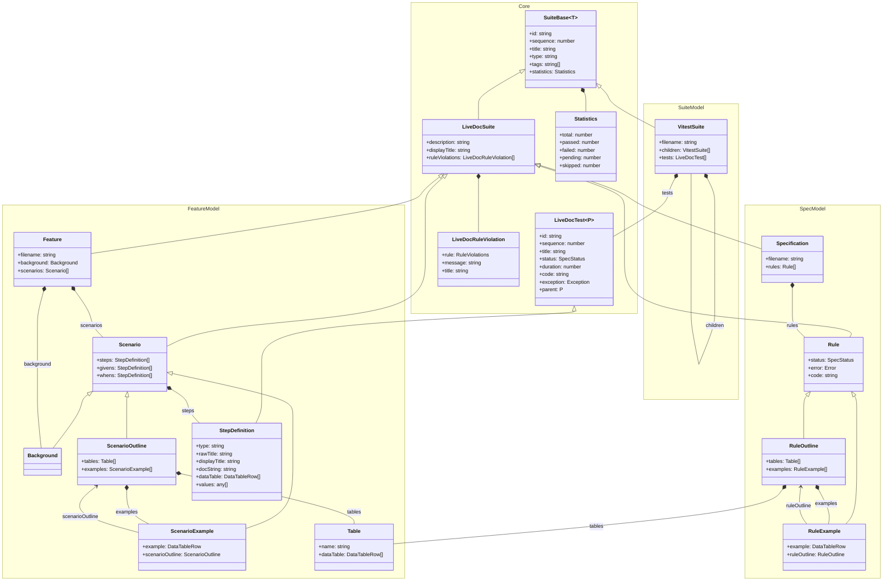

# Existing LiveDoc SDK Model

This diagram represents the current object model implemented in `packages/vitest/_src/app/model`.

```mermaid
classDiagram
    direction TB

    namespace Core {
        class SuiteBase~T~ {
            +id: string
            +sequence: number
            +title: string
            +type: string
            +tags: string[]
            +statistics: Statistics
        }

        class LiveDocSuite {
            +description: string
            +displayTitle: string
            +ruleViolations: LiveDocRuleViolation[]
        }

        class LiveDocTest~P~ {
            +id: string
            +sequence: number
            +title: string
            +status: SpecStatus
            +duration: number
            +code: string
            +exception: Exception
            +parent: P
        }

        class Statistics {
            +total: number
            +passed: number
            +failed: number
            +pending: number
            +skipped: number
        }

        class LiveDocRuleViolation {
            +rule: RuleViolations
            +message: string
            +title: string
        }
    }

    namespace FeatureModel {
        class Feature {
            +filename: string
            +background: Background
            +scenarios: Scenario[]
        }

        class Scenario {
            +steps: StepDefinition[]
            +givens: StepDefinition[]
            +whens: StepDefinition[]
        }

        class Background {
        }

        class ScenarioOutline {
            +tables: Table[]
            +examples: ScenarioExample[]
        }

        class ScenarioExample {
            +example: DataTableRow
            +scenarioOutline: ScenarioOutline
        }

        class StepDefinition {
            +type: string
            +rawTitle: string
            +displayTitle: string
            +docString: string
            +dataTable: DataTableRow[]
            +values: any[]
        }

        class Table {
            +name: string
            +dataTable: DataTableRow[]
        }
    }

    namespace SpecModel {
        class Specification {
            +filename: string
            +rules: Rule[]
        }

        class Rule {
            +status: SpecStatus
            +error: Error
            +code: string
        }

        class RuleOutline {
            +tables: Table[]
            +examples: RuleExample[]
        }

        class RuleExample {
            +example: DataTableRow
            +ruleOutline: RuleOutline
        }
    }

    namespace SuiteModel {
        class VitestSuite {
            +filename: string
            +children: VitestSuite[]
            +tests: LiveDocTest[]
        }
    }

    %% Core Inheritance
    SuiteBase <|-- LiveDocSuite
    LiveDocSuite <|-- Feature
    LiveDocSuite <|-- Scenario
    LiveDocSuite <|-- Specification
    LiveDocSuite <|-- Rule
    SuiteBase <|-- VitestSuite

    %% Feature Pattern
    Scenario <|-- Background
    Scenario <|-- ScenarioOutline
    Scenario <|-- ScenarioExample
    LiveDocTest <|-- StepDefinition

    Feature *-- Scenario : scenarios
    Feature *-- Background : background
    Scenario *-- StepDefinition : steps
    ScenarioOutline *-- ScenarioExample : examples
    ScenarioOutline *-- Table : tables
    ScenarioExample --> ScenarioOutline : scenarioOutline

    %% Spec Pattern
    Rule <|-- RuleOutline
    Rule <|-- RuleExample
    
    Specification *-- Rule : rules
    RuleOutline *-- RuleExample : examples
    RuleOutline *-- Table : tables
    RuleExample --> RuleOutline : ruleOutline

    %% Suite Pattern
    VitestSuite *-- VitestSuite : children
    VitestSuite *-- LiveDocTest : tests

    %% Associations
    SuiteBase *-- Statistics
    LiveDocSuite *-- LiveDocRuleViolation
```
