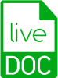

# LiveDoc

A Living Documentation platform for BDD projects using a javascript/typescript testing library. The project is made up of two parts:

* __Part I:__ A Gherkin language extension for [mochajs](mochajs.org). The mocha extension can be found here: [livedoc-mocha](packages/livedoc-mocha#readme).

* __Part II:__ provide a reporting tools for displaying the output of the specifications. This phase is where we take the test output in Gherkin and make it usable as Living Documentation. The idea is to make navigation and discovery of the specifications easy and insightful.
