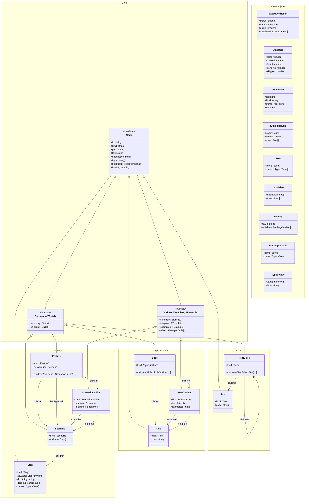

### Class Diagram

This diagram represents the model used by the viewer and VSCode extension.

*   **Node**: Base unit. Has `ExecutionResult` (status, duration, error) because *every* node has a result.
*   **Container**: A node that contains other nodes (`children`). Has a `summary` (`Statistics`).
*   **Outline**: A specialized container where the "children" are generated `examples`.
*   **Leaf** nodes are implied: any `Node` that is not a `Container` and not an `Outline`.



### TypeScript Interfaces

```ts
// =============================================================================
// Value Objects
// =============================================================================

export type Status =
  | 'pending'
  | 'running'
  | 'passed'
  | 'failed'
  | 'skipped'
  | 'timedOut'
  | 'cancelled';

// Lowercase in the model; UI can capitalize for display.
export type StepKeyword = 'given' | 'when' | 'then' | 'and' | 'but';

export interface TypedValue {
  // The producer must emit JSON-serializable values.
  // - date: ISO 8601 string (e.g. "2026-01-04T12:34:56.000Z")
  // - object: JSON object/array
  // - undefined: should be avoided over the wire; prefer omitting the field or using null.
  value: unknown;
  type: 'string' | 'number' | 'boolean' | 'date' | 'object' | 'null' | 'undefined';
  displayFormat?: string; // e.g. for dates or currency
}

export interface Binding {
  // Ordered placeholder bindings (producer-defined order; UI preserves it).
  // Example: [{ name: "user", value: { value: "Alice", type: "string" } }]
  variables: Array<{ name: string; value: TypedValue }>;
  // Optional reference back to the example row that produced this binding.
  rowId?: string;
}

export interface Row {
  // Deterministic row id for realtime systems (avoids relying on arrival/order).
  rowId: string;
  values: TypedValue[];
}

export interface DataTable {
  headers: string[];
  rows: Row[];
}

export interface ExampleTable {
  name: string;
  description?: string;
  headers: string[];
  rows: Row[];
}

export interface Attachment {
  id: string;
  kind: 'image' | 'screenshot' | 'file';
  title?: string;
  mimeType: string;

  // How the UI retrieves the attachment.
  // - uri: preferred for server-hosted assets
  // - base64: optional for inline/small payloads
  uri?: string;
  base64?: string;
}

export interface ExecutionResult {
  status: Status;
  duration: number; // Duration of this specific node
  error?: {
    message: string;
    stack?: string;
    diff?: string;
  };

  // Future-proof: primarily screenshots, but can include other artifacts.
  attachments?: Attachment[];
}

export interface RuleViolation {
  rule: string;
  message: string;
  title?: string;
  errorId?: number;
}

export interface Statistics {
  total: number;
  passed: number;
  failed: number;
  pending: number;
  skipped: number;
}

// =============================================================================
// Core Nodes
// =============================================================================

export interface Node {
  id: string;
  // Kind is explicit for known types; consumers should ignore unknown kinds gracefully.
  kind: string;

  // Optional source path for grouping (recommended: file path relative to repo/project root).
  // Example: "features/auth/Login.feature" or "src/specs/UserLogin.Spec.ts".
  path?: string;

  // IMPORTANT: title is a TEMPLATE.
  // If `binding` exists, the UI applies binding to `title` to render/format/highlight values.
  title: string;
  description?: string;
  tags?: string[];
  
  // Every node has its own execution result (status, duration, error)
  execution: ExecutionResult;

  // Non-fatal issues detected by LiveDoc rules (e.g., missing Given, ambiguous step patterns).
  // These should surface in dashboards as "warnings".
  ruleViolations?: RuleViolation[];

  // Optional binding for templated titles (steps/rules/examples, etc.).
  binding?: Binding;
}

export interface Container<TChild extends Node = Node> extends Node {
  // Containers have aggregate statistics
  summary: Statistics;
  
  // Generic children property for recursive rendering
  children: TChild[];
}

export interface Outline<TTemplate extends Node, TExample extends Node> extends Node {
  // Outlines also have aggregate statistics
  summary: Statistics;

  // The definition with placeholders (e.g. "Given <user>")
  template: TTemplate;
  
  // The generated examples (renamed from children for clarity)
  examples: TExample[];
  
  // The source data tables
  tables: ExampleTable[];
}

// =============================================================================
// Kinds (Known + Forward-Compatible)
// =============================================================================

export type KnownKind =
  | 'Feature'
  | 'Scenario'
  | 'ScenarioOutline'
  | 'Step'
  | 'Specification'
  | 'Rule'
  | 'RuleOutline'
  | 'Suite'
  | 'Test';

// =============================================================================
// Gherkin Pattern
// =============================================================================

export interface Feature extends Container<Scenario | ScenarioOutline> {
  kind: 'Feature';
  background?: Scenario;
}

export interface Scenario extends Container<Step> {
  kind: 'Scenario';
}

export interface ScenarioOutline extends Outline<Scenario, Scenario> {
  kind: 'ScenarioOutline';
}

export interface Step extends Node {
  kind: 'Step';
  keyword: StepKeyword;
  docString?: string;
  dataTable?: DataTable;
  code?: string;
  
  // The values extracted from the step text (e.g. "Given 5 cucumbers" -> 5)
  values?: TypedValue[]; 
}

// =============================================================================
// Specification Pattern
// =============================================================================

export interface Specification extends Container<Rule | RuleOutline> {
  kind: 'Specification';
}

export interface Rule extends Node {
  kind: 'Rule';
  code?: string; // The code body of the rule
}

export interface RuleOutline extends Outline<Rule, Rule> {
  kind: 'RuleOutline';
}

// =============================================================================
// Suite Pattern (Standard Tests)
// =============================================================================

export interface TestSuite extends Container<TestSuite | Test> {
  kind: 'Suite';
}

export interface Test extends Node {
  kind: 'Test';
  code?: string;
}

// =============================================================================
// Root Envelope (Run) + Navigation Hierarchy
// =============================================================================

export type Framework = 'vitest' | 'xunit' | 'mocha' | 'jest';

export interface TestRun {
  // Protocol versioning (distinct from implementation version).
  protocolVersion: '2.0';

  // Identification / grouping
  runId: string;
  project: string;
  environment: string;
  framework: Framework;

  // Timing
  timestamp: string; // ISO 8601
  duration: number; // milliseconds
  status: Status;

  // Summary (computed incrementally by the server based on known children)
  summary: Statistics;

  // UI-ready documents (no projection: features/specifications/suites are first-class nodes)
  documents: Array<Feature | Specification | TestSuite>;
}

export interface HistoryRun {
  runId: string;
  timestamp: string;
  status: Status | string;
  summary?: Statistics;
}

export interface EnvironmentNode {
  name: string;
  latestRun?: TestRun;
  historyCount: number;
  history: HistoryRun[];
}

export interface ProjectNode {
  name: string;
  environments: EnvironmentNode[];
}

export interface ProjectHierarchyResponse {
  projects: ProjectNode[];
}

// =============================================================================
// Realtime Events (NodeId-based)
// =============================================================================

export type WebSocketEvent =
  | { type: 'run:started'; runId: string; project: string; environment: string; framework: Framework; timestamp: string }
  | { type: 'node:added'; runId: string; parentId?: string; node: Node }
  | { type: 'node:updated'; runId: string; nodeId: string; patch: Partial<Node> }
  | { type: 'node:removed'; runId: string; nodeId: string }
  | { type: 'run:updated'; runId: string; patch: Partial<Pick<TestRun, 'status' | 'duration' | 'summary'>> }
  | { type: 'run:completed'; runId: string; status: Status; summary: Statistics; duration: number }
  | { type: 'run:deleted'; runId: string }
  | { type: 'error'; message: string };

export type WebSocketClientMessage =
  | { type: 'subscribe'; runId?: string; project?: string; environment?: string }
  | { type: 'unsubscribe'; runId?: string; project?: string; environment?: string }
  | { type: 'ping' };

// =========================================================================
// API Reference
// =========================================================================

### REST API

The LiveDoc Server provides a REST API for test reporters to submit results and for the Viewer to retrieve and visualize them.

|                  Endpoint                  |  Method  |                                Description                                 |
| :---                                       | :---     | :---                                                                       |
| `/api/health`                              | `GET`    | Returns server status, version, and client count.                          |
| `/api/projects`                            | `GET`    | Lists all projects and environments with latest run metadata.              |
| `/api/hierarchy`                           | `GET`    | Returns the full `ProjectHierarchyResponse` for navigation.                |
| `/api/runs`                                | `GET`    | Lists all runs across all projects.                                        |
| `/api/runs/:runId`                         | `GET`    | Returns the full `TestRun` document for a specific run.                    |
| `/api/runs/start`                          | `POST`   | Starts a new run. Body: `{ project, environment, framework, timestamp? }`. |
| `/api/runs/:runId/nodes`                   | `POST`   | Adds a node to a run. Body: `{ parentId?, node: Node }`.                   |
| `/api/runs/:runId/nodes/:nodeId`           | `PATCH`  | Patches a node. Body: `Partial<Node>`.                                     |
| `/api/runs/:runId/nodes/:nodeId/execution` | `PATCH`  | Updates execution results. Body: `ExecutionResult`.                        |
| `/api/runs/:runId/complete`                | `POST`   | Completes a run. Body: `{ status, duration, summary }`.                    |
| `/api/runs/:runId`                         | `DELETE` | Deletes a test run and its data.                                           |

### WebSocket API

The server supports real-time updates via WebSockets at the `/ws` endpoint.

#### Client Messages (Viewer -> Server)

| Type          | Description                                                              |
| :---          | :---                                                                     |
| `subscribe`   | Subscribe to events for a specific `runId`, `project`, or `environment`. |
| `unsubscribe` | Stop receiving events for a specific subscription.                       |
| `ping`        | Heartbeat to keep the connection alive.                                  |

#### Server Events (Server -> Viewer)

The server broadcasts `WebSocketEvent` objects to subscribed clients whenever the state changes.

- `run:started`: A new test run has begun.
- `node:added`: A new node (e.g., a Step or Scenario) was added to a run.
- `node:updated`: A node's properties or execution results changed.
- `node:removed`: A node was deleted.
- `run:updated`: The run's metadata (status, summary) was updated.
- `run:completed`: The test run has finished.
- `run:deleted`: A test run was removed from the store.
```

### Binding Example

When a `ScenarioOutline` is executed, it generates multiple `Scenario` instances (the `examples`). Each child `Scenario` carries a `Binding` object that maps the placeholder names to the concrete values for that iteration.

**Scenario Outline:**
```gherkin
Scenario Outline: Eating
  Given there are <start> cucumbers
  When I eat <eat> cucumbers
  Then I should have <left> cucumbers

  Examples:
    | start | eat | left |
    |    12 |   5 |    7 |
```

**Generated Data (JSON Fragment):**
```json
{
  "kind": "ScenarioOutline",
  "template": { "title": "Eating", "children": [...] },
  "tables": [...],
  "examples": [
    {
      "kind": "Scenario",
      "title": "Eating",
      "binding": {
        "rowId": "row-1",
        "variables": [
          { "name": "start", "value": { "value": 12, "type": "number" } },
          { "name": "eat", "value": { "value": 5, "type": "number" } },
          { "name": "left", "value": { "value": 7, "type": "number" } }
        ]
      },
      "children": [
        { 
          "kind": "Step", 
          "title": "Given there are <start> cucumbers"
        },
        ...
      ]
    }
  ]
}
```

### StabilityID Strategy

To ensure the UI can track test results across runs (e.g., for history, flakiness detection, or deep-linking), every `Node` must have a stable, deterministic `id`. 

Following the pattern from the original Mocha implementation, the ID is generated hierarchically.

**Minimal attributes for the hash:**

1.  **Root Nodes (Feature / Specification / Suite):**
    *   `Project Name` (to avoid collisions in multi-project views)
    *   `File Path` (relative to project root)
    *   `Title`
    *   *Formula:* `hash(project + path + title)`

2.  **Child Nodes (Scenario / Rule / Test):**
    *   `Parent ID`
    *   `Kind` (to handle same-title collisions between different node types)
    *   `Title`
    *   *Formula:* `parent.id + ":" + hash(kind + title)`

3.  **Leaf Nodes (Step):**
    *   `Parent ID`
    *   `Keyword` + `Title`
    *   `Index` (Optional, but recommended to allow duplicate step titles within a scenario)
    *   *Formula:* `parent.id + ":" + hash(keyword + title + index)`

**Benefits:**
- **Stability:** The ID remains the same as long as the test's location and title remain the same.
- **Uniqueness:** The hierarchical prefix prevents collisions between identical titles in different files or features.
- **Traceability:** Enables the Viewer to correlate results across different test runs for the same node.

Notes for review:
- This model intentionally separates `template` vs `examples` for outline types so the viewer never reconstructs them.
- `title` is always the template; the UI applies `binding` to render/highlight bound values.
- Table invariants: row length must match headers; invalid data should throw (we control both ends).
- `summary` is computed incrementally by the server as nodes arrive (realtime).

Polymorphism benefits:
- A renderer can treat everything as `Node` and branch only when it sees `children` (a `Container`) or `template/examples` (an `Outline`).
- List/summary views can rely on `Node.execution` and `Container/Outline.summary` without title-prefix inference or string heuristics.
- Pattern-specific components still exist (e.g., rendering `Step` vs `Rule` vs `Test`), but most navigation and layout code becomes generic.
