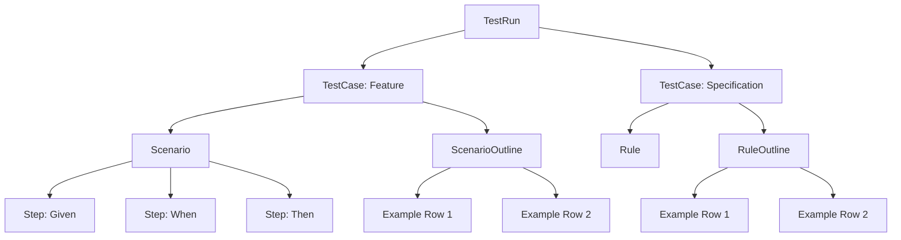

# Reporting Model

<p className="intro">
The reporting model is the shared data structure that connects everything in LiveDoc. Both the
TypeScript/Vitest and C#/xUnit SDKs produce it, the LiveDoc Server stores it, and the Viewer
renders it. Understanding this model is essential for contributors, reporter builders, and anyone
who wants to extend the LiveDoc ecosystem.
</p>

## What Is the Reporting Model?

When a LiveDoc test runs, it doesn't just produce a pass/fail result. It generates a **structured document** — a hierarchical tree of nodes that captures titles, descriptions, tags, steps, data tables, execution results, and statistics. This structured output is what makes [living documentation](./living-documentation.mdx) possible: instead of a flat list of test results, you get a browsable specification.

The **reporting model** defines the shape of that structured document. It's a protocol — a contract between producers (the SDKs) and consumers (the Viewer, VS Code extension, and any custom tooling). As long as both sides agree on the model, they're interchangeable:

```
Producers                        Consumer
┌──────────────────┐             ┌──────────────────┐
│  livedoc-vitest  │──┐         │                  │
│  (TypeScript)    │  │   ┌───▶ │  LiveDoc Viewer  │
└──────────────────┘  │   │     │  (React app)     │
                      ├───┤     └──────────────────┘
┌──────────────────┐  │   │     ┌──────────────────┐
│  LiveDoc.xUnit   │──┘   └───▶ │  VS Code Ext.   │
│  (C#)            │             │                  │
└──────────────────┘             └──────────────────┘
            │                           ▲
            └───────────────────────────┘
              Same model (Protocol 3.0)
```

This is the key architectural insight: **one model, many producers, many consumers**. Adding a new SDK (say, for Python or Go) only requires implementing the producer side of the protocol. The Viewer and all other consumers work automatically.

## The Hierarchy

The reporting model is a tree. Every node in the tree is a test result at some level of granularity:



### TestRun (Root)

The root of the hierarchy. Represents a single execution of your test suite:

| Field              | Description                                           |
| ------------------ | ----------------------------------------------------- |
| `protocolVersion`  | Always `"3.0"` for the current protocol               |
| `runId`            | Unique identifier for this run                        |
| `project`          | Project name (e.g., `"MyApp"`)                        |
| `environment`      | Execution environment (e.g., `"local"`, `"ci"`)       |
| `framework`        | SDK identifier (`"vitest"`, `"xunit"`)                |
| `timestamp`        | ISO 8601 start time                                   |
| `duration`         | Total duration in milliseconds                        |
| `status`           | Overall run status                                    |
| `summary`          | Aggregate statistics for the entire run               |
| `documents`        | Array of top-level TestCases                          |

### TestCase (Document)

A TestCase represents a top-level document — a Feature, Specification, or generic test container. These appear in the Viewer's navigation sidebar:

| Field         | Description                                                        |
| ------------- | ------------------------------------------------------------------ |
| `id`          | Stable identifier (consistent across runs)                         |
| `style`       | Discriminator: `"Feature"`, `"Specification"`, or `"Container"`    |
| `title`       | The Feature or Specification title                                 |
| `path`        | Source file path (used for grouping in navigation)                 |
| `tags`        | Array of tags for filtering                                        |
| `tests`       | Child tests (Scenarios, Rules, etc.)                               |
| `statistics`  | Aggregate pass/fail/pending/skipped counts                         |
| `background`  | Optional background scenario (Feature style only)                  |

### Test (Executable Node)

Tests represent individual executable items. The `kind` field determines the specific shape:

| Kind                | Pattern         | Contains                                    |
| ------------------- | --------------- | ------------------------------------------- |
| `Scenario`          | BDD             | Steps (Given/When/Then)                     |
| `ScenarioOutline`   | BDD             | Step templates + Examples tables + results  |
| `Step`              | BDD             | Keyword, title, optional data               |
| `Rule`              | Specification   | Direct assertion code                       |
| `RuleOutline`       | Specification   | Rule template + Examples tables + results   |

Every test node shares a common shape:

| Field             | Description                                              |
| ----------------- | -------------------------------------------------------- |
| `id`              | Stable identifier                                        |
| `kind`            | Discriminator for the specific test type                 |
| `title`           | The test title (may be a template with placeholders)     |
| `description`     | Optional additional context                              |
| `tags`            | Optional tags                                            |
| `execution`       | Execution result (status, duration, error)               |
| `ruleViolations`  | Optional LiveDoc rule warnings                           |

## Execution Results

Every node in the tree carries an `ExecutionResult` that captures how it executed:

:::note
The interfaces below are shown in TypeScript for readability. The C#/xUnit SDK uses equivalent classes with the same field names.
:::

```typescript
interface ExecutionResult {
    status: Status;       // The outcome
    duration: number;     // Milliseconds
    error?: {             // Only present when status is 'failed'
        message: string;
        stack?: string;
        diff?: string;    // For assertion diff display
    };
    attachments?: Attachment[];  // Screenshots, files, etc.
}
```

### Status Values

| Status      | Meaning                                           |
| ----------- | ------------------------------------------------- |
| `pending`   | Not yet executed (waiting to run)                 |
| `running`   | Currently executing                               |
| `passed`    | Completed successfully                            |
| `failed`    | Completed with an error or assertion failure      |
| `skipped`   | Intentionally skipped (`.skip()` modifier)        |
| `timedOut`  | Exceeded the configured timeout                   |
| `cancelled` | Run was cancelled before this node executed       |

Status propagates upward: a Scenario is `failed` if any of its Steps failed. A Feature is `failed` if any of its Scenarios failed. The TestRun's status reflects the worst status among all its documents.

## Statistics

Containers (TestRun, TestCase, and outline nodes) carry aggregate statistics:

```typescript
interface Statistics {
    total: number;    // Total child tests
    passed: number;   // Successfully completed
    failed: number;   // Failed with errors
    pending: number;  // Not yet executed
    skipped: number;  // Intentionally skipped
}
```

Statistics roll up the hierarchy. A Feature's statistics aggregate all its Scenarios and their Steps. The TestRun's summary aggregates all documents. This enables the Viewer to display progress at every level — from the overall run health down to individual features.

## Outlines: Templates + Examples

[Data-driven tests](./data-driven-tests.mdx) (ScenarioOutline and RuleOutline) have a special representation. Instead of duplicating the full test structure for each data row, the model separates the **template** from the **examples**:

1. **Template** — The step/rule structure with placeholder markers (`<name>`)
2. **Example Tables** — The data tables with headers and typed rows
3. **Example Results** — Per-row, per-step execution results keyed by `(rowId, testId)`

This design means the Viewer receives the template once and renders it for each row by substituting the placeholders with row values. It's bandwidth-efficient for real-time updates and keeps the data model clean.

### Example Table Structure

```typescript
interface ExampleTable {
    name: string;           // Table label (e.g., "Valid inputs")
    headers: string[];      // Column names
    rows: Row[];            // Data rows
}

interface Row {
    rowId: string;          // Unique within the outline
    values: TypedValue[];   // Typed values matching headers
}
```

### Typed Values

All values in the model carry type information:

```typescript
interface TypedValue {
    value: unknown;   // The actual value (JSON-serializable)
    type: 'string' | 'number' | 'boolean' | 'date' | 'object' | 'null';
}
```

This enables the Viewer to render values with appropriate formatting — numbers with alignment, booleans with icons, dates with locale formatting.

## Stable IDs

Every node has an `id` that is **stable across runs**. This is critical for several reasons:

- **Real-time patching** — The Viewer uses WebSocket updates to patch individual nodes. Without stable IDs, it couldn't match incoming updates to existing nodes.
- **History tracking** — Comparing results across runs requires stable identifiers to correlate the "same" test.
- **Deep linking** — Users can bookmark or share links to specific tests. Those links must survive re-runs.

### ID Generation Strategy

IDs are generated hierarchically using a deterministic hash:

| Node Level     | Formula                                          |
| -------------- | ------------------------------------------------ |
| Root (Feature) | `hash(project + filePath + title)`               |
| Child (Scenario) | `parentId + ":" + hash(kind + title)`         |
| Leaf (Step)    | `parentId + ":" + hash(keyword + title + index)` |

The hierarchical prefix prevents collisions between tests with identical titles in different files or features. The inclusion of `kind` handles cases where a Scenario and a Rule share the same title within a container.

## Real-Time Updates

The reporting model is designed for **real-time streaming**. As tests execute, SDKs send incremental updates to the LiveDoc Server via the REST API, which broadcasts them to connected Viewer clients via WebSocket:

| Event           | Description                                     |
| --------------- | ----------------------------------------------- |
| `run:started`   | A new test run has begun                        |
| `node:added`    | A new node (Feature, Scenario, Step) was added  |
| `node:updated`  | A node's execution result changed               |
| `run:completed` | The test run finished                           |

This means the Viewer shows tests transitioning from `pending` → `running` → `passed`/`failed` in real-time, with statistics updating live as each test completes. The model supports this by separating **structure** (sent once when nodes are added) from **execution** (patched as tests run).

### What's Sent Once vs. Patched Often

| Sent Once / Rarely               | Patched Often                         |
| -------------------------------- | ------------------------------------- |
| Document structure               | `execution` status and duration       |
| Titles, descriptions, tags       | Error information                     |
| Step templates                   | `exampleResults` for outline rows     |
| Example tables                   | `statistics` / `summary` aggregates   |

## Bindings and Templates

Titles in the model are always **templates**. When a node has a `binding` object, the UI applies the binding to the template to render the final display:

```json
{
    "title": "Given there are <start> cucumbers",
    "binding": {
        "rowId": "row-1",
        "variables": [
            { "name": "start", "value": { "value": 12, "type": "number" } }
        ]
    }
}
```

The Viewer renders this as "Given there are **12** cucumbers" with the bound value highlighted. This approach keeps the wire format compact (templates aren't duplicated for each row) and enables the UI to style bound values distinctively.

## Protocol Version 3.0

The current reporting model uses **protocol version 3.0**. This version was designed with several principles:

- **Templates are never pre-bound** — The title is always the raw template; binding is UI-driven
- **Real-time is first-class** — All updates are idempotent upserts/patches, safe to resend
- **Code is shown only on error** — Source code appears in `error.code`, not on every node
- **Polymorphic rendering** — Consumers can treat everything as a `Node` and branch only when they encounter specific kinds

Both the TypeScript/Vitest SDK and the C#/xUnit SDK produce protocol 3.0 output. This is what enables the shared Viewer — it doesn't matter which language wrote the tests, the structured output is identical.

## How Both SDKs Produce This Model

Although TypeScript and C# have very different testing idioms, both SDKs map their internal structures to the same reporting model:

| Concept               | TypeScript/Vitest                | C#/xUnit                        | Reporting Model        |
| --------------------- | -------------------------------- | ------------------------------- | ---------------------- |
| Top-level grouping    | `feature()` function             | `FeatureTest` class             | TestCase (Feature)     |
| Behavior example      | `scenario()` function            | Step methods in class           | Scenario               |
| Step                  | `given()`, `when()`, `then()`    | `[Given]`, `[When]`, `[Then]`   | Step                   |
| Technical spec        | `specification()` function       | `SpecificationTest` class       | TestCase (Specification)|
| Assertion rule        | `rule()` function                | `[Rule]` method                 | Rule                   |
| Data-driven           | `scenarioOutline()` / `ruleOutline()` | Outline attributes         | ScenarioOutline / RuleOutline |
| Inline values *(SDK API)* | `ctx.step.values` / `ctx.rule.values` | `Step.Values` / `Rule.Values` | `TypedValue[]`   |

The "Inline values" row shows each SDK's API for *producing* the `TypedValue[]` that appears in the reporting model — these are SDK-specific APIs, not part of the model itself.

The mapping is handled internally by each SDK's reporter. Test authors don't need to think about the model — they write tests using their SDK's natural API, and the reporter transforms the results into protocol 3.0 format.

## The Viewer's Perspective

Understanding the model helps explain how the [Viewer](/viewer/learn/getting-started) works:

1. **Navigation sidebar** — Built from the `documents` array of the TestRun. Each TestCase becomes a navigation item, grouped by `path`.
2. **Feature/Specification detail** — Renders the TestCase's `tests` array. Scenarios show their Steps; Rules show their assertions.
3. **Data tables** — Rendered from `ExampleTable` objects on outline nodes. Row status comes from `exampleResults`.
4. **Real-time updates** — The Viewer subscribes to WebSocket events and patches nodes by their stable `id`. Statistics update live as patches arrive.
5. **Status indicators** — Every node's `execution.status` maps to a visual indicator (green check, red X, gray clock, etc.).

## Extending the Model

The reporting model is designed to be forward-compatible. The `kind` field on every node is a string (not a closed enum), so new node types can be added without breaking existing consumers. Consumers should **ignore unknown kinds gracefully** — rendering them as generic containers or hiding them.

This means you can build custom reporters, alternative viewers, or CI integrations that consume the model. As long as you understand the tree structure and the node shapes described above, you can render LiveDoc results however you like.

## Recap

- The **reporting model** is the shared data contract between SDKs (producers) and the Viewer/VS Code (consumers).
- The hierarchy is: **TestRun → TestCase → Tests (Scenario/Rule) → Steps**.
- Every node carries an **ExecutionResult** with status, duration, and optional error info.
- **Statistics** aggregate up the hierarchy, enabling progress display at every level.
- **Outlines** separate templates from example data, enabling efficient rendering and real-time updates.
- **Stable IDs** enable real-time patching, history tracking, and deep linking.
- **Protocol 3.0** is the current standard — both SDKs produce it, enabling the shared Viewer.
- Titles are templates; the UI applies **bindings** to render concrete values with highlighting.

## Next Steps

- **Next in this series**: [Test Organization](./test-organization.mdx) — how file and namespace structure maps to the report hierarchy
- **For contributors**: [REPORTER_MODEL.md](https://github.com/user/livedoc/blob/main/REPORTER_MODEL.md) — full class diagram and TypeScript interfaces
- **SDK details**: [Vitest Getting Started](/vitest/learn/getting-started) or [xUnit Getting Started](/xunit/learn/getting-started)
