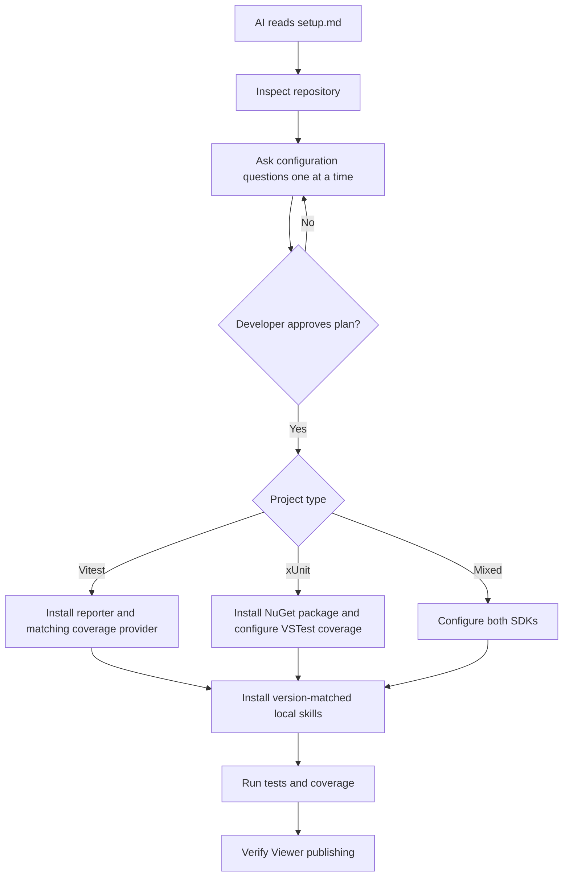
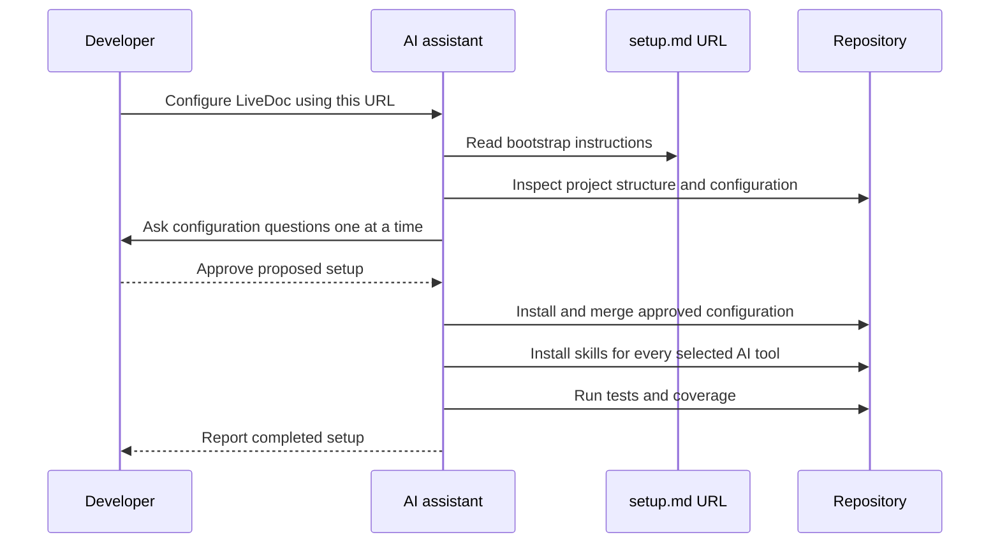

# Set Up a Project with AI

<p className="intro">
You do not need LiveDoc installed before asking an AI assistant to configure it.
Give the assistant one public bootstrap URL; it can inspect the repository,
choose the Vitest or xUnit path, install dependencies, merge configuration, and
validate the result.
</p>

## The Bootstrap URL

```text
https://livedoc.swedevtools.com/ai/setup.md
```

Use a prompt such as:

> Read https://livedoc.swedevtools.com/ai/setup.md and configure this repository
> for LiveDoc. Inspect the project first, then ask me one configuration question
> at a time. Summarize the proposed setup and wait for my approval before editing
> files or installing packages.

## What the Agent Learns



The bootstrap document tells the agent to:

- Inspect before editing and preserve existing configuration
- Ask one question at a time about scope, project identity, Viewer publishing,
  environments, coverage, thresholds, partial testing, starter content, and
  AI tools and repository-local skills
- Summarize the proposed configuration and wait for approval
- Install the correct SDK dependencies
- Configure the LiveDoc reporter and Viewer
- Prefer Microsoft Code Coverage for full xUnit solution/module scope
- Install the matching Vitest coverage provider
- Preserve and merge custom `.runsettings`
- Create self-documenting example tests
- Run test and coverage validation
- Report files changed, commands run, and unresolved warnings

## Bootstrap and Repository Skills

| Workflow | When to use it | Outcome |
| -------- | -------------- | ------- |
| **AI project bootstrap URL** | Configuring LiveDoc in a new or existing repository | The agent installs LiveDoc and version-matched skills for every selected AI tool |
| **Skill installer command** | Refreshing skills or adding another AI tool later | The package copies its current skill into the selected repository-local locations |



The bootstrap runs the appropriate installer automatically. To refresh skills
or add tools later:

```bash
# Vitest
npx livedoc-vitest-setup --tool copilot,codex,claude
```

```powershell
# xUnit
dotnet msbuild -t:LiveDocInstallSkills -p:LiveDocAITool=copilot,codex,claude
```

Skills are installed in the repository so they remain version-aligned and can
be committed for the whole team. Supported tools are GitHub Copilot, OpenAI
Codex, Claude Code, Roo Code, Cursor, and Windsurf.

## Commands the Agent Leaves Behind

AI setup creates memorable repository commands and reports them at completion:

| SDK | Normal run | Coverage run |
| --- | --- | --- |
| Vitest | `npm run test:livedoc` | `npm run test:livedoc:coverage` |
| xUnit on PowerShell | `.\scripts\test-livedoc.ps1` | `.\scripts\test-livedoc.ps1 -Coverage` |
| xUnit on Bash | `./scripts/test-livedoc.sh` | `./scripts/test-livedoc.sh --coverage` |

Vitest scripts use the repository's package manager and are merged without
overwriting existing scripts. The coverage script is added only when coverage
is enabled. xUnit launchers contain the detected solution or test-project paths,
forward additional `dotnet test` arguments, and use Microsoft Code Coverage
with Cobertura when coverage is requested.

## Recommended Prompts

### Vitest

> Read https://livedoc.swedevtools.com/ai/setup.md. Configure this Vitest project
> for LiveDoc. Ask me one question at a time about the Viewer, project name,
> coverage, thresholds, partial testing, and starter spec. Preserve existing
> configuration and wait for approval before making changes.

### xUnit

> Read https://livedoc.swedevtools.com/ai/setup.md. Configure this xUnit solution
> for LiveDoc. Ask me one question at a time about the Viewer, project name,
> coverage, thresholds, partial testing, and starter test. Preserve existing
> runsettings and wait for approval before making changes.

### Mixed monorepo

> Read https://livedoc.swedevtools.com/ai/setup.md. Detect every Vitest and xUnit
> test project in this monorepo. Ask me one question at a time about scope,
> project grouping, Viewer publishing, coverage, and validation. Wait for
> approval before configuring LiveDoc.

## Key Takeaways

- **One URL bootstraps setup** before LiveDoc or its skills are installed.
- **The agent interviews the developer first** and waits for plan approval.
- **The agent chooses the SDK path** after inspecting the repository.
- **Version-matched skills are installed automatically** for every selected AI tool.
- **Repository scope prevents cross-project version drift** and makes setup shareable.
- **Validation is part of setup**, including Viewer publishing and coverage scope.

## Related

- [Vitest AI Skill Setup](../vitest/guides/ai-skill-setup.mdx)
- [xUnit AI Skill Setup](../xunit/guides/ai-skill-setup.mdx)
- [Code Coverage](../viewer/guides/code-coverage.mdx)
- [Viewer Getting Started](../viewer/learn/getting-started.mdx)
