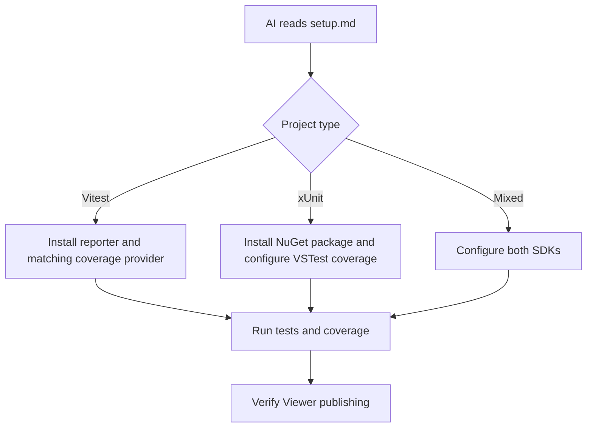
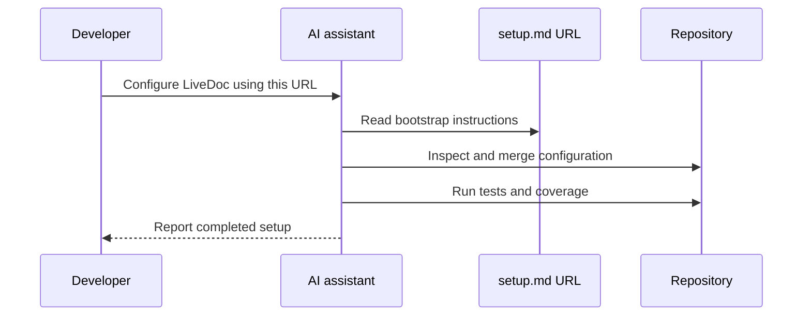

# Set Up a Project with AI

<p className="intro">
You do not need LiveDoc installed before asking an AI assistant to configure it.
Give the assistant one public bootstrap URL; it can inspect the repository,
choose the Vitest or xUnit path, install dependencies, merge configuration, and
validate the result.
</p>

## The Bootstrap URL

```text
https://livedoc.swedevtools.com/ai/setup.md
```

Use a prompt such as:

> Read https://livedoc.swedevtools.com/ai/setup.md and configure this repository
> for LiveDoc. Preserve existing configuration and include Viewer publishing and
> full code coverage.

## What the Agent Learns



The bootstrap document tells the agent to:

- Inspect before editing and preserve existing configuration
- Install the correct SDK dependencies
- Configure the LiveDoc reporter and Viewer
- Prefer Microsoft Code Coverage for full xUnit solution/module scope
- Install the matching Vitest coverage provider
- Preserve and merge custom `.runsettings`
- Create self-documenting example tests
- Run test and coverage validation
- Report files changed, commands run, and unresolved warnings

## Bootstrap Versus Reusable Skills

| Workflow | When to use it | Installation required first? | Outcome |
| -------- | -------------- | ---------------------------- | ------- |
| **AI project bootstrap URL** | Configuring LiveDoc in a new or existing repository | No | The agent installs and configures LiveDoc now |
| **Reusable LiveDoc skill** | Teaching future AI sessions LiveDoc authoring conventions | Yes, after the package is installed | Durable repository instructions for ongoing work |



Installing reusable skills afterward is optional:

```bash
# Vitest
npx livedoc-vitest-setup
```

```powershell
# xUnit
dotnet msbuild -t:LiveDocInstallSkills
```

## Recommended Prompts

### Vitest

> Read https://livedoc.swedevtools.com/ai/setup.md. Configure this Vitest project
> for LiveDoc, the Viewer, V8 coverage, and branch thresholds. Preserve the
> existing Vitest configuration.

### xUnit

> Read https://livedoc.swedevtools.com/ai/setup.md. Configure this xUnit solution
> for LiveDoc, Viewer publishing, and Microsoft Code Coverage in Cobertura format
> with complete module and branch data. Preserve existing runsettings.

### Mixed monorepo

> Read https://livedoc.swedevtools.com/ai/setup.md. Detect every Vitest and xUnit
> test project in this monorepo and configure LiveDoc consistently. Use one Viewer
> and explain project grouping, coverage dependencies, and validation.

## Key Takeaways

- **One URL bootstraps setup** before LiveDoc or its skills are installed.
- **The agent chooses the SDK path** after inspecting the repository.
- **Reusable skills are optional follow-up tooling**, not a prerequisite.
- **Validation is part of setup**, including Viewer publishing and coverage scope.

## Related

- [Vitest AI Skill Setup](../vitest/guides/ai-skill-setup.mdx)
- [xUnit AI Skill Setup](../xunit/guides/ai-skill-setup.mdx)
- [Code Coverage](../viewer/guides/code-coverage.mdx)
- [Viewer Getting Started](../viewer/learn/getting-started.mdx)

