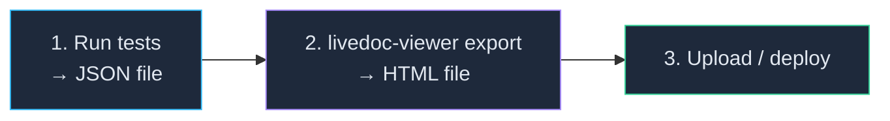

# How to Use the Viewer in CI/CD

<p className="intro">
The LiveDoc Viewer converts test results into rich, interactive HTML reports.
In CI, the most common pattern is the static export: run tests, generate HTML,
upload as an artifact or deploy to GitHub Pages.
</p>

:::info Prerequisites
- `@swedevtools/livedoc-viewer` installed (`npm install -D @swedevtools/livedoc-viewer`)
- A test project configured with a LiveDoc reporter that exports TestRunV1 JSON
:::

## Static Report Pipeline

The standard CI workflow is three steps:



### The Export Command

```bash
npx @swedevtools/livedoc-viewer export \
  -i ./test-results/livedoc-report.json \
  -o ./reports/index.html \
  -t "My Project — Build #42"
```

| Flag | Description | Default |
| ---- | ----------- | ------- |
| `-i, --input` | Path to TestRunV1 JSON file | *(required)* |
| `-o, --output` | Output HTML file path | `./livedoc-report.html` |
| `-t, --title` | Report title | Project name from JSON |

The output is a **single, self-contained HTML file** with all JavaScript, CSS,
and data embedded inline. It works offline — just open it in any browser.

---

## GitHub Actions — Artifact Upload

The simplest approach: upload the HTML report as a build artifact.

```yaml
# .github/workflows/tests.yml
- name: Generate HTML report
  if: always()
  run: npx @swedevtools/livedoc-viewer export -i test-results/report.json -o test-results/report.html

- name: Upload report
  if: always()
  uses: actions/upload-artifact@v4
  with:
    name: livedoc-report
    path: test-results/report.html
    retention-days: 30
```

Team members can download the artifact from the workflow run page.

---

## GitHub Actions — Deploy to GitHub Pages

For a permanent, browsable URL, deploy to GitHub Pages:

```yaml
name: LiveDoc Report

on:
  push:
    branches: [main]

permissions:
  contents: read
  pages: write
  id-token: write

concurrency:
  group: pages
  cancel-in-progress: true

jobs:
  report:
    runs-on: ubuntu-latest
    steps:
      - uses: actions/checkout@v4
      - uses: actions/setup-node@v4
        with:
          node-version: 22

      - run: npm ci
      - run: npx vitest run  # produces test-results/report.json

      - name: Generate HTML report
        if: always()
        run: npx @swedevtools/livedoc-viewer export -i test-results/report.json -o reports/index.html

      - name: Setup Pages
        if: always()
        uses: actions/configure-pages@v5

      - name: Upload Pages artifact
        if: always()
        uses: actions/upload-pages-artifact@v3
        with:
          path: reports

  deploy:
    needs: report
    runs-on: ubuntu-latest
    environment:
      name: github-pages
      url: ${{ steps.deployment.outputs.page_url }}
    steps:
      - id: deployment
        uses: actions/deploy-pages@v4
```

### Required Setup

Before the deploy works:

1. **Settings → Pages** — set Source to **GitHub Actions**
2. **Settings → Environments** — ensure `github-pages` environment exists
3. **Environment rules** — if branch protection is on, add your deploy branch

:::danger Environment must exist
The deploy job references `environment: name: github-pages`. If this
environment doesn't exist, the job fails silently without being assigned a
runner. Create it in **Settings → Environments → New environment**.
:::

### Multi-Project Reports

If you have both TypeScript and .NET tests, generate each into a subdirectory
and create a landing page:

```bash
# Generate separate reports
npx @swedevtools/livedoc-viewer export -i vitest-report.json -o reports/vitest/index.html -t "Vitest"
npx @swedevtools/livedoc-viewer export -i dotnet-report.json -o reports/dotnet/index.html -t "xUnit"
```

```yaml
- name: Create landing page
  run: |
    cat > reports/index.html << 'EOF'
    <!DOCTYPE html>
    <html>
    <head><title>Test Reports</title></head>
    <body>
      <h1>LiveDoc Test Reports</h1>
      <ul>
        <li><a href="./vitest/">Vitest (TypeScript)</a></li>
        <li><a href="./dotnet/">xUnit (.NET)</a></li>
      </ul>
    </body>
    </html>
    EOF
```

---

## Advanced: Live Dashboard in CI

For real-time monitoring during long test runs, you can run the viewer as a
background service. This is an advanced setup — the static export covers most
CI use cases.

```yaml
- name: Start Viewer
  run: npx @swedevtools/livedoc-viewer --no-open --host 0.0.0.0 &

- name: Wait for Viewer
  run: |
    for i in $(seq 1 10); do
      curl -sf http://localhost:3100/api/health && break || sleep 1
    done

- name: Run tests
  run: npx vitest run

- name: Collect results
  if: always()
  run: curl -s http://localhost:3100/api/runs > results.json
```

| Flag | Purpose |
| ---- | ------- |
| `--no-open` | Don't launch a browser |
| `--host 0.0.0.0` | Bind to all interfaces |
| `--port <n>` | Use a different port (default: 3100) |

---

## Troubleshooting

| Problem | Cause | Solution |
| ------- | ----- | -------- |
| `protocolVersion` error | Wrong JSON format | Ensure your reporter exports TestRunV1 (use `export` option, not `JsonReporter`) |
| HTML report is empty | Missing webview assets | Run `npm run build` in the viewer package first, or use `npx` |
| Pages deploy fails | Environment missing | Create `github-pages` in Settings → Environments |
| Pages deploy "not authorized" | Branch not allowed | Add branch to environment deployment rules |
| Static report shows "Run in progress" | Older viewer version | Update `@swedevtools/livedoc-viewer` to latest |

## Related

- [Static Export](./static-export.mdx) — detailed `export` command reference
- [CLI Options](../reference/cli-options.mdx) — all command-line flags
- [REST API](../reference/rest-api.mdx) — querying the live viewer
- [Multi-Project Setup](./multi-project-setup.mdx) — multiple projects in one viewer
