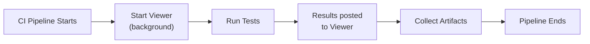

# How to Use the Viewer in CI/CD

<p className="intro">
This guide shows you how to run the LiveDoc Viewer as a background service in
CI pipelines, collect test results, and make them available for review. By the
end, you'll have a GitHub Actions workflow with a live viewer dashboard.
</p>

:::info Prerequisites
- The LiveDoc Viewer installed (`npm install -g @swedevtools/livedoc-viewer`)
- A test project configured with a LiveDoc reporter ([Getting Started](../learn/getting-started.mdx))
:::

---

## Overview

In CI, the viewer runs **headless** as a background process. Tests post results
to it via the reporter, and you can either:

- **Query the API** after the run to extract results
- **Save the JSON data** from `.livedoc/data` as build artifacts
- **Keep the viewer running** for on-demand access during the pipeline



---

## Key Flags for CI

Two CLI flags are essential in CI environments:

| Flag         | Why                                                         |
| ------------ | ----------------------------------------------------------- |
| `--no-open`  | Prevents the viewer from trying to open a browser           |
| `--host 0.0.0.0` | Binds to all interfaces so other CI jobs can reach it |

```bash
livedoc-viewer --no-open --host 0.0.0.0
```

See [CLI Options](../reference/cli-options.mdx) for the full reference.

---

## GitHub Actions Example

### Basic Setup

```yaml
# .github/workflows/livedoc.yml
name: LiveDoc Tests

on:
  push:
    branches: [main]
  pull_request:

jobs:
  test:
    runs-on: ubuntu-latest
    steps:
      - uses: actions/checkout@v4

      - uses: actions/setup-node@v4
        with:
          node-version: '20'

      - name: Install dependencies
        run: npm ci

      - name: Install LiveDoc Viewer
        run: npm install -g @swedevtools/livedoc-viewer

      - name: Start Viewer (background)
        run: livedoc-viewer --no-open --host 0.0.0.0 &

      - name: Wait for Viewer
        run: |
          for i in $(seq 1 10); do
            curl -s http://localhost:3100/api/health && break
            sleep 1
          done

      - name: Run tests
        run: npx vitest run

      - name: Collect results
        if: always()
        run: |
          curl -s http://localhost:3100/api/runs > test-results.json

      - name: Upload results
        if: always()
        uses: actions/upload-artifact@v4
        with:
          name: livedoc-results
          path: |
            test-results.json
            .livedoc/data/
```

### What's Happening

1. **Start Viewer** — launches in the background with `&`, no browser, bound to all interfaces
2. **Wait for Viewer** — polls the health endpoint until the server is ready
3. **Run tests** — Vitest executes specs; the reporter posts results to `localhost:3100`
4. **Collect results** — queries the REST API to save the run data as JSON
5. **Upload artifacts** — persists results for later inspection

---

## Configuring the Reporter for CI

Set the `project` and `environment` fields to label CI results distinctly:

```typescript
// vitest.config.ts
import { defineConfig } from 'vitest/config';
import {
  LiveDocSpecReporter,
  LiveDocViewerReporter,
} from '@swedevtools/livedoc-vitest/reporter';

export default defineConfig({
  test: {
    include: ['**/*.Spec.ts'],
    globals: true,
    reporters: [
      new LiveDocSpecReporter({
        detailLevel: 'spec+summary+headers',
        colors: false, // No ANSI colors in CI logs
        postReporters: [
          new LiveDocViewerReporter({
            server: 'http://localhost:3100',
            project: 'my-project',
            environment: process.env.CI ? 'ci' : 'local',
          }),
        ],
      }),
    ],
  },
});
```

:::tip Environment detection
Use `process.env.CI` (set by most CI providers) to automatically switch the
environment label.
:::

---

## Advanced: Custom Port

If port 3100 conflicts with other services in your CI environment, use a
different port:

```yaml
- name: Start Viewer (background)
  run: livedoc-viewer --no-open --host 0.0.0.0 --port 9100 &

- name: Wait for Viewer
  run: |
    for i in $(seq 1 10); do
      curl -s http://localhost:9100/api/health && break
      sleep 1
    done
```

Update the reporter config to match:

```typescript
new LiveDocViewerReporter({
  server: 'http://localhost:9100',
}),
```

---

## Advanced: JSON-Only (No Viewer)

If you only need the JSON results file and don't need the live dashboard, skip
the viewer entirely and use the `JsonReporter`:

```typescript
import {
  LiveDocSpecReporter,
  JsonReporter,
} from '@swedevtools/livedoc-vitest/reporter';

export default defineConfig({
  test: {
    reporters: [
      new LiveDocSpecReporter({
        detailLevel: 'spec+summary+headers',
        colors: false,
        postReporters: [new JsonReporter()],
        'json-output': './livedoc-results.json',
      }),
    ],
  },
});
```

```yaml
- name: Upload JSON results
  if: always()
  uses: actions/upload-artifact@v4
  with:
    name: livedoc-json
    path: livedoc-results.json
```

---

## Deploying Static Reports to GitHub Pages

For a permanent, browsable URL hosting your test reports, deploy the static
HTML export to GitHub Pages. This combines the Viewer's `export` command with
GitHub's free static hosting.

### Complete Workflow

```yaml
name: LiveDoc Report

on:
  push:
    branches: [main]
  workflow_dispatch:

permissions:
  contents: read
  pages: write
  id-token: write

concurrency:
  group: pages
  cancel-in-progress: true

jobs:
  generate-reports:
    runs-on: ubuntu-latest

    steps:
      - uses: actions/checkout@v4

      - uses: actions/setup-node@v4
        with:
          node-version: 22

      - name: Install dependencies
        run: npm ci

      - name: Run tests with JSON export
        run: npx vitest run
        # Assumes vitest.config.ts has LiveDocSpecReporter with export option

      - name: Generate HTML report
        if: always()
        run: npx @swedevtools/livedoc-viewer export -i ./test-results/livedoc-report.json -o ./reports/index.html -t "My Project"

      - name: Setup Pages
        if: always()
        uses: actions/configure-pages@v5

      - name: Upload Pages artifact
        if: always()
        uses: actions/upload-pages-artifact@v3
        with:
          path: reports

  deploy:
    needs: generate-reports
    runs-on: ubuntu-latest
    environment:
      name: github-pages
      url: ${{ steps.deployment.outputs.page_url }}
    steps:
      - id: deployment
        uses: actions/deploy-pages@v4
```

### GitHub Pages Setup

Before the deploy job will succeed, configure your repository:

1. **Settings → Pages**: Set Source to **GitHub Actions** (not "Deploy from a branch")
2. **Settings → Environments**: Ensure a `github-pages` environment exists
3. **Environment branch rules**: If you have branch protection on the `github-pages`
   environment, add your deployment branch (e.g., `main`) to the allowed list

:::danger Environment must exist
The deploy job references `environment: name: github-pages`. If this environment
doesn't exist in your repo settings, the job fails silently — it won't even be
assigned a runner. Go to **Settings → Environments → New environment** and name
it exactly `github-pages`.
:::

### Multi-Project Landing Page

If you run both TypeScript (Vitest) and .NET (xUnit) tests, create a landing
page that links to both reports:

```yaml
- name: Create index page
  if: always()
  run: |
    cat > reports/index.html << 'EOF'
    <!DOCTYPE html>
    <html>
    <head><title>Test Reports</title></head>
    <body>
      <h1>Test Reports</h1>
      <ul>
        <li><a href="./vitest/">Vitest Report</a></li>
        <li><a href="./dotnet/">xUnit Report</a></li>
      </ul>
    </body>
    </html>
    EOF
```

Generate each report into its own subdirectory:

```bash
npx @swedevtools/livedoc-viewer export -i vitest-report.json -o reports/vitest/index.html
npx @swedevtools/livedoc-viewer export -i dotnet-report.json -o reports/dotnet/index.html
```

---

## Troubleshooting

| Problem                      | Cause                             | Solution                                           |
| ---------------------------- | --------------------------------- | -------------------------------------------------- |
| Viewer not reachable in CI   | Not bound to `0.0.0.0`           | Add `--host 0.0.0.0`                               |
| Browser error in CI          | `--no-open` missing              | Add `--no-open` flag                                |
| Port conflict                | Another service on 3100          | Use `--port <other>`                                |
| Results empty after run      | Reporter not configured          | Verify `LiveDocViewerReporter` is in the config     |
| Health check times out       | Viewer hasn't started yet        | Increase the retry count in the wait loop           |
| Pages deploy fails immediately | `github-pages` environment missing | Create it in Settings → Environments |
| Pages deploy "not authorized" | Branch not in environment rules | Add your branch to the `github-pages` environment's deployment branch rules |
| Static report shows "Run in progress" | Stale status in exported data | Update to latest `@swedevtools/livedoc-viewer` — fixed in the static export mode |

---

## See Also

- [CLI Options](../reference/cli-options.mdx) — all command-line flags
- [REST API](../reference/rest-api.mdx) — querying results programmatically
- [Multi-Project Setup](./multi-project-setup.mdx) — multiple projects in one viewer
