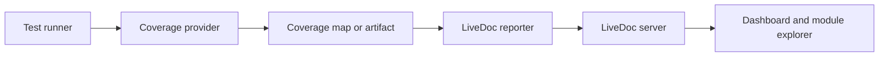
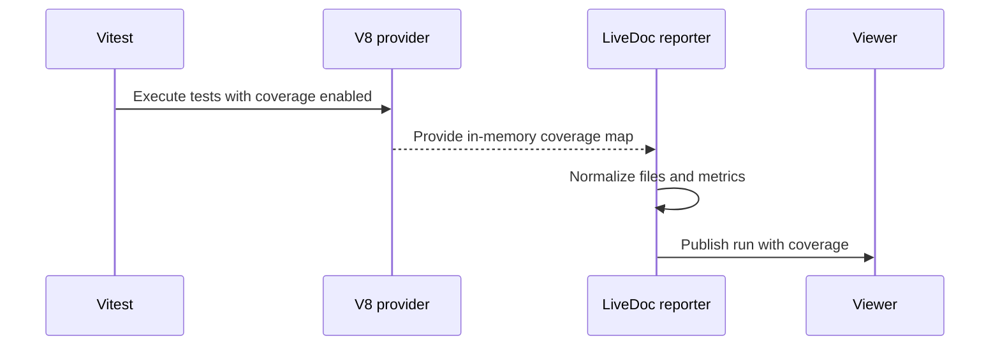
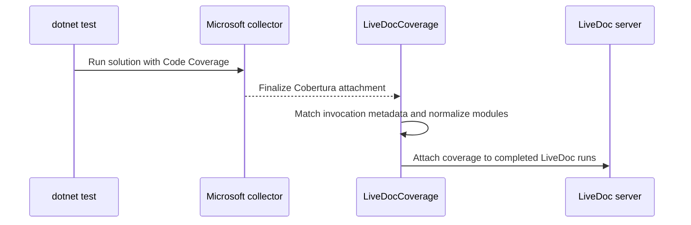

# Code Coverage

<p className="intro">
LiveDoc treats code coverage as optional evidence beside executable specifications.
It shows which modules were exercised without pretending that invocation-level
coverage belongs to one scenario or rule.
</p>

## What Is LiveDoc Coverage?

LiveDoc normalizes coverage produced by your test runner and attaches it to the
completed run. The Viewer calculates weighted totals, groups files by module or
assembly, and presents line, branch, function, and statement metrics when the
source tool provides them.

Coverage does **not** change a test run from passed to failed. Configured
threshold misses appear as warnings so test behavior and coverage health remain
separate signals.

## Why This Matters

Imagine a solution with a core library, two test assemblies, an API sample, and a
code-generation tool. A single percentage hides which module needs attention.
LiveDoc keeps the invocation together while making each covered module visible.

> **Example: A solution-wide .NET run**
>
> The overall line coverage is 82%, but the Journey Generator module is 27%.
> The module hierarchy immediately identifies the weak area without attributing
> that coverage to an unrelated test.
>
> **Result**: The team gets the same project-oriented mental model it expects
> from Visual Studio, with the test documentation and coverage evidence in one place.

## The Big Picture



Vitest normally supplies an in-memory Istanbul coverage map. .NET runners produce
a VSTest attachment, commonly Microsoft Code Coverage or XPlat/Coverlet
Cobertura. LiveDoc normalizes both into the same Viewer model.


## Choose a Setup

| Test runner | Recommended collector | Required dependency | Run command |
| ----------- | --------------------- | ------------------- | ----------- |
| Vitest | V8 coverage | `@vitest/coverage-v8` matching your Vitest version | `npx vitest run --coverage` |
| xUnit / `dotnet test` | Microsoft Code Coverage with Cobertura output | `SweDevTools.LiveDoc.xUnit`; the LiveDoc collector is included | `dotnet test <solution> --collect:"Code Coverage;Format=Cobertura"` |
| xUnit alternative | XPlat Code Coverage (Coverlet) | `coverlet.collector` in every participating test project | `dotnet test --collect:"XPlat Code Coverage"` |
| Visual Studio | Analyze Code Coverage for All Tests | `dotnet-coverage` when Visual Studio emits binary `.coverage` files | Use the Test menu command |

## Configure Vitest

### Install the dependencies

Install the LiveDoc reporter, Vitest, and the coverage provider. Keep
`@vitest/coverage-v8` on the same major/minor version as Vitest.

```bash
npm install --save-dev vitest @vitest/coverage-v8 @swedevtools/livedoc-vitest
```

If you use the Istanbul provider instead, install
`@vitest/coverage-istanbul` and change the provider to `istanbul`.

### Enable coverage and LiveDoc publishing

```typescript
// vitest.config.ts
import { defineConfig } from 'vitest/config';
import { LiveDocSpecReporter } from '@swedevtools/livedoc-vitest/reporter';

export default defineConfig({
  test: {
    include: ['**/*.Spec.ts'],
    reporters: [
      new LiveDocSpecReporter({
        coverage: {
          enabled: true,
          thresholds: {
            lines: 80,
            branches: 75,
          },
        },
      }),
    ],
    coverage: {
      enabled: true,
      provider: 'v8',
      reporter: ['text', 'html', 'json-summary'],
    },
  },
});
```

Run the suite:

```bash
npx vitest run --coverage
```



LiveDoc consumes the in-memory map before publication. The `json-summary`
reporter is a useful fallback for tools that execute reporters differently.
LiveDoc also discovers `coverage/coverage-summary.json` and `coverage/lcov.info`.
For another artifact location, configure `coverage.artifactPath` on
`LiveDocSpecReporter` or set `LIVEDOC_COVERAGE_PATH`.

## Configure xUnit and .NET

### Install the test dependencies

A normal LiveDoc xUnit project needs the package, the .NET test SDK, xUnit, and
the Visual Studio runner:

```xml
<ItemGroup>
  <PackageReference Include="Microsoft.NET.Test.Sdk" Version="17.*" />
  <PackageReference Include="xunit" Version="2.*" />
  <PackageReference Include="xunit.runner.visualstudio" Version="2.*" />
  <PackageReference Include="SweDevTools.LiveDoc.xUnit" Version="*" />
</ItemGroup>
```

`SweDevTools.LiveDoc.xUnit` includes the `LiveDocCoverage` VSTest collector and
attachment processor. You do not need `coverlet.collector` for the recommended
Microsoft Code Coverage command.

### Recommended CLI command

Use Microsoft Code Coverage and request Cobertura directly. This captures branch
data and preserves the module/assembly hierarchy used by the Viewer.

```powershell
dotnet test .\dotnet\xunit\livedoc-xunit.sln --collect:"Code Coverage;Format=Cobertura"
```

For another solution:

```powershell
dotnet test .\MySolution.sln --collect:"Code Coverage;Format=Cobertura"
```



The LiveDoc reporter completes the test result first. VSTest then finalizes the
coverage attachment, and the packaged attachment processor patches coverage
into the completed run. This is why coverage can appear a moment after the test
counts.

### Visual Studio

Use **Test > Analyze Code Coverage for All Tests**. Running **Run All Tests**
does not request coverage and LiveDoc intentionally hides all coverage UI.

Visual Studio may emit a binary `.coverage` attachment instead of Cobertura.
Install Microsoft's converter once:

```powershell
dotnet tool install --global dotnet-coverage
```

If it is installed through a local tool manifest or another directory, set
`LIVEDOC_DOTNET_COVERAGE_TOOL` to the executable path. Restart Visual Studio
after upgrading the LiveDoc NuGet package so its cached test adapter and
collector paths are refreshed.

### XPlat/Coverlet alternative

XPlat Code Coverage is Coverlet's VSTest collector. It supports line, branch,
and method coverage and writes Cobertura directly. Choose it when you need
Coverlet's open-source, cross-platform tooling or already publish Coverlet
reports in CI.

Install `coverlet.collector` in **every test project** that participates in the
solution run:

```powershell
dotnet add package coverlet.collector
$env:LIVEDOC_COVERAGE = "true"
dotnet test .\MySolution.sln --collect:"XPlat Code Coverage"
```

Coverlet excludes test assemblies by default. To include them, use a custom
runsettings file containing both collectors:

```xml
<?xml version="1.0" encoding="utf-8"?>
<RunSettings>
  <DataCollectionRunSettings>
    <DataCollectors>
      <DataCollector friendlyName="XPlat Code Coverage">
        <Configuration>
          <Format>cobertura</Format>
          <IncludeTestAssembly>true</IncludeTestAssembly>
        </Configuration>
      </DataCollector>
      <DataCollector
        friendlyName="LiveDocCoverage"
        uri="datacollector://swedevtools/livedoc/coverage"
        enabled="True" />
    </DataCollectors>
  </DataCollectionRunSettings>
</RunSettings>
```

```powershell
dotnet test .\MySolution.sln --settings .\coverage.runsettings --collect:"XPlat Code Coverage"
```

### Collector capability and scope

| Capability | Microsoft Code Coverage | XPlat / Coverlet |
| ---------- | ----------------------- | ---------------- |
| Line coverage | Yes | Yes |
| Branch coverage | Yes | Yes |
| Method/function coverage | Yes | Yes |
| Direct Cobertura | `Format=Cobertura` | Default collector output |
| Managed .NET | Yes | Yes |
| Native code | Supported when configured | No |
| Visual Studio integration | Native | Primarily CLI/CI |
| Test assemblies | Included by VSTest default/configuration | Excluded by default; enable `IncludeTestAssembly` |
| Solution behavior | One invocation-level view aligned with Visual Studio | Usually one artifact per test project/testhost |

LiveDoc merges all valid coverage attachments it receives. It cannot invent
coverage for a project when Coverlet does not emit an attachment—for example,
if that testhost terminates before finalization. For the most consistent
solution-wide, Visual Studio-style module picture, prefer Microsoft Code
Coverage with `Format=Cobertura`. Use one collector consistently when comparing
trends.

### Custom `.runsettings`

The NuGet package selects its packaged runsettings when coverage is requested
and no custom settings are active. If your solution already sets
`RunSettingsFilePath` or `VSTestSetting`, LiveDoc preserves it. Add the
LiveDoc collector to your file:

```xml
<?xml version="1.0" encoding="utf-8"?>
<RunSettings>
  <DataCollectionRunSettings>
    <DataCollectors>
      <DataCollector
        friendlyName="LiveDocCoverage"
        uri="datacollector://swedevtools/livedoc/coverage"
        enabled="True" />
    </DataCollectors>
  </DataCollectionRunSettings>
</RunSettings>
```

`LD-COV-000` confirms automatic settings selection. `LD-COV-001` confirms that
a custom file was preserved and needs the collector entry above.

## Read Coverage in the Viewer

The dashboard hides coverage until the selected run contains file-level data.
When available, it adds Coverage to Quality Signals and shows a project/module
summary below the failures section.


The detail view provides:

- Weighted totals rather than averages of percentages
- Health colors for line and branch percentages
- Module/project rows with file counts and covered/total line counts
- Collapsed modules by default
- Common path prefixes removed before folder/file navigation
- Diagnostics for missing, stale, malformed, or unsupported artifacts

Coverage belongs to the test invocation and covered module. LiveDoc does not
claim that a particular scenario produced a particular line hit.

## Thresholds

Vitest thresholds are configured on the reporter, as shown above. xUnit accepts
environment variables:

```powershell
$env:LIVEDOC_COVERAGE_THRESHOLD_LINES = "80"
$env:LIVEDOC_COVERAGE_THRESHOLD_BRANCHES = "75"
dotnet test .\MySolution.sln --collect:"Code Coverage;Format=Cobertura"
```

Supported suffixes are `LINES`, `BRANCHES`, `FUNCTIONS`, and `STATEMENTS`.
Threshold warnings do not fail tests.

## Troubleshooting

| Problem | Likely cause | Resolution |
| ------- | ------------ | ---------- |
| Coverage UI is absent | The run did not request or attach coverage | Use `--coverage`, `--collect`, or Visual Studio Analyze Code Coverage |
| Vitest reports no coverage | Coverage provider is missing or not enabled | Install `@vitest/coverage-v8` and set `coverage.enabled: true` or run with `--coverage` |
| `dotnet-coverage-missing` / `LD-COV-062` | A binary `.coverage` file needs conversion | Install `dotnet-coverage` or set `LIVEDOC_DOTNET_COVERAGE_TOOL` |
| `LD-COV-001` | Custom runsettings prevented automatic selection | Merge the `LiveDocCoverage` collector entry into the custom file |
| `artifact-missing` | The runner did not produce a supported artifact | Request Cobertura or set `LIVEDOC_COVERAGE_PATH` |
| Coverage differs between collectors | Microsoft and Coverlet use different default module scopes | Compare runs produced by the same collector; enable `IncludeTestAssembly` for XPlat when required |
| XPlat only shows some projects | `coverlet.collector` is missing from a test project, or its testhost did not emit an attachment | Install Coverlet in every test project and inspect each `TestResults` directory |
| Visual Studio still uses old behavior | Test adapter/collector cache is stale | Rebuild, restart Visual Studio, and rerun Analyze Code Coverage |

## Implementation Reference

- **Vitest collection**: `packages/vitest/_src/app/reporter/CoverageCollector.ts:33`,
  `collectCoverageReport`
- **Vitest integration**: `packages/vitest/_src/app/reporter/LiveDocSpecReporter.ts`,
  `onCoverage` at line 115
- **xUnit in-process parsing**: `dotnet/xunit/src/Reporter/CoverageCollector.cs:10`
- **xUnit post-run collection**: `dotnet/xunit/collector/LiveDocCoverageDataCollector.cs:12`
  and `dotnet/xunit/collector/LiveDocCoverageAttachmentProcessor.cs:11`
- **Viewer aggregation**: `packages/viewer/src/client/lib/coverage-utils.ts:28`
- **Viewer hierarchy**: `packages/viewer/src/client/components/CoverageView.tsx:30`
- **Related tests**: `packages/viewer/test/CoverageModules.Spec.ts`,
  `dotnet/xunit/tests/ReportingOutput/Coverage_Output_Spec.cs`, and
  `Coverage_Collector_Spec.cs`

## Key Takeaways

- **Request coverage explicitly**: Ordinary test runs do not show coverage.
- **Prefer native data**: Vitest uses its in-memory map; .NET works best with
  Microsoft Code Coverage formatted as Cobertura.
- **Install the right provider**: Vitest needs a coverage provider; binary
  Visual Studio coverage needs `dotnet-coverage`.
- **Compare like with like**: Collector scope changes the module denominator.
- **Treat coverage as evidence**: It informs quality decisions without changing
  executable-specification status.

## Related

- [Understanding the Viewer UI](../learn/understanding-the-ui.mdx)
- [Vitest Viewer Integration](../../vitest/guides/viewer-integration.mdx)
- [xUnit Viewer Integration](../../xunit/guides/viewer-integration.mdx)
- [Vitest Configuration](../../vitest/reference/configuration.mdx)
- [xUnit Configuration](../../xunit/reference/configuration.mdx)
