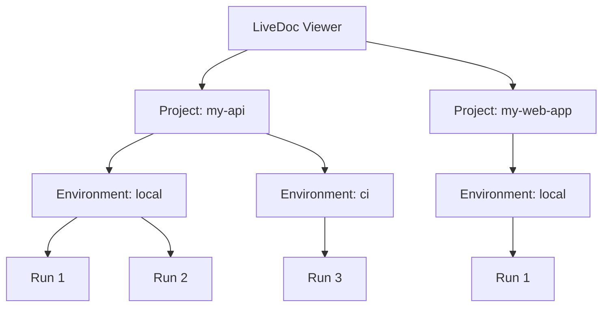
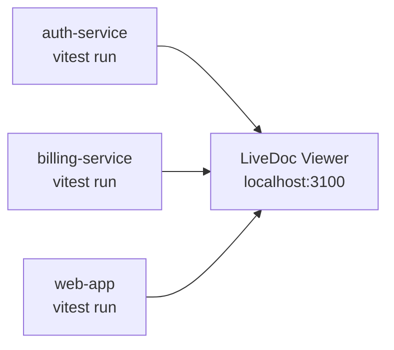

# How to Set Up Multiple Projects

<p className="intro">
This guide shows you how to configure multiple projects and environments to
send test results to a single LiveDoc Viewer instance. By the end, you'll have
a shared dashboard that organizes results by project and environment.
</p>

:::info Prerequisites
- The LiveDoc Viewer running ([Getting Started](../learn/getting-started.mdx))
- At least two projects with LiveDoc reporters configured
:::

---

## Overview

A single LiveDoc Viewer instance can receive results from multiple test
projects and environments simultaneously. The viewer organizes results into
a hierarchy:



Each combination of **project + environment** maintains its own run history,
and the viewer's project selector lets you switch between them.

---

## Step 1: Configure Project Identity

Each project sets its `project` and `environment` fields in the reporter
configuration:

import Tabs from '@theme/Tabs';
import TabItem from '@theme/TabItem';

<Tabs>
  <TabItem value="vitest" label="Vitest (TypeScript)" default>

```typescript
// packages/api/vitest.config.ts
import { defineConfig } from 'vitest/config';
import {
  LiveDocSpecReporter,
  LiveDocViewerReporter,
} from '@swedevtools/livedoc-vitest/reporter';

export default defineConfig({
  test: {
    include: ['**/*.Spec.ts'],
    globals: true,
    reporters: [
      new LiveDocSpecReporter({
        detailLevel: 'spec+summary+headers',
        postReporters: [
          new LiveDocViewerReporter({
            server: 'http://localhost:3100',
            project: 'my-api',            // ← Project name
            environment: 'local',          // ← Environment label
          }),
        ],
      }),
    ],
  },
});
```

```typescript
// packages/web/vitest.config.ts
export default defineConfig({
  test: {
    include: ['**/*.Spec.ts'],
    globals: true,
    reporters: [
      new LiveDocSpecReporter({
        detailLevel: 'spec+summary+headers',
        postReporters: [
          new LiveDocViewerReporter({
            server: 'http://localhost:3100',
            project: 'my-web-app',         // ← Different project
            environment: 'local',
          }),
        ],
      }),
    ],
  },
});
```

  </TabItem>
  <TabItem value="xunit" label="xUnit (.NET)">

```csharp
// API project
[assembly: LiveDocViewerReporter(
    "http://localhost:3100",
    Project = "my-dotnet-api",
    Environment = "local"
)]

// Web project
[assembly: LiveDocViewerReporter(
    "http://localhost:3100",
    Project = "my-dotnet-web",
    Environment = "local"
)]
```

  </TabItem>
</Tabs>

---

## Step 2: Run Tests

Start the viewer once, then run tests from each project. Results are organized
automatically:

```bash
# Terminal 1: Start the viewer
livedoc-viewer

# Terminal 2: Run API tests
cd packages/api && npx vitest run

# Terminal 3: Run web tests
cd packages/web && npx vitest run
```

Both projects' results appear in the viewer under their respective project
names.

---

## Step 3: Navigate in the Viewer

In the viewer dashboard:

1. Use the **Project selector** dropdown at the top to switch between `my-api` and `my-web-app`
2. Use the **Environment selector** to filter by `local`, `ci`, or other environments
3. Each project/environment combination has its own **run history**

---

## Environment Naming Conventions

Choose environment names that reflect your deployment contexts:

| Environment | When to use                                  |
| ----------- | -------------------------------------------- |
| `local`     | Developer workstation during local development |
| `ci`        | Continuous integration pipeline              |
| `staging`   | Pre-production environment                   |
| `production`| Production smoke tests or monitors           |

### Dynamic Environment Labels

Use environment variables to set the label automatically:

```typescript
new LiveDocViewerReporter({
  server: 'http://localhost:3100',
  project: 'my-api',
  environment: process.env.LIVEDOC_ENV
    || (process.env.CI ? 'ci' : 'local'),
}),
```

---

## Monorepo Setup

In a monorepo, each package typically has its own `vitest.config.ts`. Set a
unique `project` name per package:

```
my-monorepo/
├── packages/
│   ├── auth/        → project: "auth-service"
│   ├── billing/     → project: "billing-service"
│   └── web/         → project: "web-app"
└── livedoc-viewer   → single shared viewer
```

All packages point to the same viewer URL. The viewer's project selector shows
all three projects.



---

## Querying Multi-Project Data via API

Use the [REST API](../reference/rest-api.mdx) to query the hierarchy
programmatically:

```bash
# List all projects and their environments
curl -s http://localhost:3100/api/hierarchy | jq .

# List runs for a specific project (filter client-side)
curl -s http://localhost:3100/api/runs | jq '.[] | select(.project == "my-api")'
```

---

## Key Takeaways

- **`project`** groups results by application or service
- **`environment`** distinguishes deployment contexts (local, CI, staging)
- A **single viewer** handles multiple projects and environments
- Each **project + environment** combo has independent run history
- The **hierarchy API** exposes the full project → environment → run tree

---

## See Also

- [Getting Started](../learn/getting-started.mdx) — install and connect the viewer
- [REST API](../reference/rest-api.mdx) — query the hierarchy programmatically
- [CI/CD Dashboards](./ci-cd-dashboards.mdx) — running the viewer in CI
