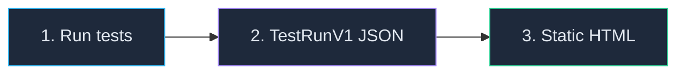

# How to Share Test Results Without a Server

<p className="intro">
LiveDoc can produce a single HTML file containing your complete test results —
features, scenarios, steps, attachments, and screenshots — that anyone can open
in a browser. No server, no internet, no setup. Just double-click and read.
</p>

:::info Prerequisites
- `@swedevtools/livedoc-vitest` (TypeScript) **or** `SweDevTools.LiveDoc.xUnit` (.NET)
- `@swedevtools/livedoc-viewer` installed (for the `export` CLI command)
:::

## The Pipeline



| Step | What happens | Output |
|------|-------------|--------|
| **Run tests** | Your test framework executes specs and exports results | `livedoc-report.json` (TestRunV1 format) |
| **Export HTML** | `livedoc-viewer export` bundles the viewer + data into one file | `report.html` (self-contained) |
| **Share** | Upload as CI artifact, deploy to Pages, email, or drop in a shared folder | Anyone opens it in a browser |

## Step 1: Configure Your Reporter to Export JSON

### TypeScript (Vitest)

Add the `export` option to `LiveDocSpecReporter`:

```typescript
// vitest.config.ts
import { defineConfig } from 'vitest/config';
import { LiveDocSpecReporter } from '@swedevtools/livedoc-vitest/reporter';

export default defineConfig({
  test: {
    globals: true,
    include: ['**/*.Spec.ts'],
    reporters: [
      new LiveDocSpecReporter({
        detailLevel: 'spec+summary+headers',
        export: {
          output: './test-results/livedoc-report.json',
        },
      }),
    ],
  },
});
```

Run your tests normally:

```bash
npx vitest run
```

The reporter prints a confirmation when the file is written:

```
✅ LiveDoc results exported to ./test-results/livedoc-report.json (1.2 MB)
```

:::tip Optional: project and environment metadata
You can set `project` and `environment` in the export config. If omitted, the
reporter falls back to the `publish` config values, then to sensible defaults
(`"default"` for project, auto-detected `"ci"` or `"local"` for environment):

```typescript
export: {
  output: './test-results/livedoc-report.json',
  project: 'my-project',
  environment: 'ci',
}
```
:::

### .NET (xUnit)

Pass the `ExportPath` parameter to the LiveDoc logger:

```bash
dotnet test --logger "LiveDoc;ExportPath=./test-results/livedoc-report.json;Project=my-project;Environment=ci"
```

| Parameter     | Description                                |
| ------------- | ------------------------------------------ |
| `ExportPath`  | Path to write the TestRunV1 JSON file      |
| `Project`     | Project name label in the report           |
| `Environment` | Environment label (e.g., `ci`, `local`)    |

The logger creates directories automatically and prints the same confirmation:

```
✅ LiveDoc results exported to ./test-results/livedoc-report.json (845.2 KB)
```

:::info Export runs alongside console output
In both SDKs, the JSON export runs **in addition to** console output and server
publishing. It doesn't replace either — you get all output channels when
all are configured.
:::

## Step 2: Generate the Static HTML Report

Use the `livedoc-viewer export` command to convert the JSON file into a
self-contained HTML report:

```bash
npx @swedevtools/livedoc-viewer export \
  --input ./test-results/livedoc-report.json \
  --output ./test-results/report.html
```

You can set a custom title (defaults to the project name from the JSON):

```bash
npx @swedevtools/livedoc-viewer export \
  -i ./test-results/livedoc-report.json \
  -o ./test-results/report.html \
  -t "Sprint 42 — Regression Results"
```

| Flag | Description | Default |
| ---- | ----------- | ------- |
| `-i, --input` | Path to TestRunV1 JSON file | *(required)* |
| `-o, --output` | Output HTML file path | `./livedoc-report.html` |
| `-t, --title` | Report title | Project name from JSON |

On success:

```
✅ LiveDoc report exported successfully!
   Input:  ./test-results/livedoc-report.json
   Output: /home/ci/project/test-results/report.html
   Size:   847.3 KB

   Open in any browser to view your test results.
```

### What's in the HTML file?

The generated HTML is completely self-contained:

- **Full LiveDoc Viewer** — the same React application you see in the browser, bundled inline
- **All test data** — features, scenarios, steps, timing, errors, tags
- **All attachments** — screenshots and file attachments are embedded as base64
- **Dark theme** — matches the Viewer's default appearance
- **Zero external dependencies** — no CDN links, no fetch calls, no internet needed

:::tip File size expectations
| Content | Typical size |
|---------|-------------|
| Tests only (no screenshots) | 700 KB – 1 MB |
| Tests + a few screenshots | 2 – 5 MB |
| Tests + many high-res screenshots | 10 MB+ |

The bulk of the base size is the bundled Viewer JavaScript and CSS. Screenshots
add size proportional to their resolution and count.
:::

## Step 3: Share the Report

The HTML file is a single file you can share however works for your team:

- **CI artifact** — upload with `actions/upload-artifact` (GitHub) or `artifacts:` (GitLab)
- **GitHub Pages** — deploy as a static site for a permanent URL
- **Email** — attach to a release email or review request
- **Shared drive** — drop in a network folder, SharePoint, or Google Drive
- **Pull request comment** — link to the CI artifact URL
- **Slack / Teams** — upload directly to a channel

## CI/CD Integration

For complete CI pipeline examples including GitHub Actions, GitLab CI, Azure
DevOps, and GitHub Pages deployment, see the per-SDK CI/CD guides:

- **[Vitest CI/CD Guide](../../vitest/guides/ci-cd.mdx)** — includes CI-specific
  config (`allowOnly`, `fileParallelism`), tag filtering, and complete workflows
- **[xUnit CI/CD Guide](../../xunit/guides/ci-cd.mdx)** — includes build config
  matching, journey test gotchas, and complete workflows
- **[Viewer CI/CD Guide](./ci-cd-dashboards.mdx)** — GitHub Pages deployment,
  multi-project reports, and live dashboard setup

## Troubleshooting

| Problem | Cause | Solution |
|---------|-------|----------|
| `Input file not found` | JSON file wasn't created | Verify the `export.output` path in your config matches the `--input` path |
| `Invalid TestRunV1 format` | Wrong JSON format | Ensure you're using the `export` option (TestRunV1), not `JsonReporter` (SDK model) |
| `Webview assets not found` | Viewer not built | Run `pnpm build` in the viewer package, or use `npx` which resolves the built package |
| HTML file is very large | Many screenshots | Screenshots are base64-encoded; consider reducing resolution or count |
| Report shows no data | Empty test run | Check that tests actually ran and the JSON file contains test results |
| Report shows "Run in progress" | Older viewer version | Update to the latest `@swedevtools/livedoc-viewer` |

## See Also

- [CLI Options — `export` subcommand](../reference/cli-options.mdx#export-subcommand) — full command reference
- [Vitest Reporter — Export Options](../../vitest/reference/reporters.mdx#export-options) — configure JSON export in TypeScript
- [xUnit Configuration](../../xunit/reference/configuration.mdx) — configure JSON export in .NET