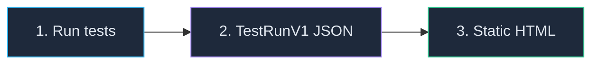

# How to Share Test Results Without a Server

<p className="intro">
LiveDoc can produce a single HTML file containing your complete test results —
features, scenarios, steps, attachments, and screenshots — that anyone can open
in a browser. No server, no internet, no setup. Just double-click and read.
</p>

:::info Prerequisites
- `@swedevtools/livedoc-vitest` (TypeScript) **or** `SweDevTools.LiveDoc.xUnit` (.NET)
- `@swedevtools/livedoc-viewer` installed (for the `export` CLI command)
:::

## The Pipeline

The static export pipeline has three steps:



| Step | What happens | Output |
|------|-------------|--------|
| **Run tests** | Your test framework executes specs and exports results | `livedoc-report.json` (TestRunV1 format) |
| **Export HTML** | `livedoc-viewer export` bundles the viewer + data into one file | `report.html` (self-contained) |
| **Share** | Upload as CI artifact, email, or drop in a shared folder | Anyone opens it in a browser |

## Step 1: Configure Your Reporter to Export JSON

### TypeScript (Vitest)

Add the `export` option to `LiveDocSpecReporter`:

```typescript
// vitest.config.ts
import { defineConfig } from 'vitest/config';
import { LiveDocSpecReporter } from '@swedevtools/livedoc-vitest/reporter';

export default defineConfig({
  test: {
    globals: true,
    include: ['**/*.Spec.ts'],
    reporters: [
      new LiveDocSpecReporter({
        detailLevel: 'spec+summary+headers',
        export: {
          output: './test-results/livedoc-report.json',
        },
      }),
    ],
  },
});
```

Run your tests normally:

```bash
npx vitest run
```

The reporter prints a confirmation when the file is written:

```
✅ LiveDoc results exported to ./test-results/livedoc-report.json (1.2 MB)
```

:::tip Optional: project and environment metadata
You can set `project` and `environment` in the export config. If omitted, the
reporter falls back to the `publish` config values, then to sensible defaults
(`"default"` for project, auto-detected `"ci"` or `"local"` for environment):

```typescript
export: {
  output: './test-results/livedoc-report.json',
  project: 'my-project',
  environment: 'ci',
}
```
:::

### .NET (xUnit)

Set the `LIVEDOC_EXPORT_PATH` environment variable:

```bash
# Linux / macOS
LIVEDOC_EXPORT_PATH=./test-results/livedoc-report.json dotnet test --logger LiveDoc

# Windows PowerShell
$env:LIVEDOC_EXPORT_PATH = "./test-results/livedoc-report.json"
dotnet test --logger LiveDoc
```

You can also set project and environment metadata:

```bash
LIVEDOC_EXPORT_PATH=./test-results/livedoc-report.json \
LIVEDOC_PROJECT=my-dotnet-app \
LIVEDOC_ENVIRONMENT=ci \
dotnet test --logger LiveDoc
```

The reporter prints the same confirmation:

```
✅ LiveDoc results exported to ./test-results/livedoc-report.json (845.2 KB)
```

:::info Export runs alongside server publishing
In both SDKs, the JSON export runs **in addition to** console output and server
publishing. It doesn't replace either — you get all three output channels when
all are configured.
:::

## Step 2: Generate the Static HTML Report

Use the `livedoc-viewer export` command to convert the JSON file into a
self-contained HTML report:

```bash
npx livedoc-viewer export \
  --input ./test-results/livedoc-report.json \
  --output ./test-results/report.html
```

You can set a custom title (defaults to the project name from the JSON):

```bash
npx livedoc-viewer export \
  -i ./test-results/livedoc-report.json \
  -o ./test-results/report.html \
  -t "Sprint 42 — Regression Results"
```

On success:

```
✅ LiveDoc report exported successfully!
   Input:  ./test-results/livedoc-report.json
   Output: /home/ci/project/test-results/report.html
   Size:   847.3 KB

   Open in any browser to view your test results.
```

### What's in the HTML file?

The generated HTML is completely self-contained:

- **Full LiveDoc Viewer** — the same React application you see in the browser, bundled inline
- **All test data** — features, scenarios, steps, timing, errors, tags
- **All attachments** — screenshots and file attachments are embedded as base64
- **Dark theme** — matches the Viewer's default appearance
- **Zero external dependencies** — no CDN links, no fetch calls, no internet needed

:::tip File size expectations
| Content | Typical size |
|---------|-------------|
| Tests only (no screenshots) | 700 KB – 1 MB |
| Tests + a few screenshots | 2 – 5 MB |
| Tests + many high-res screenshots | 10 MB+ |

The bulk of the base size is the bundled Viewer JavaScript and CSS. Screenshots
add size proportional to their resolution and count.
:::

## Step 3: Share the Report

The HTML file is a single file you can share in any way that works for your team:

- **CI artifact** — upload with `actions/upload-artifact` (GitHub) or `artifacts:` (GitLab)
- **Email** — attach to a release email or review request
- **Shared drive** — drop in a network folder, SharePoint, or Google Drive
- **Pull request comment** — link to the CI artifact URL
- **Slack / Teams** — upload directly to a channel

## Complete CI Examples

### GitHub Actions (TypeScript)

```yaml
# .github/workflows/livedoc-tests.yml
name: LiveDoc Tests

on:
  push:
    branches: [main]
  pull_request:
    branches: [main]

jobs:
  test:
    runs-on: ubuntu-latest

    steps:
      - uses: actions/checkout@v4

      - uses: actions/setup-node@v4
        with:
          node-version: 20
          cache: npm

      - name: Install dependencies
        run: npm ci

      - name: Run tests
        run: npx vitest run
        env:
          CI: 'true'

      - name: Generate HTML report
        if: always()
        run: npx livedoc-viewer export -i ./test-results/livedoc-report.json -o ./test-results/report.html

      - name: Upload test results
        if: always()
        uses: actions/upload-artifact@v4
        with:
          name: livedoc-report
          path: |
            test-results/livedoc-report.json
            test-results/report.html
          retention-days: 30
```

### GitHub Actions (.NET)

```yaml
# .github/workflows/livedoc-dotnet.yml
name: LiveDoc .NET Tests

on:
  push:
    branches: [main]
  pull_request:
    branches: [main]

jobs:
  test:
    runs-on: ubuntu-latest

    steps:
      - uses: actions/checkout@v4

      - uses: actions/setup-dotnet@v4
        with:
          dotnet-version: '8.0'

      - uses: actions/setup-node@v4
        with:
          node-version: 20
          cache: npm

      - name: Install viewer CLI
        run: npm install -g @swedevtools/livedoc-viewer

      - name: Run .NET tests
        run: dotnet test --logger LiveDoc
        env:
          LIVEDOC_EXPORT_PATH: ./test-results/livedoc-report.json
          LIVEDOC_PROJECT: my-dotnet-app
          LIVEDOC_ENVIRONMENT: ci

      - name: Generate HTML report
        if: always()
        run: livedoc-viewer export -i ./test-results/livedoc-report.json -o ./test-results/report.html

      - name: Upload test results
        if: always()
        uses: actions/upload-artifact@v4
        with:
          name: livedoc-report
          path: |
            test-results/livedoc-report.json
            test-results/report.html
          retention-days: 30
```

### GitHub Actions (Both SDKs in one pipeline)

```yaml
name: Full LiveDoc Pipeline

on:
  push:
    branches: [main]

jobs:
  test-typescript:
    runs-on: ubuntu-latest
    steps:
      - uses: actions/checkout@v4
      - uses: actions/setup-node@v4
        with: { node-version: 20, cache: npm }
      - run: npm ci
      - name: Run TypeScript tests
        run: npx vitest run
        env:
          CI: 'true'
      - name: Generate HTML report
        if: always()
        run: npx livedoc-viewer export -i ./test-results/livedoc-report.json -o ./test-results/ts-report.html -t "TypeScript Tests"
      - uses: actions/upload-artifact@v4
        if: always()
        with:
          name: ts-livedoc-report
          path: test-results/

  test-dotnet:
    runs-on: ubuntu-latest
    steps:
      - uses: actions/checkout@v4
      - uses: actions/setup-dotnet@v4
        with: { dotnet-version: '8.0' }
      - uses: actions/setup-node@v4
        with: { node-version: 20, cache: npm }
      - run: npm install -g @swedevtools/livedoc-viewer
      - name: Run .NET tests
        run: dotnet test --logger LiveDoc
        env:
          LIVEDOC_EXPORT_PATH: ./test-results/livedoc-report.json
          LIVEDOC_ENVIRONMENT: ci
      - name: Generate HTML report
        if: always()
        run: livedoc-viewer export -i ./test-results/livedoc-report.json -o ./test-results/dotnet-report.html -t ".NET Tests"
      - uses: actions/upload-artifact@v4
        if: always()
        with:
          name: dotnet-livedoc-report
          path: test-results/
```

### GitLab CI

```yaml
# .gitlab-ci.yml
livedoc-tests:
  image: node:20
  stage: test
  script:
    - npm ci
    - npx vitest run
    - npx livedoc-viewer export -i ./test-results/livedoc-report.json -o ./test-results/report.html
  variables:
    CI: 'true'
  artifacts:
    when: always
    paths:
      - test-results/
    expire_in: 30 days
```

## Troubleshooting

| Problem | Cause | Solution |
|---------|-------|----------|
| `Input file not found` | JSON file wasn't created | Verify the `export.output` path in your vitest config matches the `--input` path |
| `Invalid TestRunV1 format` | Wrong JSON format | Ensure you're using the `export` option (TestRunV1), not `JsonReporter` (SDK model) |
| `Webview assets not found` | Viewer not built | Run `pnpm build` in the viewer package, or use `npx` which resolves the built package |
| HTML file is very large | Many screenshots | Screenshots are base64-encoded; consider reducing resolution or count |
| Report shows no data | Empty test run | Check that tests actually ran and the JSON file contains test results |

## See Also

- [CLI Options — `export` subcommand](../reference/cli-options.mdx#export-subcommand) — full command reference
- [Vitest Reporter — Export Options](../../vitest/reference/reporters.mdx#export-options) — configure JSON export in TypeScript
- [xUnit — Export Configuration](../../xunit/reference/configuration.mdx#export-configuration) — configure JSON export in .NET
- [CI/CD Integration (Vitest)](../../vitest/guides/ci-cd.mdx) — complete Vitest CI guide
- [CI/CD Dashboards](./ci-cd-dashboards.mdx) — using the Viewer server in CI (alternative to static export)
