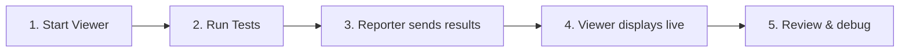

# Getting Started

<p className="intro">
In this guide you'll install the LiveDoc Viewer, start the dashboard, connect it
to your test framework, and watch test results appear in real time — all in
under five minutes.
</p>

## What You'll Build

By the end of this page you will have:

- The **LiveDoc Viewer** running at `http://localhost:3100`
- A **test reporter** sending results to the viewer
- A **live dashboard** showing features, scenarios, and step results as tests execute

---

## Prerequisites

- **Node.js 18+** installed
- A project using **@swedevtools/livedoc-vitest** or **LiveDoc.xUnit** (.NET)

---

## Step 1: Install the Viewer

import Tabs from '@theme/Tabs';
import TabItem from '@theme/TabItem';

<Tabs>
  <TabItem value="global" label="Global (recommended)" default>
    ```bash
    npm install -g @swedevtools/livedoc-viewer
    ```
  </TabItem>
  <TabItem value="dev" label="Dev dependency">
    ```bash
    npm install -D @swedevtools/livedoc-viewer
    ```
  </TabItem>
</Tabs>

---

## Step 2: Start the Viewer

```bash
livedoc-viewer
```

The viewer opens your default browser at **`http://localhost:3100`** and waits
for incoming test results.

{/*  */}

:::tip Custom port
If port 3100 is taken, pick another:
```bash
livedoc-viewer --port 8080
```
See [CLI Options](../reference/cli-options.mdx) for all flags.
:::

---

## Step 3: Connect Your Test Framework

<Tabs>
  <TabItem value="vitest" label="Vitest (TypeScript)" default>

Add `LiveDocSpecReporter` to your Vitest configuration — it auto-discovers
a running viewer and publishes results automatically:

```typescript
// vitest.config.ts
import { defineConfig } from 'vitest/config';
import { LiveDocSpecReporter } from '@swedevtools/livedoc-vitest/reporter';

export default defineConfig({
  test: {
    include: ['**/*.Spec.ts'],
    globals: true,
    reporters: [
      new LiveDocSpecReporter({
        detailLevel: 'spec+summary+headers',
      }),
      // Auto-discovers the viewer — no extra reporter needed
    ],
  },
});
```

For **explicit control** over the viewer connection, use `LiveDocViewerReporter`
as a post-reporter:

```typescript
import {
  LiveDocSpecReporter,
  LiveDocViewerReporter,
} from '@swedevtools/livedoc-vitest/reporter';

reporters: [
  new LiveDocSpecReporter({
    detailLevel: 'spec+summary+headers',
    postReporters: [
      new LiveDocViewerReporter({
        server: 'http://localhost:3100',
        project: 'my-project',
      }),
    ],
  }),
],
```

  </TabItem>
  <TabItem value="xunit" label="xUnit (.NET)">

Add the `[LiveDocViewerReporter]` attribute to your assembly:

```csharp
// In your test project (e.g., AssemblyInfo.cs)
[assembly: LiveDocViewerReporter("http://localhost:3100")]
```

See the [xUnit Getting Started](/xunit/learn/getting-started) guide for full details.

  </TabItem>
</Tabs>

---

## Step 4: Run Your Tests

```bash
npx vitest run
```

Switch to your browser — the viewer dashboard updates **in real time** as each
scenario and step completes.

{/*  */}

---

## The Workflow



1. **Start the viewer** — `livedoc-viewer`
2. **Run your tests** — `npx vitest run` (or `dotnet test`)
3. **Reporter posts results** — each scenario streams to the viewer as it finishes
4. **Dashboard updates live** — features, scenarios, and steps appear in real time
5. **Debug failures** — click any failed step to see the error message and stack trace

---

## Recap

- **Install** with `npm install -g @swedevtools/livedoc-viewer`
- **Start** with `livedoc-viewer` (opens at `http://localhost:3100`)
- **Connect** via `LiveDocSpecReporter` (auto-discovers the viewer) or `LiveDocViewerReporter` (explicit URL)
- **Run tests** and watch results stream into the browser

---

## Next Steps

- **Explore the UI**: [Understanding the UI](./understanding-the-ui.mdx) — learn what each panel shows
- **CLI flags**: [CLI Options](../reference/cli-options.mdx) — all command-line options
- **CI pipelines**: [CI/CD Dashboards](../guides/ci-cd-dashboards.mdx) — run the viewer in CI
