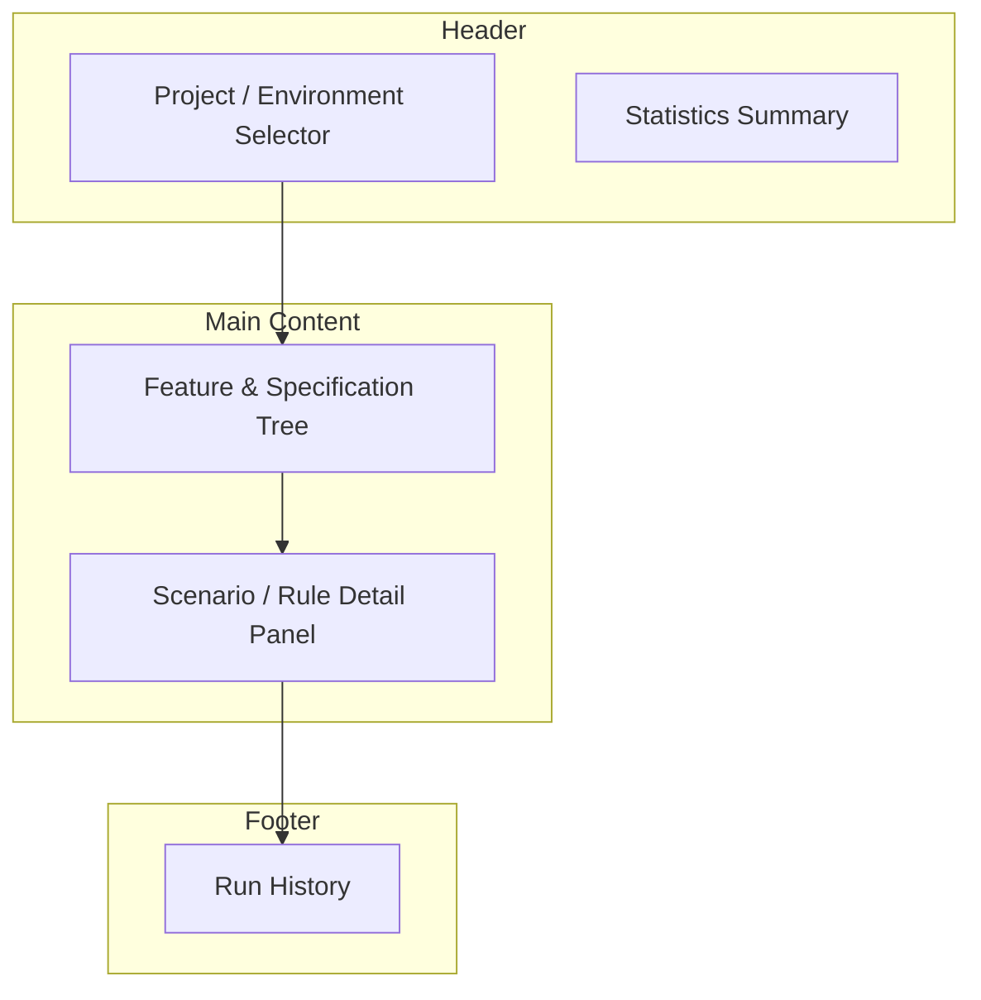
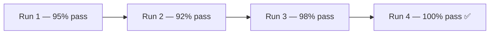

# Understanding the UI

<p className="intro">
The LiveDoc Viewer presents your BDD test results in a navigable, real-time
dashboard. This page walks through every panel so you know where to find what
you need.
</p>

---

## Dashboard Overview

When you open the viewer at `http://localhost:3100`, you see a layout organized
into these areas:




---

## Project & Environment Selector

At the top of the dashboard, the **project selector** lets you switch between
projects and environments. If multiple projects or environments post results to
the same viewer instance, they appear here as separate entries.

- **Project** — a logical grouping (e.g., `my-api`, `my-web-app`)
- **Environment** — a deployment context (e.g., `local`, `ci`, `staging`)

Select a project and environment to filter the results shown below.

:::tip Multi-project setup
See [Multi-Project Setup](../guides/multi-project-setup.mdx) for how to
configure multiple projects posting to the same viewer.
:::

---

## Feature & Specification Tree

The left panel displays a **collapsible tree** of all features and
specifications from the selected run:


- **Features** appear as top-level nodes with their title and tags
- **Specifications** appear alongside features at the top level
- **Scenarios / Rules** nest under their parent feature or specification
- **Status indicators** show pass ✅, fail ❌, or skip ⏭️ at a glance

Click any feature to expand its scenarios, or click a scenario to open it in
the detail panel.

### Filtering & Search

Use the search bar above the tree to filter by:

- **Feature or scenario name** — type any part of the title
- **Tags** — filter by `@tag` values assigned to features or scenarios
- **Status** — show only passing, failing, or skipped items

---

## Scenario Drill-Down

Selecting a scenario (or rule) in the tree opens the **detail panel**, which
shows:

### Step-by-Step Results


Each step (`Given`, `When`, `Then`, `And`, `But`) is listed with:

| Element         | Description                                        |
| --------------- | -------------------------------------------------- |
| **Step keyword** | The Gherkin keyword (`Given`, `When`, `Then`, etc.) |
| **Step title**   | The full step title with embedded values            |
| **Status icon**  | ✅ passed, ❌ failed, ⏭️ skipped                   |
| **Duration**     | How long the step took to execute                   |

### Failure Details

When a step fails, the detail panel expands to show:

{/*  */}

- **Error message** — the assertion or exception message
- **Stack trace** — the full call stack pointing to the failing line
- **Expected vs. Actual** — for assertion failures, a clear diff of what was expected and what was received

> **Example: A Failing Step**
>
> ```
> ✗ Then the balance should be '300' dollars
>
>   Error: expected 250 to be 300
>
>   at Context.<anonymous> (tests/Account.Spec.ts:42:27)
> ```
>
> **Result**: You immediately see which step failed, what the expected value was,
> and the exact file and line number to investigate.

---

## Statistics Summary

{/*  */}

The top-right area displays a **statistics summary** for the current run:

| Metric            | What it shows                              |
| ----------------- | ------------------------------------------ |
| **Features**       | Total features / specifications in the run |
| **Scenarios**      | Total scenarios / rules                    |
| **Steps**          | Total steps executed                       |
| **Passed**         | Count and percentage of passing steps      |
| **Failed**         | Count and percentage of failing steps      |
| **Skipped**        | Count of skipped steps                     |
| **Duration**       | Total run time                             |

This gives you an at-a-glance health check of your test suite.

---

## Run History

{/*  */}

The viewer persists results across runs. The **run history** section lets you:

- **Browse previous runs** — see when each run occurred and its pass/fail summary
- **Compare runs** — select two runs to see what changed between them
- **Track trends** — spot regressions or improvements over time

Test results are stored locally in `.livedoc/data` within your project
directory as JSON files. Results survive server restarts and can be processed
by external tools.



---

## Real-Time Updates

The viewer connects to the server via **WebSocket**, so results appear
instantly as tests execute — no need to refresh. You'll see:

- New features and scenarios appear in the tree as they start
- Step statuses update from pending to passed/failed in real time
- Statistics recalculate after each scenario completes

If the WebSocket connection drops, the viewer automatically attempts to
reconnect. You can also refresh the page to re-establish the connection.

---

## Key Takeaways

- **Project selector** filters results by project and environment
- **Feature tree** gives a collapsible, searchable overview of all test results
- **Detail panel** shows step-by-step results with failure diagnostics
- **Statistics** provide an at-a-glance health check
- **Run history** enables comparison and trend tracking
- **WebSocket** powers instant, real-time updates

---

## Next Steps

- **Reference**: [CLI Options](../reference/cli-options.mdx) — customize how the viewer starts
- **Reference**: [REST API](../reference/rest-api.mdx) — query results programmatically
- **Guide**: [CI/CD Dashboards](../guides/ci-cd-dashboards.mdx) — use the viewer in CI pipelines
