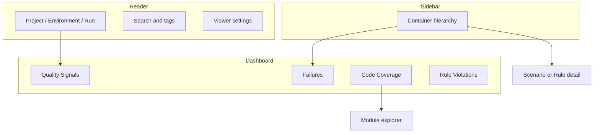
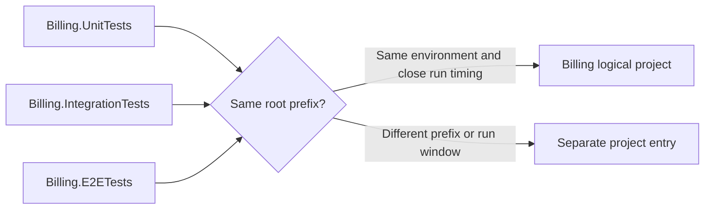
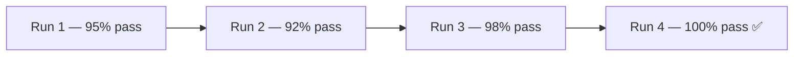
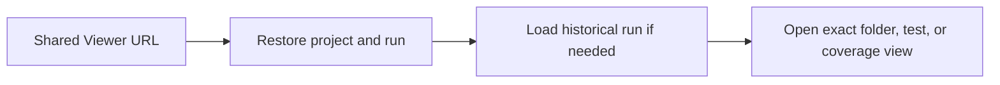

# Understanding the UI

<p className="intro">
The LiveDoc Viewer presents your BDD test results in a navigable, real-time
dashboard. This page walks through every panel so you know where to find what
you need.
</p>

---

## Dashboard Overview

When you open the viewer at `http://localhost:3100`, you see a layout organized
into these areas:



```mermaid
graph TD
    subgraph Header
        PS[Project / Environment / Run]
        FILTER[Search and tags]
        SETTINGS[Viewer settings]
    end
    subgraph Sidebar
        TREE[Container hierarchy]
    end
    subgraph Dashboard
        SIGNALS[Quality Signals]
        FAILURES[Failures]
        COVERAGE[Code Coverage]
        RULES[Rule Violations]
    end
    PS --> SIGNALS
    TREE --> FAILURES
    COVERAGE --> EXPLORER[Module explorer]
    TREE --> DETAIL[Scenario or Rule detail]
```

The dashboard is deliberately conditional. Coverage appears only when the run
contains file-level coverage; Failures and Rule Violations appear only when
there is something to review.

---

## Project & Environment Selector

At the top of the dashboard, the **project selector** lets you switch between
projects and environments. If multiple projects or environments post results to
the same viewer instance, they appear here as separate entries.

- **Project** — a logical grouping (e.g., `my-api`, `my-web-app`)
- **Environment** — a deployment context (e.g., `local`, `ci`, `staging`)

Select a project and environment to filter the results shown below.

:::tip Multi-project setup
See [Multi-Project Setup](../guides/multi-project-setup.mdx) for how to
configure multiple projects posting to the same viewer.
:::

### Logical Project Grouping

Some solutions split one product into several test projects: for example,
`Billing.UnitTests`, `Billing.IntegrationTests`, and `Billing.E2ETests`. When
those projects run together, the viewer can present them as one logical project
so the project selector stays focused on the product instead of every physical
test assembly.


```mermaid
graph LR
    U[Billing.UnitTests] --> D{Same root prefix?}
    I[Billing.IntegrationTests] --> D
    E[Billing.E2ETests] --> D
    D -->|Same environment and close run timing| G[Billing logical project]
    D -->|Different prefix or run window| S[Separate project entry]
```

The first time the viewer detects a group, it asks whether you want to use the
grouped view or keep each test project separate. Grouping uses three signals:

| Signal | What the viewer checks | Why it matters |
| ------ | ---------------------- | -------------- |
| Root project prefix | Shared name before test-type suffixes such as `Unit`, `Integration`, `Tests`, or `E2E` | Keeps related test projects together without merging unrelated products |
| Environment | Matching labels such as `local`, `ci`, or `staging` | Prevents local and CI runs from being mixed |
| Run timing | Runs overlap, or one starts within 60 seconds of another in the set completing | Treats sequential and parallel test-project runs as one logical execution |

Use **Viewer settings > Group related test projects** to turn grouping on or off
later. When grouping is enabled, **Hide grouped source projects** keeps physical
test projects out of the project selector once they are represented by a logical
group. The source projects still appear as folders inside the grouped run, so
you can tell where each feature or specification came from without cluttering
the top-level project list.

The selector shows only the newest logical group for each project and
environment. Older grouped executions remain available from the **Run** menu.
Enable **Always show latest run** when you want the Viewer to follow each new
execution automatically; leave it disabled when you want the current historical
selection to remain stable.


---

## Feature & Specification Tree

The left panel displays a **collapsible tree** of all features and
specifications from the selected run:


- **Features** appear as top-level nodes with their title and tags
- **Specifications** appear alongside features at the top level
- **Scenarios / Rules** nest under their parent feature or specification
- **Status indicators** show pass ✅, fail ❌, or skip ⏭️ at a glance

Click any feature to expand its scenarios, or click a scenario to open it in
the detail panel.

### Filtering & Search

Use the search bar above the tree to filter by:

- **Feature or scenario name** — type any part of the title
- **Tags** — filter by `@tag` values assigned to features or scenarios
- **Status** — show only passing, failing, or skipped items

---

## Scenario Drill-Down

Selecting a scenario (or rule) in the tree opens the **detail panel**, which
shows:

### Step-by-Step Results


Each step (`Given`, `When`, `Then`, `And`, `But`) is listed with:

| Element         | Description                                        |
| --------------- | -------------------------------------------------- |
| **Step keyword** | The Gherkin keyword (`Given`, `When`, `Then`, etc.) |
| **Step title**   | The full step title with embedded values            |
| **Status icon**  | ✅ passed, ❌ failed, ⏭️ skipped                   |
| **Duration**     | How long the step took to execute                   |

### Failure Details

When a step fails, the detail panel expands to show:


- **Error message** — the assertion or exception message
- **Stack trace** — the full call stack pointing to the failing line
- **Expected vs. Actual** — for assertion failures, a clear diff of what was expected and what was received

> **Example: A Failing Step**
>
> ```
> ✗ Then the balance should be '300' dollars
>
>   Error: expected 250 to be 300
>
>   at Context.<anonymous> (tests/Account.Spec.ts:42:27)
> ```
>
> **Result**: You immediately see which step failed, what the expected value was,
> and the exact file and line number to investigate.

---

## Statistics Summary

The **Quality Signals** card displays the current run's primary health metrics:

| Metric | What it shows |
| ------ | ------------- |
| **Tests** | Total executable scenarios, rules, and outline examples |
| **Failed** | Authoritative failed-test count from the runner |
| **Rule violations** | Non-fatal specification-quality warnings |
| **Coverage** | Weighted line coverage, shown only when coverage exists |
| **Duration** | Full run duration, or latest-update duration for a combined partial view |

Below the card, the status bar shows the relative passed, failed, pending, and
skipped result counts.

## Failures and Rule Violations

Failures, code coverage, and rule violations use the same full-width visual
language. Each section has a summary header and rows that navigate directly to
the relevant specification.


Rule violations are warnings. A test can pass while still reporting a warning
such as a scenario missing a Given step.

## Code Coverage

Coverage is hidden until the selected run contains file-level data. When
available, the dashboard shows module health and a link to the explorer.


The explorer pivots around projects/modules rather than raw file-system roots.
Top-level rows show line and branch percentages, file count, and covered/total
lines. Modules are collapsed by default and redundant common path prefixes are
removed before you drill into folders.


See [Code Coverage](../guides/code-coverage.mdx) for Vitest, xUnit, Visual
Studio, dependency, and troubleshooting guidance.

---

## Run History

{/*  */}

The viewer persists results across runs. The **Run** menu lets you:

- **Browse previous runs** with status and timestamp
- **Distinguish Full and Partial runs** with derived badges
- **Choose Combined or This partial** when inspecting a completed focused run
- **Keep a historical selection stable**, or enable **Always show latest run**

Test results are stored locally in `.livedoc/data` within your project
directory as JSON files. Results survive server restarts and can be processed
by external tools.


```mermaid
graph LR
    R1[Run 1 — 95% pass] --> R2[Run 2 — 92% pass]
    R2 --> R3[Run 3 — 98% pass]
    R3 --> R4["Run 4 — 100% pass ✅"]
```

---

## Real-Time Updates

The viewer connects to the server via **WebSocket**, so results appear
instantly as tests execute — no need to refresh. You'll see:

- New features and scenarios appear in the tree as they start
- Step statuses update from pending to passed/failed in real time
- Statistics recalculate after each scenario completes
- Completed logical project groups replace the current selector entry instead of
  accumulating duplicates


The header badge reports connection health only: **Connected**, **Connecting**,
**Disconnected**, or **Error**. Live test activity always uses the banner below
the header. The banner remains visible for raw, partial, and grouped runs even
when you are inspecting history, and **View live run** switches to that active
execution. The sidebar uses one running status spinner when the live run is selected.

If the WebSocket connection drops, the Viewer automatically attempts to
reconnect. The connection badge changes, while the banner continues to represent
test-run activity rather than socket state.

## Deep Links

Every browser URL preserves the selected project, environment, exact run or
logical group, Combined/physical projection, and current dashboard, coverage,
folder, or test view.


```mermaid
flowchart LR
    URL[Shared Viewer URL] --> SELECT[Restore project and run]
    SELECT --> LOAD[Load historical run if needed]
    LOAD --> VIEW[Open exact folder, test, or coverage view]
```

Copy the browser address to share the current investigation. Older node-only
hash links remain supported, while contextual links prevent an identically
named scenario in another run from being selected accidentally.

---

## Key Takeaways

- **Project selector** filters results by project and environment
- **Run selector** supports Full/Partial history and optional latest-run following
- **Feature tree** gives a collapsible, searchable overview of all test results
- **Detail panel** shows step-by-step results with failure diagnostics
- **Quality Signals** combine test, rule, coverage, and duration health
- **Coverage explorer** presents weighted line and branch metrics by module
- **Deep links** restore the exact project, run, projection, and view
- **WebSocket** powers instant, real-time updates

---

## Next Steps

- **Reference**: [CLI Options](../reference/cli-options.mdx) — customize how the viewer starts
- **Reference**: [REST API](../reference/rest-api.mdx) — query results programmatically
- **Guide**: [Code Coverage](../guides/code-coverage.mdx) — configure Vitest, xUnit, and Visual Studio
- **Guide**: [CI/CD Dashboards](../guides/ci-cd-dashboards.mdx) — use the viewer in CI pipelines
