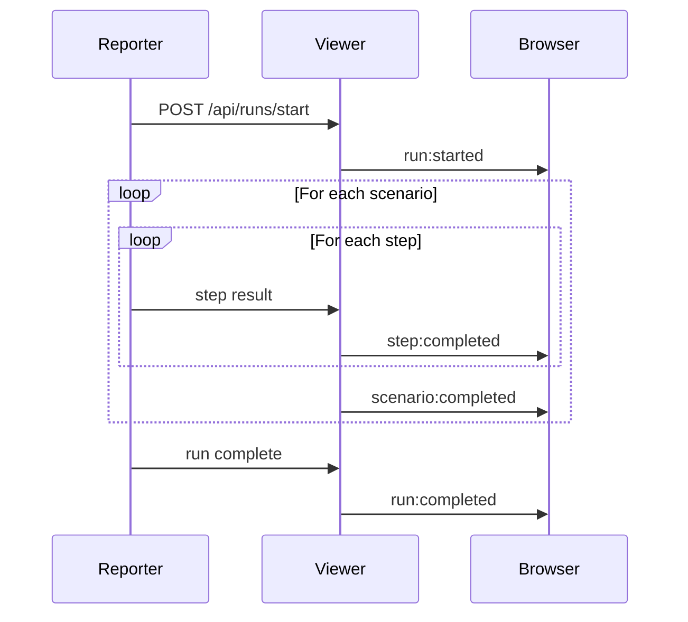

# WebSocket API

<p className="intro">
The LiveDoc Viewer uses WebSocket connections to push test results to the
browser in real time. This page documents the WebSocket endpoint, message
format, and available event types.
</p>

---

## Connecting {#connecting}

Connect to the `/ws` path on the viewer's host and port:

```
ws://localhost:3100/ws
```

The server accepts standard WebSocket connections. All messages are JSON-encoded
strings.

### JavaScript Example

```javascript
const ws = new WebSocket('ws://localhost:3100/ws');

ws.onopen = () => {
  console.log('Connected to LiveDoc Viewer');
};

ws.onmessage = (event) => {
  const message = JSON.parse(event.data);
  console.log(`Event: ${message.type}`, message.payload);
};

ws.onclose = () => {
  console.log('Disconnected from LiveDoc Viewer');
};

ws.onerror = (error) => {
  console.error('WebSocket error:', error);
};
```

### Node.js Example

```javascript
import WebSocket from 'ws';

const ws = new WebSocket('ws://localhost:3100/ws');

ws.on('open', () => {
  console.log('Connected');
});

ws.on('message', (data) => {
  const message = JSON.parse(data.toString());
  console.log(`${message.type}:`, message.payload);
});
```

---

## Message Format {#message-format}

Every WebSocket message follows this structure:

```typescript
interface WebSocketMessage {
  type: string;      // Event type identifier
  payload: unknown;  // Event-specific data
}
```

```json
{
  "type": "run:started",
  "payload": {
    "runId": "run-004",
    "project": "my-api",
    "environment": "local",
    "startedAt": "2025-01-15T10:30:00Z"
  }
}
```

---

## Event Types {#event-types}

### `run:started` {#run-started}

Emitted when a new test run begins.

```json
{
  "type": "run:started",
  "payload": {
    "runId": "run-004",
    "project": "my-api",
    "environment": "local",
    "startedAt": "2025-01-15T10:30:00Z"
  }
}
```

---

### `run:completed` {#run-completed}

Emitted when a test run finishes (all features/scenarios done).

```json
{
  "type": "run:completed",
  "payload": {
    "runId": "run-004",
    "completedAt": "2025-01-15T10:30:45Z",
    "summary": {
      "features": 5,
      "scenarios": 23,
      "passed": 22,
      "failed": 1,
      "skipped": 0,
      "duration": 45000
    }
  }
}
```

---

### `scenario:completed` {#scenario-completed}

Emitted when a single scenario (or rule) finishes execution.

```json
{
  "type": "scenario:completed",
  "payload": {
    "runId": "run-004",
    "feature": "User Authentication",
    "scenario": "Successful login",
    "status": "passed",
    "steps": [
      {
        "keyword": "Given",
        "title": "a registered user",
        "status": "passed",
        "duration": 12
      },
      {
        "keyword": "When",
        "title": "the user submits valid credentials",
        "status": "passed",
        "duration": 25
      },
      {
        "keyword": "Then",
        "title": "the user is logged in",
        "status": "passed",
        "duration": 8
      }
    ],
    "duration": 45
  }
}
```

---

### `step:completed` {#step-completed}

Emitted when an individual step finishes. This provides the most granular
real-time feedback.

```json
{
  "type": "step:completed",
  "payload": {
    "runId": "run-004",
    "feature": "User Authentication",
    "scenario": "Successful login",
    "step": {
      "keyword": "Given",
      "title": "a registered user",
      "status": "passed",
      "duration": 12
    }
  }
}
```

---

## Event Flow {#event-flow}

A typical test run produces events in this order:



1. The test reporter calls `POST /api/runs/start` to begin a streaming run
2. As each step completes, the viewer broadcasts `step:completed` to all connected clients
3. After all steps in a scenario finish, `scenario:completed` is broadcast
4. When the entire run is done, `run:completed` is broadcast with the summary

---

## Connection Handling {#connection-handling}

### Auto-Reconnection

The viewer's built-in web UI automatically reconnects if the WebSocket
connection drops. If you're building a custom client, implement reconnection
with exponential backoff:

```javascript
function connect() {
  const ws = new WebSocket('ws://localhost:3100/ws');

  ws.onclose = () => {
    // Reconnect after 2 seconds
    setTimeout(connect, 2000);
  };

  ws.onmessage = (event) => {
    const message = JSON.parse(event.data);
    handleEvent(message);
  };
}

connect();
```

### Multiple Clients

The viewer supports multiple simultaneous WebSocket connections. All connected
clients receive the same events. This means you can have the browser dashboard
open alongside a custom monitoring script.

---

## Quick Reference {#quick-reference}

| Event                | When it fires                    | Key payload fields                        |
| -------------------- | -------------------------------- | ----------------------------------------- |
| `run:started`        | A new test run begins            | `runId`, `project`, `environment`         |
| `run:completed`      | A test run finishes              | `runId`, `summary` (pass/fail counts)     |
| `scenario:completed` | A scenario/rule finishes         | `runId`, `feature`, `scenario`, `steps`   |
| `step:completed`     | An individual step finishes      | `runId`, `feature`, `scenario`, `step`    |

---

## See Also {#see-also}

- [REST API](./rest-api.mdx) — query and manage runs via HTTP
- [CLI Options](./cli-options.mdx) — configure the server host and port
- [Getting Started](../learn/getting-started.mdx) — initial setup walkthrough
