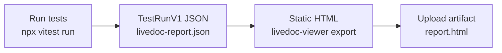

# How to Run LiveDoc in CI/CD

<p className="intro">
This guide shows you how to integrate LiveDoc tests into your CI/CD pipeline.
By the end, you'll have a GitHub Actions workflow that runs tests, exports
a TestRunV1 JSON file, generates a static HTML report, and uploads artifacts.
</p>

:::info Prerequisites
- A working LiveDoc Vitest setup ([imports](./setup-imports.mdx) or [globals](./setup-globals.mdx))
- A CI environment (GitHub Actions, GitLab CI, or similar)
:::

## Overview

LiveDoc tests run with standard `npx vitest run` in CI — no special
configuration needed. Add the `export` option to write a TestRunV1 JSON file,
then use `livedoc-viewer export` to generate a shareable static HTML report.



## Step 1: Configure TestRunV1 Export

Add the `export` option to `LiveDocSpecReporter` to write a TestRunV1 JSON file
after each test run:

```typescript
// vitest.config.ts
import { defineConfig } from 'vitest/config';
import { LiveDocSpecReporter } from '@swedevtools/livedoc-vitest/reporter';

export default defineConfig({
  test: {
    globals: true,
    include: ['**/*.Spec.ts'],
    reporters: [
      new LiveDocSpecReporter({
        detailLevel: 'spec+summary+headers',
        export: {
          output: './test-results/livedoc-report.json',
        },
      }),
    ],
  },
});
```

The reporter creates directories automatically and prints a confirmation:

```
✅ LiveDoc results exported to ./test-results/livedoc-report.json (1.2 MB)
```

The TestRunV1 JSON file contains all features, scenarios, steps, pass/fail
status, timing data, error messages, tags, and attachments.

:::tip Alternative: JsonReporter (SDK model)
The `JsonReporter` post-reporter also writes JSON, but in the **LiveDoc SDK model format** — not TestRunV1. Use `export` for the standard pipeline. Use `JsonReporter` only if you need the raw SDK model for custom tooling:

```typescript
import { LiveDocSpecReporter, JsonReporter } from '@swedevtools/livedoc-vitest/reporter';

new LiveDocSpecReporter({
  detailLevel: 'spec+summary+headers',
  postReporters: [new JsonReporter()],
  'json-output': './test-results/livedoc-results.json',
})
```
:::

## Step 2: Generate a Static HTML Report

Use `livedoc-viewer export` to convert the TestRunV1 JSON into a self-contained
HTML file that anyone can open in a browser — no server needed:

```bash
npx livedoc-viewer export \
  --input ./test-results/livedoc-report.json \
  --output ./test-results/report.html \
  --title "My Project — CI Build"
```

The HTML file embeds all JavaScript, CSS, and images (including base64 screenshots)
inline. It works offline on any computer.

See the [Static Export Guide](../../viewer/guides/static-export.mdx) for the
complete walkthrough.

## Step 3: Add CI-Specific Tag Filtering

Skip slow or flaky tests in CI using environment-based filtering:

```typescript
// test/livedoc.setup.ts
import { livedoc } from '@swedevtools/livedoc-vitest';

if (process.env.CI === 'true') {
  livedoc.options.filters.exclude = ['@slow', '@flaky'];
}

if (process.env.SMOKE_ONLY === 'true') {
  livedoc.options.filters.include = ['@smoke'];
}
```

Register in your config:

```typescript
// vitest.config.ts
setupFiles: ['./test/livedoc.setup.ts'],
```

## Step 4: Create a GitHub Actions Workflow

```yaml
# .github/workflows/livedoc-tests.yml
name: LiveDoc Tests

on:
  push:
    branches: [main]
  pull_request:
    branches: [main]

jobs:
  test:
    runs-on: ubuntu-latest

    steps:
      - uses: actions/checkout@v4

      - uses: actions/setup-node@v4
        with:
          node-version: 20
          cache: npm

      - name: Install dependencies
        run: npm ci

      - name: Run LiveDoc tests
        run: npx vitest run
        env:
          CI: 'true'

      - name: Generate HTML report
        if: always()
        run: npx livedoc-viewer export -i ./test-results/livedoc-report.json -o ./test-results/report.html

      - name: Upload test results
        if: always()
        uses: actions/upload-artifact@v4
        with:
          name: livedoc-results
          path: |
            test-results/livedoc-report.json
            test-results/report.html
          retention-days: 30
```

The `if: always()` on the export and upload steps ensures results are captured
even when tests fail.

## Step 5: Write Output to a Log File

For human-readable test output in CI logs, add file output:

```typescript
new LiveDocSpecReporter({
  detailLevel: 'spec+summary+headers',
  output: './test-results/test-output.txt',
  export: {
    output: './test-results/livedoc-report.json',
  },
})
```

Upload all files as artifacts:

```yaml
- name: Upload test results
  if: always()
  uses: actions/upload-artifact@v4
  with:
    name: livedoc-results
    path: test-results/
```

## Complete Example

```typescript
// vitest.config.ts
import { defineConfig } from 'vitest/config';
import { LiveDocSpecReporter } from '@swedevtools/livedoc-vitest/reporter';

export default defineConfig({
  test: {
    globals: true,
    include: ['**/*.Spec.ts'],
    setupFiles: ['./test/livedoc.setup.ts'],
    reporters: [
      new LiveDocSpecReporter({
        detailLevel: 'spec+summary+headers',
        output: './test-results/test-output.txt',
        export: {
          output: './test-results/livedoc-report.json',
        },
      }),
    ],
  },
});
```

```typescript
// test/livedoc.setup.ts
import { livedoc } from '@swedevtools/livedoc-vitest';

if (process.env.CI === 'true') {
  livedoc.options.filters.exclude = ['@slow', '@flaky'];
}
```

```yaml
# .github/workflows/livedoc-tests.yml
name: LiveDoc Tests

on:
  push:
    branches: [main]
  pull_request:
    branches: [main]

jobs:
  test:
    runs-on: ubuntu-latest

    steps:
      - uses: actions/checkout@v4

      - uses: actions/setup-node@v4
        with:
          node-version: 20
          cache: npm

      - name: Install dependencies
        run: npm ci

      - name: Run LiveDoc tests
        run: npx vitest run
        env:
          CI: 'true'

      - name: Generate HTML report
        if: always()
        run: npx livedoc-viewer export -i ./test-results/livedoc-report.json -o ./test-results/report.html

      - name: Upload test results
        if: always()
        uses: actions/upload-artifact@v4
        with:
          name: livedoc-results
          path: test-results/
          retention-days: 30
```

## Common Variations

### Smoke Test Job

Run a fast subset in a separate job:

```yaml
jobs:
  smoke:
    runs-on: ubuntu-latest
    steps:
      - uses: actions/checkout@v4
      - uses: actions/setup-node@v4
        with: { node-version: 20, cache: npm }
      - run: npm ci
      - name: Run smoke tests
        run: npx vitest run
        env:
          SMOKE_ONLY: 'true'

  full:
    needs: smoke
    runs-on: ubuntu-latest
    steps:
      - uses: actions/checkout@v4
      - uses: actions/setup-node@v4
        with: { node-version: 20, cache: npm }
      - run: npm ci
      - name: Run all tests
        run: npx vitest run
        env:
          CI: 'true'
```

### pnpm Monorepo

For pnpm workspaces, adjust the install and run commands:

```yaml
- uses: pnpm/action-setup@v4
  with:
    version: 9

- uses: actions/setup-node@v4
  with:
    node-version: 20
    cache: pnpm

- run: pnpm install --frozen-lockfile

- name: Run LiveDoc tests
  run: pnpm --filter @swedevtools/livedoc-vitest test
  env:
    CI: 'true'
```

### GitLab CI

```yaml
# .gitlab-ci.yml
livedoc-tests:
  image: node:20
  stage: test
  script:
    - npm ci
    - npx vitest run
  variables:
    CI: 'true'
  artifacts:
    when: always
    paths:
      - test-results/
    expire_in: 30 days
```

## Troubleshooting

| Problem | Cause | Solution |
| ------- | ----- | -------- |
| JSON file not created | Output directory missing | Create `test-results/` in your project or use `mkdir -p test-results` in CI |
| Tests pass locally, fail in CI | Environment differences | Check Node.js version, ensure `CI=true` is set, verify dependencies |
| No test output in CI logs | `detailLevel: 'silent'` | Change to `'spec+summary+headers'` for visible output |
| Artifact upload fails | Wrong path | Verify the `path` in `upload-artifact` matches your `json-output` path |
| Slow tests in CI | No tag filtering | Add `@slow` tags and exclude them with `livedoc.options.filters.exclude` |

## Related

- [Static HTML Export](../../viewer/guides/static-export.mdx) — generate shareable reports without a server
- [Tags and Filtering](./tags-and-filtering.mdx) — environment-based tag filtering
- [Custom Reporters](./custom-reporters.mdx) — build CI-specific reporters
- [Viewer Integration](./viewer-integration.mdx) — visualize results from CI
- [Reporters Reference](../reference/reporters.mdx) — reporter options and export API
- [CLI Options](../../viewer/reference/cli-options.mdx) — `livedoc-viewer export` command reference
