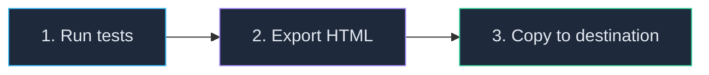

# How to Run LiveDoc in CI/CD

<p className="intro">
LiveDoc tests run with standard `npx vitest run` in CI. Add a JSON export,
convert it to a static HTML report, and upload it as an artifact — three steps.
</p>

:::info Prerequisites
- A working LiveDoc Vitest setup ([imports](./setup-imports.mdx) or [globals](./setup-globals.mdx))
- A CI environment (GitHub Actions, GitLab CI, or similar)
:::

## The Pipeline



### Step 1 — Run Tests with JSON Export

Add the `export` option to `LiveDocSpecReporter` to write a TestRunV1 JSON
file after each run:

```typescript
// vitest.config.ts
import { defineConfig } from 'vitest/config';
import { LiveDocSpecReporter } from '@swedevtools/livedoc-vitest/reporter';

export default defineConfig({
  test: {
    globals: true,
    include: ['**/*.Spec.ts'],
    reporters: [
      new LiveDocSpecReporter({
        detailLevel: 'spec+summary+headers',
        export: {
          output: './test-results/livedoc-report.json',
        },
      }),
    ],
  },
});
```

Run your tests normally — the JSON file is created automatically:

```bash
npx vitest run
# ✅ LiveDoc results exported to ./test-results/livedoc-report.json
```

### Step 2 — Generate Static HTML

Convert the JSON into a self-contained HTML file:

```bash
npx @swedevtools/livedoc-viewer export \
  -i ./test-results/livedoc-report.json \
  -o ./test-results/report.html \
  -t "My Project"
```

| Flag | Description |
| ---- | ----------- |
| `-i, --input` | Path to the TestRunV1 JSON file (required) |
| `-o, --output` | Output HTML path (default: `./livedoc-report.html`) |
| `-t, --title` | Report title (defaults to project name from JSON) |

The HTML file embeds everything — JavaScript, CSS, and data — inline. It works
offline on any machine.

### Step 3 — Copy to Destination

Upload the HTML as a CI artifact, deploy to GitHub Pages, or copy it anywhere:

```yaml
- name: Upload report
  uses: actions/upload-artifact@v4
  with:
    name: livedoc-report
    path: test-results/report.html
```

---

## CI-Specific Vitest Configuration

GitHub Actions and most CI providers set `CI=true`, which changes Vitest's
defaults in ways that affect LiveDoc. Create a dedicated CI config:

```typescript
// vitest.config.ci.ts
import { defineConfig, mergeConfig } from 'vitest/config';
import baseConfig from './vitest.config';

export default mergeConfig(
  baseConfig,
  defineConfig({
    test: {
      allowOnly: true,
      pool: 'forks',
      fileParallelism: false,
    },
  })
);
```

Then run with this config in CI:

```bash
npx vitest run --config vitest.config.ci.ts
```

:::danger `allowOnly` is required
When `CI=true`, Vitest defaults `allowOnly` to `false` — any `describe.only()`
call throws an error. LiveDoc's tag-based filtering uses `describe.only()`
internally. Without `allowOnly: true`, **all tag-filtered tests fail in CI**:

```
Error: Vitest is running with config.allowOnly set to false.
```
:::

:::caution Dynamic tests need sequential execution
If your tests use `executeDynamicTestAsync`, disable file parallelism in CI.
Dynamic tests spawn nested Vitest instances — running them in parallel causes
resource contention, flaky failures, or hangs.

`pool: 'forks'` + `fileParallelism: false` ensures sequential, isolated
execution. This only affects CI — local dev still runs in parallel.
:::

---

## Tag Filtering in CI

Skip slow or flaky tests using environment-based filtering:

```typescript
// test/livedoc.setup.ts
import { livedoc } from '@swedevtools/livedoc-vitest';

if (process.env.CI === 'true') {
  livedoc.options.filters.exclude = ['@slow', '@flaky'];
}

if (process.env.SMOKE_ONLY === 'true') {
  livedoc.options.filters.include = ['@smoke'];
}
```

Register in your config:

```typescript
setupFiles: ['./test/livedoc.setup.ts'],
```

---

## GitHub Actions — Complete Example

```yaml
# .github/workflows/livedoc-tests.yml
name: LiveDoc Tests

on:
  push:
    branches: [main]
  pull_request:
    branches: [main]

jobs:
  test:
    runs-on: ubuntu-latest

    steps:
      - uses: actions/checkout@v4

      - uses: actions/setup-node@v4
        with:
          node-version: 22
          cache: npm

      - run: npm ci

      - name: Run LiveDoc tests
        run: npx vitest run --config vitest.config.ci.ts

      - name: Generate HTML report
        if: always()
        run: npx @swedevtools/livedoc-viewer export -i ./test-results/livedoc-report.json -o ./test-results/report.html

      - name: Upload results
        if: always()
        uses: actions/upload-artifact@v4
        with:
          name: livedoc-results
          path: test-results/
          retention-days: 30
```

### pnpm Monorepo Variant

```yaml
      - uses: pnpm/action-setup@v4

      - uses: actions/setup-node@v4
        with:
          node-version: 22
          cache: pnpm

      - run: pnpm install --frozen-lockfile

      # Run from the package directory with npx, not pnpm --filter
      - name: Run LiveDoc tests
        run: npx vitest run --config vitest.config.ci.ts
        working-directory: packages/my-tests
```

:::tip Avoid `pnpm --filter` for test config
Don't use `pnpm --filter pkg test -- --config vitest.config.ci.ts` — this can
cause double `--config` arguments. Run `npx vitest run --config ...` directly
from the package directory instead.
:::

### GitLab CI

```yaml
# .gitlab-ci.yml
livedoc-tests:
  image: node:22
  stage: test
  script:
    - npm ci
    - npx vitest run --config vitest.config.ci.ts
    - npx @swedevtools/livedoc-viewer export -i ./test-results/livedoc-report.json -o ./test-results/report.html
  artifacts:
    when: always
    paths:
      - test-results/
    expire_in: 30 days
```

---

## Troubleshooting

| Problem | Cause | Solution |
| ------- | ----- | -------- |
| JSON file not created | `export` option missing from reporter | Add `export: { output: '...' }` to `LiveDocSpecReporter` |
| `config.allowOnly` error | `CI=true` disables `.only()` | Add `allowOnly: true` to CI vitest config |
| Dynamic tests fail/hang | Parallel nested Vitest instances | Use `pool: 'forks'` and `fileParallelism: false` |
| `--config` ignored via pnpm | Double `--config` argument | Use `npx vitest run --config ...` directly |
| Tests pass locally, fail in CI | Environment differences | Check Node.js version, use CI-specific config |
| No output in CI logs | `detailLevel: 'silent'` | Use `'spec+summary+headers'` for visible output |

## Related

- [Static HTML Export](../../viewer/guides/static-export.mdx) — the `export` command in detail
- [Tags and Filtering](./tags-and-filtering.mdx) — environment-based tag filtering
- [Custom Reporters](./custom-reporters.mdx) — build CI-specific reporters
- [Reporters Reference](../reference/reporters.mdx) — reporter options and export API
- [CLI Options](../../viewer/reference/cli-options.mdx) — `livedoc-viewer export` reference
