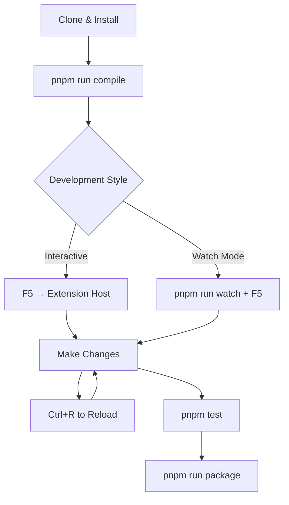

# Development

<p className="intro">
This guide covers everything you need to build, debug, and contribute to the
LiveDoc VS Code extension locally.
</p>

---

## Prerequisites

| Tool           | Version | Purpose                          |
| -------------- | ------- | -------------------------------- |
| **Node.js**    | 18+     | JavaScript runtime               |
| **pnpm**       | 9+      | Package manager (monorepo)       |
| **VS Code**    | Latest  | Extension host and debugger      |

---

## Getting Started

### 1. Clone and Install

```bash
git clone https://github.com/dotnetprofessional/LiveDoc.git
cd LiveDoc
pnpm install
```

### 2. Build the Extension

```bash
cd packages/vscode
pnpm run compile
```

### 3. Launch in VS Code

**Option A: Extension Development Host (recommended)**

1. Open the `packages/vscode` folder in VS Code
2. Press **F5** to launch the Extension Development Host
3. A new VS Code window opens with the extension loaded and ready to test

**Option B: Watch Mode**

Start the TypeScript watcher for continuous compilation, then launch:

```bash
pnpm run watch
```

Press **F5** in VS Code to launch the Extension Development Host. Changes
recompile automatically — press `Ctrl+R` (`Cmd+R` on Mac) in the host window
to reload the extension.

---

## Project Structure

```
packages/vscode/
├── src/
│   ├── extension.ts              # Extension entry point (activate/deactivate)
│   ├── ExecutionResultOutline/   # Test results tree view provider
│   ├── reporter/                 # WebView reporter components
│   └── tableFormatter/           # Data table formatting logic
├── snippets/
│   └── livedoc.json              # Code snippet definitions
├── images/                       # Icons and images
├── .vscode/
│   ├── launch.json               # Debug configurations
│   └── tasks.json                # Build tasks
├── package.json                  # Extension manifest & contribution points
└── tsconfig.json                 # TypeScript configuration
```

### Key Files

| File / Directory               | Purpose                                              |
| ------------------------------ | ---------------------------------------------------- |
| `src/extension.ts`             | Registers commands, tree views, and activates the extension |
| `src/tableFormatter/`          | Implements the `LiveDoc: Format Data Tables` command  |
| `src/reporter/`                | WebView panel for the embedded viewer                 |
| `src/ExecutionResultOutline/`  | Activity bar tree view showing test results           |
| `snippets/livedoc.json`        | All `ld-*` snippet definitions                        |
| `package.json`                 | Extension manifest — commands, snippets, activation events |

---

## Debugging

1. Set breakpoints in your TypeScript source files
2. Press **F5** to start the debugger
3. The Extension Development Host launches as a separate VS Code window
4. Trigger extension features (snippets, commands) to hit your breakpoints
5. Use the **Debug Console** in the primary window to inspect variables

:::tip Reload without restarting
After making changes, press `Ctrl+R` (`Cmd+R` on Mac) in the Extension
Development Host to reload the extension without restarting the full debug
session.
:::

---

## Running Tests

```bash
cd packages/vscode
pnpm test
```

Tests run inside the VS Code test runner, which launches a headless Extension
Development Host.

---

## Packaging for Distribution

Create a `.vsix` package for manual installation or marketplace publishing:

```bash
cd packages/vscode
pnpm run package
```

This generates a `livedoc-{version}.vsix` file. Install it locally with:

```bash
code --install-extension livedoc-{version}.vsix
```

Or publish to the VS Code Marketplace using the
[vsce](https://code.visualstudio.com/api/working-with-extensions/publishing-extension)
CLI tool.

---

## Development Workflow Summary



---

## Key Takeaways

- **Build** with `pnpm run compile`, **watch** with `pnpm run watch`
- **Debug** by pressing F5 — sets up the Extension Development Host automatically
- **Reload** with `Ctrl+R` in the host window for fast iteration
- **Package** with `pnpm run package` to create a distributable `.vsix`

---

## See Also

- [VS Code Extension Overview](./overview.mdx) — features and installation
- [VS Code Extension API](https://code.visualstudio.com/api) — official VS Code extension docs
- [Vitest SDK](/vitest/learn/getting-started) — the testing framework this extension supports
