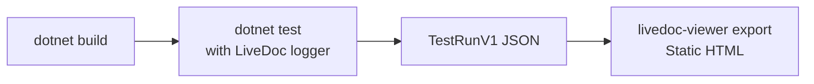

# How to Run LiveDoc xUnit in CI/CD

<p className="intro">
This guide shows you how to integrate LiveDoc xUnit tests into your CI/CD pipeline.
By the end, you'll have a GitHub Actions workflow that builds your project, runs
tests with the LiveDoc logger, exports a TestRunV1 JSON file, and generates a
static HTML report.
</p>

:::info Prerequisites
- A .NET project with `SweDevTools.LiveDoc.xUnit` installed ([Getting Started](../learn/getting-started.mdx))
- A CI environment (GitHub Actions, GitLab CI, Azure DevOps, or similar)
:::

## Overview

LiveDoc xUnit tests run with standard `dotnet test` in CI — the LiveDoc console
logger exports results to a TestRunV1 JSON file, which can then be converted to
a static HTML report using `livedoc-viewer export`.



## Step 1: Configure the LiveDoc Logger

The LiveDoc console logger supports an `ExportPath` parameter that writes a
TestRunV1 JSON file after the test run:

```bash
dotnet test --logger "LiveDoc;ExportPath=./reports/dotnet-report.json;Project=MyProject;Environment=ci"
```

| Parameter       | Description                                      |
| --------------- | ------------------------------------------------ |
| `ExportPath`    | Path to write the TestRunV1 JSON file            |
| `Project`       | Label for the project name in the report         |
| `Environment`   | Label for the environment (e.g., `ci`, `staging`) |

:::tip
The logger creates directories automatically. You don't need to `mkdir` the output path.
:::

## Step 2: Generate a Static HTML Report

Use `livedoc-viewer export` to convert the JSON into a self-contained HTML file:

```bash
npx @swedevtools/livedoc-viewer export \
  --input ./reports/dotnet-report.json \
  --output ./reports/dotnet/index.html \
  --title "My Project — xUnit Tests"
```

The HTML file works offline — it embeds all JavaScript, CSS, and data inline.
See [Static Export](../../viewer/guides/static-export.mdx) for full details.

## Step 3: Create a GitHub Actions Workflow

```yaml
# .github/workflows/livedoc-tests.yml
name: LiveDoc Tests

on:
  push:
    branches: [main]
  pull_request:
    branches: [main]

jobs:
  test:
    runs-on: ubuntu-latest

    steps:
      - uses: actions/checkout@v4

      - name: Setup .NET
        uses: actions/setup-dotnet@v4
        with:
          dotnet-version: |
            8.0.x
            10.0.x

      - name: Restore dependencies
        run: dotnet restore

      - name: Build
        run: dotnet build --no-restore

      - name: Run LiveDoc tests
        run: |
          dotnet test --no-build \
            --logger "LiveDoc;ExportPath=${{ github.workspace }}/reports/dotnet-report.json;Project=MyProject;Environment=ci"

      - name: Setup Node.js (for report generation)
        if: always()
        uses: actions/setup-node@v4
        with:
          node-version: 22

      - name: Generate HTML report
        if: always()
        run: npx @swedevtools/livedoc-viewer export -i reports/dotnet-report.json -o reports/index.html -t "MyProject Tests"

      - name: Upload test results
        if: always()
        uses: actions/upload-artifact@v4
        with:
          name: livedoc-results
          path: reports/
          retention-days: 30
```

The `if: always()` on the report and upload steps ensures results are captured
even when tests fail — which is exactly when you need them most.

## CI-Specific Configuration

### Build Configuration Must Match

When using `--no-build` with `dotnet test`, the build configuration must match
between the build and test steps:

```yaml
# ✅ Correct — both use the same configuration (default: Debug)
- run: dotnet build
- run: dotnet test --no-build

# ✅ Correct — both explicitly use Release
- run: dotnet build --configuration Release
- run: dotnet test --no-build --configuration Release

# ❌ Wrong — build uses Release, test defaults to Debug
- run: dotnet build --configuration Release
- run: dotnet test --no-build
```

:::danger Build/test configuration mismatch
If you build with `--configuration Release` but run `dotnet test --no-build`
without specifying the configuration, the test runner defaults to Debug and
will fail with "file not found" errors — the binaries are in `bin/Release/`
but it looks in `bin/Debug/`.
:::

### Journey Tests in CI

[Journey tests](./journey-testing.mdx) run API servers and execute HTTP requests
via httpyac. They require extra setup in CI:

#### 1. Ensure the API Project Builds

Journey tests start your API server using `dotnet run --no-build`. If you use
`--no-build`, the API project must already be compiled:

```yaml
# Build the entire solution first
- run: dotnet build
```

#### 2. Cross-Platform httpyac Output

httpyac produces different output formats on different operating systems:

| Platform | Assertion markers | Example output |
| -------- | ---------------- | -------------- |
| Windows  | Bracketed ASCII  | `[✓] status == 200` |
| Linux    | Bare Unicode     | `✓ status == 200` |

LiveDoc handles both formats automatically as of v0.1.8-beta4. If you're on an
older version, update the NuGet package:

```bash
dotnet add package SweDevTools.LiveDoc.xUnit --prerelease
```

#### 3. Exclude Journey Tests (Optional)

If your CI environment doesn't support running API servers (e.g., restricted
network, no port binding), exclude journey tests using tags:

```csharp
[Feature("My API Journeys")]
[Trait("Category", "Journey")]
public class MyApiJourneys : JourneyTest { ... }
```

```yaml
- name: Run tests (skip journeys)
  run: dotnet test --no-build --filter "Category!=Journey"
```

### Tag-Based Test Filtering

Use `dotnet test --filter` to include or exclude tests by category:

```bash
# Run only smoke tests
dotnet test --filter "Category=Smoke"

# Exclude slow tests
dotnet test --filter "Category!=Slow"

# Combine filters
dotnet test --filter "Category=Smoke|Category=Critical"
```

Apply categories with the `[Trait]` attribute:

```csharp
[Scenario("Quick validation")]
[Trait("Category", "Smoke")]
public void QuickValidation() { ... }
```

## Deploying Reports to GitHub Pages

You can publish LiveDoc test reports as a static site on GitHub Pages. This
gives your team a permanent, browsable URL for the latest test results.

### GitHub Actions Workflow

```yaml
name: LiveDoc Report

on:
  push:
    branches: [main]

permissions:
  contents: read
  pages: write
  id-token: write

concurrency:
  group: pages
  cancel-in-progress: true

jobs:
  generate-reports:
    runs-on: ubuntu-latest

    steps:
      - uses: actions/checkout@v4

      - uses: actions/setup-dotnet@v4
        with:
          dotnet-version: 8.0.x

      - uses: actions/setup-node@v4
        with:
          node-version: 22

      - run: dotnet build
      - run: |
          dotnet test --no-build \
            --logger "LiveDoc;ExportPath=reports/dotnet-report.json;Project=MyProject;Environment=ci"

      - name: Generate HTML report
        if: always()
        run: npx @swedevtools/livedoc-viewer export -i reports/dotnet-report.json -o reports/index.html -t "MyProject"

      - name: Setup Pages
        if: always()
        uses: actions/configure-pages@v5

      - name: Upload Pages artifact
        if: always()
        uses: actions/upload-pages-artifact@v3
        with:
          path: reports

  deploy:
    needs: generate-reports
    runs-on: ubuntu-latest
    environment:
      name: github-pages
      url: ${{ steps.deployment.outputs.page_url }}
    steps:
      - id: deployment
        uses: actions/deploy-pages@v4
```

:::caution GitHub Pages environment setup
Before the deploy job will work, you must:
1. Go to **Settings → Pages** and set Source to **GitHub Actions**
2. Go to **Settings → Environments** and ensure a `github-pages` environment exists
3. If you have branch protection rules on the environment, add your deployment branch
:::

## Common Variations

### Azure DevOps

```yaml
# azure-pipelines.yml
trigger:
  branches:
    include:
      - main

pool:
  vmImage: 'ubuntu-latest'

steps:
  - task: UseDotNet@2
    inputs:
      version: '8.0.x'

  - script: dotnet restore
  - script: dotnet build --no-restore

  - script: |
      dotnet test --no-build \
        --logger "LiveDoc;ExportPath=$(Build.ArtifactStagingDirectory)/dotnet-report.json;Project=MyProject;Environment=ci"

  - task: PublishBuildArtifacts@1
    condition: always()
    inputs:
      pathToPublish: '$(Build.ArtifactStagingDirectory)'
      artifactName: 'livedoc-results'
```

### GitLab CI

```yaml
# .gitlab-ci.yml
livedoc-tests:
  image: mcr.microsoft.com/dotnet/sdk:8.0
  stage: test
  script:
    - dotnet restore
    - dotnet build --no-restore
    - dotnet test --no-build --logger "LiveDoc;ExportPath=reports/dotnet-report.json;Project=MyProject;Environment=ci"
  artifacts:
    when: always
    paths:
      - reports/
    expire_in: 30 days
```

## Troubleshooting

| Problem | Cause | Solution |
| ------- | ----- | -------- |
| `The target "X" does not exist` | Running against solution instead of project | Target the specific `.csproj` that has the NuGet: `dotnet msbuild MyTests.csproj -t:...` |
| Tests pass locally, fail in CI | Build configuration mismatch | Ensure `dotnet build` and `dotnet test` use the same `--configuration` |
| Journey tests: "file not found" | `dotnet run --no-build` defaults to Debug | Match the build configuration between build and test steps |
| Journey tests: invalid JSON | httpyac cross-platform symbols | Update to LiveDoc xUnit ≥ 0.1.8-beta4 which handles both Windows and Linux formats |
| Report not generated | Logger not loaded | Verify the NuGet package is installed and the `--logger` parameter is correct |
| GitHub Pages deploy fails | Environment not configured | Create a `github-pages` environment in Settings → Environments |

## Related

- [Journey Testing](./journey-testing.mdx) — setting up API journey tests
- [Configuration Reference](../reference/configuration.mdx) — all logger parameters
- [Viewer Integration](./viewer-integration.mdx) — connecting to the live viewer
- [Static HTML Export](../../viewer/guides/static-export.mdx) — the `export` command in detail
- [Debugging](./debugging.mdx) — troubleshooting test failures
