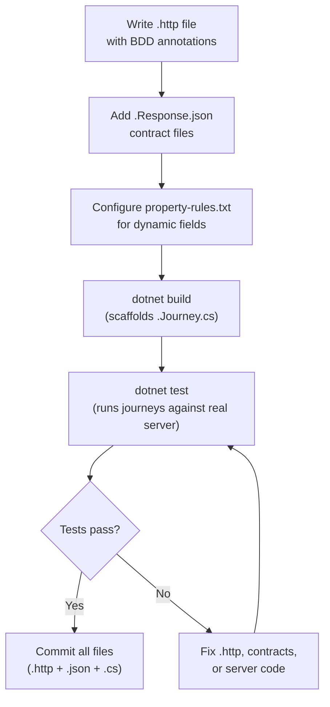

# Journey Testing

<p className="intro">
Journey testing lets you define end-to-end API test flows in standard
<code>.http</code> files — runnable by developers in VS Code — and automatically
scaffold LiveDoc xUnit test classes that execute those journeys against a real
server and validate responses against precanned JSON contracts.
</p>

---

## What is a Journey?

A **journey** is a sequence of HTTP requests that exercises an API end-to-end.
Each journey lives in a folder containing:

| File | Purpose |
| --- | --- |
| `_my-journey.http` | The HTTP requests with BDD annotations |
| `stepName.Response.json` | Expected response payload for each step |
| `property-rules.txt` *(optional)* | Rules for handling dynamic fields |

Journeys serve **two purposes simultaneously**:

1. **Manual exploration** — Developers open `.http` files in VS Code (with the
   [httpYac](https://httpyac.github.io/) or REST Client extension) and execute
   requests interactively.
2. **Automated testing** — The LiveDoc journey generator reads the BDD comments
   and scaffolds xUnit test classes that run the entire journey and validate
   every response.

```
journeys/
├── http-client.env.json              ← Environment variables (baseUrl, tokens)
├── property-rules.txt                ← Global rules for dynamic fields
├── health-check/
│   ├── _health-check.http            ← Journey file (prefixed with _)
│   ├── healthCheck.Response.json     ← Expected response for "healthCheck" step
│   └── adminHealth.Response.json     ← Expected response for "adminHealth" step
└── api/
    └── ai-services/
        ├── _ai-services.http
        ├── createService.Response.json
        ├── getService.Response.json
        ├── listServices.Response.json
        └── ...
```

:::tip Why the `_` prefix?
The `.http` file is prefixed with `_` so it sorts **above** the `.Response.json`
files in directory listings, making it easy to find the journey definition at a glance.
:::

---

## Step 1: Enable Journey Scaffolding {#enable}

Add these MSBuild properties to your test project's `.csproj`:

```xml
<PropertyGroup>
  <LiveDocJourneysEnabled>true</LiveDocJourneysEnabled>
  <LiveDocJourneysDir>$(MSBuildProjectDirectory)\..\..\journeys</LiveDocJourneysDir>
  <LiveDocJourneyOutputDir>$(MSBuildProjectDirectory)\Journeys</LiveDocJourneyOutputDir>
  <LiveDocJourneyBaseNamespace>MyProject.Specs.Journeys</LiveDocJourneyBaseNamespace>
  <LiveDocJourneyFixtureType>JourneyServerFixture</LiveDocJourneyFixtureType>
  <LiveDocJourneyMode>scaffold</LiveDocJourneyMode>
  <LiveDocHttpYacEnsure>check</LiveDocHttpYacEnsure>
</PropertyGroup>
```

### Configuration Properties {#msbuild-properties}

| Property | Default | Description |
| --- | --- | --- |
| `LiveDocJourneysEnabled` | `false` | Set to `true` to enable journey scaffolding on build |
| `LiveDocJourneysDir` | `$(MSBuildProjectDirectory)\journeys` | Root folder containing journey subfolders |
| `LiveDocJourneyOutputDir` | `$(MSBuildProjectDirectory)\Journeys` | Where generated `.Journey.cs` files are written |
| `LiveDocJourneyBaseNamespace` | `$(RootNamespace).Journeys` | Root namespace for generated test classes |
| `LiveDocJourneyInfrastructureNamespace` | `$(BaseNamespace).Infrastructure` | Namespace for `JsonAssertions`, `PropertyRules`, etc. |
| `LiveDocJourneyFixtureType` | `JourneyServerFixture` | The `IClassFixture<T>` type that starts your server |
| `LiveDocJourneyMode` | `scaffold` | `scaffold`, `validate`, or `force` (see [Modes](#modes)) |
| `LiveDocHttpYacEnsure` | `check` | `check`, `auto-install`, or `off` (see [httpYac](#httpyac)) |

### Modes {#modes}

| Mode | Behavior |
| --- | --- |
| **`scaffold`** | Generate test files only if they don't already exist. Safe for iterative development — your edits are preserved. |
| **`validate`** | Report missing or extra steps without modifying any files. Useful in CI to catch drift. |
| **`force`** | Regenerate all test files, overwriting existing ones. Use when you want a clean slate. |

### httpYac Dependency {#httpyac}

The journey runner uses [httpYac CLI](https://httpyac.github.io/) to execute `.http` files.
The `LiveDocHttpYacEnsure` property controls how this dependency is managed:

| Value | Behavior |
| --- | --- |
| **`check`** | Verify httpYac is installed; fail the build with an error message if not |
| **`auto-install`** | Automatically `npm install --save-dev httpyac` if missing |
| **`off`** | Skip the check entirely (you manage the dependency yourself) |

---

## Step 2: Create the Environment File {#env-file}

Create `journeys/http-client.env.json` with your server's connection details:

```json
{
  "local": {
    "baseUrl": "http://localhost:5000",
    "adminToken": ""
  }
}
```

The `local` environment is used by httpYac when running journeys. Your
`JourneyServerFixture` typically writes a temporary env file at test time
with the dynamic port and token for the test server instance.

:::info Variable Syntax
httpYac uses `{{variableName}}` for variable interpolation. Variables can
reference environment values, process environment variables
(`{{$processEnv MY_VAR}}`), or captured response values
(`{{requestName.field}}`).
:::

---

## Step 3: Write Your First Journey {#write-journey}

Create a journey folder and `.http` file. Every journey file follows this
structure:

```http
# Feature: Health Check
# Description: Verify the server is running and responsive

# Scenario: Server is alive and healthy

# When checking the public health endpoint
# @name healthCheck
GET {{baseUrl}}/health

?? status == 200
?? body status == healthy

###

# Then the admin health endpoint is also accessible
# @name adminHealth
GET {{baseUrl}}/health
X-Admin-Token: {{adminToken}}

?? status == 200
?? body status == healthy
```

### .http File Format Reference {#http-format}

#### BDD Annotations

BDD annotations are **comments** in the `.http` file (lines starting with `#`).
The journey generator parses these to create the test class structure:

| Annotation | Purpose | Example |
| --- | --- | --- |
| `# Feature: Title` | Names the test class and `[Feature]` attribute | `# Feature: AI Services API` |
| `# Description: Text` | Sets the `Description` on the `[Feature]` attribute | `# Description: Full CRUD validation` |
| `# Scenario: Title` | Creates a `[Scenario]` test method | `# Scenario: Create and delete a service` |
| `# Given ...` | BDD step — maps to `Given()` in the test | `# Given a new service is created` |
| `# When ...` | BDD step — maps to `When()` in the test | `# When listing all services` |
| `# Then ...` | BDD step — maps to `Then()` in the test | `# Then the service is deleted` |
| `# And ...` | BDD step — maps to `And()` in the test | `# And getting it returns 404` |
| `# But ...` | BDD step — maps to `But()` in the test | `# But the list is now empty` |
| `# @name requestName` | Links the preceding step to this HTTP request | `# @name createService` |
| `# @tag tagName` | Tags the feature | `# @tag smoke` |

#### HTTP Request Structure

Each request follows standard `.http` file format:

```http
# BDD step comment
# @name requestName
METHOD {{baseUrl}}/path
Header-Name: value
Content-Type: application/json

{
  "field": "value"
}

?? status == 200
?? body fieldName == expectedValue

###
```

Key rules:
- **`###`** separates HTTP requests (required between requests)
- **`??`** lines are httpYac assertions — they run during manual and automated execution
- **`# @name`** must appear **after** the BDD step comment and **before** the HTTP method line
- Request bodies are standard JSON
- Headers go between the request line and the body (blank line separates headers from body)

#### Variable References

| Syntax | Source | Example |
| --- | --- | --- |
| `{{variableName}}` | Environment file or captured response | `{{baseUrl}}` |
| `{{requestName.field}}` | Response body from a previous request | `{{createProfile.api_key}}` |
| `{{$processEnv VAR}}` | System environment variable | `{{$processEnv AZURE_OPENAI_API_KEY}}` |

#### Complete Example — CRUD Journey

Here's a full journey testing create, read, update, and delete:

```http
# Feature: AI Services API
# Description: Full CRUD validation for the /api/ai-services endpoints

# Scenario: Create, read, update, and delete a service

# --- Cleanup (safe to re-run) ---

# @name cleanup
DELETE {{baseUrl}}/api/ai-services/test-svc
X-Admin-Token: {{adminToken}}

?? status >= 200
?? status < 500

###

# --- CRUD ---

# Given a new AI service is created
# @name createService
POST {{baseUrl}}/api/ai-services
Content-Type: application/json
X-Admin-Token: {{adminToken}}

{
  "name": "test-svc",
  "provider_id": "echo",
  "tags": ["api-test", "validation"]
}

?? status == 201
?? body name == test-svc

###

# When listing all services
# @name listServices
GET {{baseUrl}}/api/ai-services
X-Admin-Token: {{adminToken}}

?? status == 200

###

# And getting the service by name
# @name getService
GET {{baseUrl}}/api/ai-services/test-svc
X-Admin-Token: {{adminToken}}

?? status == 200
?? body name == test-svc

###

# And deleting the service
# @name deleteService
DELETE {{baseUrl}}/api/ai-services/test-svc
X-Admin-Token: {{adminToken}}

?? status == 204

###

# Then getting the deleted service returns 404
# @name verifyDeleted
GET {{baseUrl}}/api/ai-services/test-svc
X-Admin-Token: {{adminToken}}

?? status == 404
```

---

## Step 4: Add Response Contracts {#response-contracts}

For each step where you want to validate the **full response payload**, create
a `.Response.json` file in the same folder as the `.http` file.

The file name must match the `@name` annotation: `{requestName}.Response.json`.

**Example**: For `# @name createService`, create `createService.Response.json`:

```json
{
  "name": "test-svc",
  "provider_id": "echo",
  "base_url": null,
  "organization": null,
  "is_available": true,
  "tags": ["api-test", "validation"],
  "model_count": 0,
  "health_status": "Unknown"
}
```

The generated test code uses `JsonAssertions.IsComparable()` to structurally
compare the actual response against this expected payload. Fields that are
dynamic (timestamps, IDs, etc.) are handled by `property-rules.txt`.

### When to Create Response Contracts

| Scenario | Create `.Response.json`? |
| --- | --- |
| Step returns a meaningful JSON body you want to validate | ✅ Yes |
| Step returns `204 No Content` or the body isn't important | ❌ No — the generator emits a simple `run.AssertStep("name")` |
| Step is a cleanup/setup with variable results | ❌ No |

:::caution
Steps **without** a `.Response.json` file still assert that the HTTP request
succeeded (via httpYac's `??` assertions). The response contract adds
**structural payload validation** on top.
:::

### Auto-Generating Contracts with Capture Mode {#capture-mode}

Instead of writing `.Response.json` files by hand, use **capture mode** to
run your journeys against a live server and save the actual responses as
contract files.

**Step 1**: Start your server.

**Step 2**: Run capture via MSBuild:

```bash
dotnet msbuild -t:LiveDocCaptureJourneys \
  -p:LiveDocCaptureVars="--var baseUrl=http://localhost:5000 --var adminToken=my-token"
```

Or run the tool directly:

```bash
dotnet <path-to-tool>/SweDevTools.LiveDoc.xUnit.JourneyGenerator.dll \
  capture ./journeys --var baseUrl=http://localhost:5000 --var adminToken=my-token
```

This executes every `.http` file via httpYac, captures each step's JSON response
body, and writes it as a prettified `.Response.json` file.

**Key behaviors:**
- Only creates `.Response.json` files that **don't already exist** (safe by default)
- Skips steps with no response body or non-JSON responses
- Add `--overwrite` (or `-p:LiveDocCaptureOverwrite=true`) to regenerate all contracts

```bash
# Overwrite existing contracts
dotnet msbuild -t:LiveDocCaptureJourneys \
  -p:LiveDocCaptureOverwrite=true \
  -p:LiveDocCaptureVars="--var baseUrl=http://localhost:5000 --var adminToken=my-token"
```

:::tip Capture Workflow
The recommended workflow is:
1. Write your `.http` files with BDD annotations
2. Run capture mode against a live server to seed the `.Response.json` files
3. **Review the captured responses** — verify they represent the correct expected behavior
4. Add `property-rules.txt` entries for any dynamic fields
5. Build to scaffold the `.Journey.cs` test classes
6. Run the tests to validate everything works
:::

| MSBuild Property | Default | Description |
| --- | --- | --- |
| `LiveDocCaptureVars` | *(none)* | httpYac variables: `--var key=value --var key2=value2` |
| `LiveDocCaptureEnv` | `local` | httpYac environment name from `http-client.env.json` |
| `LiveDocCaptureOverwrite` | `false` | Set to `true` to overwrite existing `.Response.json` files |

---

## Step 5: Configure Property Rules {#property-rules}

Create `journeys/property-rules.txt` at your journeys root to tell
`JsonAssertions.IsComparable()` how to handle dynamic or non-deterministic fields.

### Syntax Reference

```
# Lines starting with # are comments. Blank lines are ignored.

# Ignore entirely — field is skipped during comparison
api_key
api_key_prefix

# Must be present, any value
created_at: exists
updated_at: exists

# Type checking
total_spend: type number
is_active: type boolean
tags: type array
details: type object

# Numeric comparisons
request_count: type number, >= 0
port: type number, > 0

# String length / array length
data: length >= 1
content: type string, length > 0

# Regex matching
email: matches ^[^@]+@[^@]+$

# Multiple rules (AND logic)
total_tokens: type number, >= 0

# Scoped to a parent object
providers.healthy: type number, >= 0
```

### Rule Types

| Rule | Meaning | Example |
| --- | --- | --- |
| *(bare name)* | Ignore entirely — skip comparison | `api_key` |
| `exists` | Must be present, value doesn't matter | `created_at: exists` |
| `type T` | Must be the specified JSON type (`string`, `number`, `boolean`, `array`, `object`) | `tags: type array` |
| `> N`, `>= N`, `< N`, `<= N` | Numeric comparison | `port: type number, > 0` |
| `length > N`, `length >= N` | Array or string length check | `data: length >= 1` |
| `matches <regex>` | String must match regex | `email: matches ^[^@]+@` |
| Multiple rules | Comma-separated (AND logic) | `total: type number, >= 0` |

### Folder-Specific Overrides

You can create additional `property-rules.txt` files in subfolders for
specialized rules. For example, journeys that call real LLM providers may
need different rules:

```
journeys/
├── property-rules.txt           ← Global rules (applied to all journeys)
└── real/
    ├── property-rules.txt       ← Overrides for real LLM journeys
    └── chat-completions/
        └── _chat-completions.http
```

The generated test constructor automatically merges global + folder-specific
rules based on the journey's folder path.

---

## Step 6: Build and Run {#build-and-run}

When you build your test project, the journey generator runs automatically:

```bash
dotnet build
```

This scaffolds `.Journey.cs` files in your output directory. Then run the tests:

```bash
dotnet test --filter "FullyQualifiedName~Journeys"
```

### What Gets Generated {#generated-output}

For a journey at `api/ai-services/_ai-services.http`, the generator creates
`Journeys/Api/AiServices.Journey.cs`:

```csharp
// Generated from api/ai-services/_ai-services.http
// This file is developer-owned. The generator will not overwrite it.
// Re-scaffold with: dotnet msbuild -t:Build

using SweDevTools.LiveDoc.xUnit;
using Xunit;
using Xunit.Abstractions;
using MyProject.Specs.Journeys.Infrastructure;

namespace MyProject.Specs.Journeys.Api;

[Feature("AI Services API", Description = "Full CRUD validation for the /api/ai-services endpoints")]
[Scenario("Create, read, update, and delete a service")]
public class AiServices_Journey : FeatureTest, IClassFixture<JourneyServerFixture>
{
    private readonly JourneyServerFixture _server;
    private readonly PropertyRules _propertyRules;

    public AiServices_Journey(ITestOutputHelper output, JourneyServerFixture server) : base(output)
    {
        _server = server;
        _propertyRules = JsonAssertions.LoadPropertyRules(
            Path.Combine(server.JourneysDir, "property-rules.txt"));
    }

    [Scenario("Create, read, update, and delete a service")]
    public async Task CreateReadUpdateAndDeleteAService()
    {
        var run = await _server.RunJourneyAsync("api/ai-services/_ai-services.http");

        Given("a new AI service is created", ctx =>
        {
            run.AssertStep("createService", step =>
            {
                var expected = _server.LoadResponseFile("api/ai-services", "createService");
                Assert.False(string.IsNullOrWhiteSpace(step.ResponseBody),
                    "Step 'createService' has a response contract but returned no body");
                JsonAssertions.IsComparable(step.ResponseBody, expected, _propertyRules, "createService");
            });
        });

        When("listing all services", ctx =>
        {
            run.AssertStep("listServices", step =>
            {
                var expected = _server.LoadResponseFile("api/ai-services", "listServices");
                Assert.False(string.IsNullOrWhiteSpace(step.ResponseBody),
                    "Step 'listServices' has a response contract but returned no body");
                JsonAssertions.IsComparable(step.ResponseBody, expected, _propertyRules, "listServices");
            });
        });

        // Steps without .Response.json get simple assertion
        And("deleting the service", ctx =>
        {
            run.AssertStep("deleteService");
        });
    }
}
```

### Path Derivation {#path-derivation}

The generator maps journey folder paths to C# namespaces and file paths:

| Journey Path | Generated File | Namespace Suffix |
| --- | --- | --- |
| `api/ai-services/_ai-services.http` | `Api/AiServices.Journey.cs` | `.Api` |
| `health-check/_health-check.http` | `HealthCheck.Journey.cs` | *(root)* |
| `user/getting-started/_getting-started.http` | `User/GettingStarted.Journey.cs` | `.User` |

Numeric prefixes are stripped if present (e.g., `00-health-check` → `HealthCheck`),
but prefer plain kebab-case folder names — ordering is only within a `.http` file, not across folders.

---

## Server Fixture Setup {#infrastructure}

The generated tests need a **fixture class** that starts your server and provides
journey execution. The LiveDoc library ships all the heavy lifting — you just
create a small subclass with a `Configure()` override.

### Quick Start: Minimal Fixture {#minimal-fixture}

For a standard ASP.NET Core project, this is all you need:

```csharp title="Journeys/JourneyServerFixture.cs"
using SweDevTools.LiveDoc.xUnit.Journeys;

namespace MyProject.Specs.Journeys;

public class JourneyServerFixture : JourneyFixtureBase
{
    protected override JourneyConfig Configure() => new()
    {
        ServerProject = "../../src/MyProject.Api",  // relative to test .csproj
        JourneysPath  = "../../journeys",           // relative to test .csproj
    };
}
```

**That's it.** Everything else has sensible defaults:

| Setting | Default |
| --- | --- |
| `ServerEnvironment` | `"Test"` — sets `ASPNETCORE_ENVIRONMENT` and `DOTNET_ENVIRONMENT` |
| `HttpYacEnvironment` | `"local"` — httpYac environment name |
| `StartupTimeout` | 30 seconds |
| `ServerArguments` | `"--no-launch-profile"` |
| `Verbose` | `false` — when `true`, writes startup diagnostics to stderr |

Plus automatic behavior:
- **Port**: Random ephemeral port via `TcpListener`
- **URL binding**: `ASPNETCORE_URLS=http://localhost:{port}`
- **Startup detection**: Monitors stdout/stderr for Kestrel's "Now listening on"
- **Diagnostic logging**: Always logs port/URL/environment at startup; set `Verbose = true` for full server output
- **httpYac variables**: `baseUrl` auto-set to `http://localhost:{port}`
- **Capture mode**: `JOURNEY_CAPTURE=true` env var saves `.Response.json` files
- **Cleanup**: Kills server process tree on dispose

:::caution UseUrls() overrides ASPNETCORE_URLS
LiveDoc sets the `ASPNETCORE_URLS` environment variable to bind your server to a
random port. However, **if your `Program.cs` calls `UseUrls()`,
`builder.WebHost.UseUrls()`, or hard-codes URLs in `launchSettings.json`, those
take precedence** and your server will ignore the environment variable.

ASP.NET Core's [URL binding precedence](https://learn.microsoft.com/en-us/aspnet/core/fundamentals/servers/kestrel/endpoints) (highest wins):
1. `UseUrls()` / `UseKestrel().Listen()` — **in code**
2. `--urls` command-line argument
3. `ASPNETCORE_URLS` environment variable ← LiveDoc sets this
4. `launchSettings.json` profiles

**Fix**: Remove `UseUrls()` calls from your server, or gate them behind an
environment check:

```csharp title="Program.cs"
// ✅ Only set URLs when NOT in test mode
if (builder.Environment.EnvironmentName != "Test")
{
    builder.WebHost.UseUrls("http://localhost:5000");
}
```

Alternatively, pass the URL explicitly via `ServerArguments`:

```csharp title="JourneyServerFixture.cs"
protected override JourneyConfig Configure() => new()
{
    ServerProject = "../../src/MyApi",
    JourneysPath  = "../../journeys",
    // highlight-next-line
    ServerArguments = $"--no-launch-profile --urls http://localhost:{Port}",
};
```

The `--urls` flag has higher precedence than `UseUrls()` and will override it.
:::

### Customizing Config {#custom-config}

Override any defaults directly in the config:

```csharp title="Journeys/JourneyServerFixture.cs"
public class JourneyServerFixture : JourneyFixtureBase
{
    protected override JourneyConfig Configure() => new()
    {
        ServerProject     = "../../src/MyProject.Api",
        JourneysPath      = "../../journeys",
        ServerEnvironment = "Development",               // override default "Test"
        StartupTimeout    = TimeSpan.FromSeconds(60),    // slow-starting server
    };
}
```

### Adding Custom httpYac Variables {#custom-vars}

If your `.http` files reference variables beyond `baseUrl`, override `GetHttpYacVariables()`:

```csharp
protected override Dictionary<string, string> GetHttpYacVariables()
{
    var vars = base.GetHttpYacVariables(); // includes baseUrl
    vars["adminToken"] = "test-token-123";
    vars["apiKey"] = "test-key";
    return vars;
}
```

### Adding Custom Environment Variables {#custom-env}

Override `ConfigureServerProcess()` to set additional environment variables on the
server process:

```csharp
protected override void ConfigureServerProcess(ProcessStartInfo psi)
{
    psi.Environment["MY_APP__ConnectionString"] = "Server=localhost;Database=TestDb";
    psi.Environment["MY_APP__DataDir"] = TempDataDir; // isolated per test run
}
```

:::tip
`TempDataDir` provides a unique temporary directory per test run — perfect for
isolating server data.
:::

### Custom Startup Detection {#custom-startup}

For non-Kestrel servers, override `IsServerReady()`:

```csharp
protected override bool IsServerReady(string outputLine)
    => outputLine.Contains("Server started on port", StringComparison.OrdinalIgnoreCase);
```

### Extracting Values from Server Output {#output-extraction}

Override `OnServerOutputLine()` to capture values from startup logs:

```csharp
private string? _adminToken;
public string AdminToken => _adminToken ?? throw new InvalidOperationException("Token not captured");

protected override void OnServerOutputLine(string line)
{
    if (_adminToken != null) return;
    if (line.Contains("Admin token:", StringComparison.OrdinalIgnoreCase))
    {
        var idx = line.IndexOf("Admin token:", StringComparison.OrdinalIgnoreCase);
        _adminToken = line[(idx + "Admin token:".Length)..].Trim();
    }
}
```

### Library-Provided Classes Reference {#library-classes}

All ship in the `SweDevTools.LiveDoc.xUnit.Journeys` namespace:

| Class | Purpose |
| --- | --- |
| `JourneyFixtureBase` | Server lifecycle, httpYac execution, response loading, capture mode |
| `JourneyConfig` | Configuration record with `ServerProject`, `JourneysPath`, and defaults |
| `JourneyResult` | Parses httpYac output into per-step results — `Parse(exitCode, output)` |
| `StepResult` | Per-step result with `Name`, `Passed`, `StatusCode`, `ResponseBody` |
| `JsonAssertions` | Deep JSON comparison — `IsComparable(actual, expected, rules)` |
| `PropertyRules` | Loads and matches property rules — `PropertyRules.Load(filePath)` |

---

### MSBuild Infrastructure Namespace {#msbuild-infra}

The journey generator uses `LiveDocJourneyInfrastructureNamespace` to emit the
`using` directive for your fixture class. Set it to match where your
`JourneyServerFixture` lives:

```xml title="In your test .csproj"
<PropertyGroup>
    <LiveDocJourneyInfrastructureNamespace>MyProject.Specs.Journeys</LiveDocJourneyInfrastructureNamespace>
</PropertyGroup>
```

---

## Workflow Summary {#workflow}



---

## Common Patterns {#patterns}

### Cleanup Steps

Start journeys with idempotent cleanup requests to make them safe to re-run:

```http
# @name cleanup
DELETE {{baseUrl}}/api/resources/test-item
X-Admin-Token: {{adminToken}}

?? status >= 200
?? status < 500

###
```

Steps without BDD annotations (like `cleanup` above) are still executed by
httpYac but don't appear in the generated test's BDD output.

### Chaining Response Values

httpYac automatically captures the JSON response body of every named request.
Reference captured fields in subsequent requests using `{{requestName.propertyPath}}`:

```http
# Given a profile is created
# @name createProfile
POST {{baseUrl}}/api/profiles
Content-Type: application/json

{ "name": "test-user" }

?? status == 201
```

The `createProfile` request returns a JSON body like `{"api_key": "sk-abc123", "id": 42}`.
httpYac captures this automatically because the request has `# @name createProfile`.

```http
###

# When making an authenticated request
# @name authenticatedRequest
GET {{baseUrl}}/v1/data
Authorization: Bearer {{createProfile.api_key}}

?? status == 200
```

`{{createProfile.api_key}}` resolves to `sk-abc123` — the `api_key` field from the
`createProfile` response body. No explicit variable declaration is needed; httpYac
binds the full JSON response to the request name automatically.

**Nested access** works too: `{{createProfile.metadata.region}}` for `{"metadata": {"region": "us-east"}}`.

### Error Case Testing

Journeys can validate error responses — httpYac assertions on 4xx/5xx
status codes still **pass** (the test checks assertions, not status codes):

```http
# When requesting without authorization
# @name missingAuth
POST {{baseUrl}}/v1/chat/completions
Content-Type: application/json

{ "model": "gpt-4", "messages": [{"role": "user", "content": "Hello"}] }

?? status == 401
```

---

## Troubleshooting {#troubleshooting}

| Problem | Cause | Solution |
| --- | --- | --- |
| "Server process exited before startup completed" | Server crashed or bound to the wrong port | Check the diagnostic output for errors. Most commonly, your `Program.cs` calls `UseUrls()` which overrides `ASPNETCORE_URLS` — see [the warning above](#custom-config) |
| Server starts but tests get connection refused | Server is listening on a different port than LiveDoc expects | Your server ignores `ASPNETCORE_URLS` (e.g., via `UseUrls()` or `launchSettings.json`). Remove those calls or pass `--urls` via `ServerArguments` |
| "Server did not start within 30s" | Slow startup or custom startup message | Increase `StartupTimeout` in config, or override `IsServerReady()` if your server doesn't output the standard Kestrel message |
| No diagnostic output during startup | Default is quiet mode | Set `Verbose = true` in your `JourneyConfig` to see all server output lines in test runner stderr |
| Build fails with "httpYac not found" | httpYac CLI not installed | Run `npm install --save-dev httpyac` or set `LiveDocHttpYacEnsure=auto-install` |
| No `.Journey.cs` files generated | `LiveDocJourneysEnabled` not set | Add `<LiveDocJourneysEnabled>true</LiveDocJourneysEnabled>` to `.csproj` |
| Generator skips a `.http` file | No BDD comments found | Add `# Feature:` and `# Scenario:` annotations |
| Response contract assertion fails | Actual response doesn't match expected | Update the `.Response.json` file, or add property rules for dynamic fields |
| "Step 'X' has a response contract but returned no body" | httpYac didn't capture the response body | Check that the request returns a JSON body and the httpYac assertions pass |
| Tests pass locally but fail in CI | Dynamic values differ | Add rules to `property-rules.txt` for timestamps, IDs, ports, etc. |

---

## Related

- [Best Practices](./best-practices.mdx) — patterns for writing great LiveDoc tests
- [Configuration](../reference/configuration.mdx) — environment variables, auto-discovery, and project setup
- [AI Skill Setup](./ai-skill-setup.mdx) — let your AI assistant write tests for you
- [Viewer Integration](./viewer-integration.mdx) — visualize journey test results in real-time
