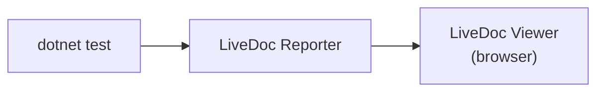

# Viewer Integration

<p className="intro">
This guide shows you how to connect your LiveDoc xUnit tests to the
LiveDoc Viewer — a real-time web UI that displays your test results as
they execute. For local development, auto-discovery means **no code changes
and no configuration files** — just start the Viewer and run your tests.
</p>

:::info Prerequisites
- A .NET project with `SweDevTools.LiveDoc.xUnit` installed — see [Getting Started](../learn/getting-started.mdx)
- Node.js 18+ (required for the viewer)
:::

## Overview

The LiveDoc Viewer is a standalone web application that receives test
results over HTTP. When you run your xUnit tests, the LiveDoc Reporter
automatically discovers the Viewer on `localhost:3100` and streams
results in real time. No assembly attributes or configuration files needed.



**How auto-discovery works:** At startup, the reporter pings `http://localhost:3100/api/health`. If the Viewer responds, reporting is enabled automatically. If not, reporting is silently disabled and tests run normally.

---

## Step 1: Install and Start the Viewer

Install the viewer CLI globally via npm:

```bash
npm install -g @swedevtools/livedoc-viewer
```

Start it:

```bash
livedoc-viewer
```

The viewer opens at `http://localhost:3100` by default.

---

## Step 2: Run Your Tests

In a separate terminal, run your tests as usual:

```bash
dotnet test --logger LiveDoc
```

That's it. Auto-discovery detects the Viewer and streams results as each test completes. Open `http://localhost:3100` in your browser to see results appear in real time.

The viewer organizes results by namespace hierarchy — mirroring the folder structure described in [Best Practices](./best-practices.mdx#namespace-organization).

:::tip Zero config
No assembly attributes, no `.runsettings` files, no environment variables needed for local development. Auto-discovery handles everything.
:::

---

## Step 3: Customize (Optional)

For custom project names, non-default ports, or CI/CD pipelines — pass parameters directly on the `--logger` flag:

```bash
# Custom project name
dotnet test --logger "LiveDoc;Project=checkout-service"

# Viewer on a non-default port
dotnet test --logger "LiveDoc;ServerUrl=http://localhost:4200"

# Multiple settings
dotnet test --logger "LiveDoc;ServerUrl=http://localhost:4200;Project=checkout-service;Environment=staging"
```

| Parameter | Default | Description |
|-----------|---------|-------------|
| `ServerUrl` | *(auto-discover on `localhost:3100`)* | Explicit Viewer URL. Skips auto-discovery. |
| `Project` | Assembly name | Project name displayed in the Viewer. |
| `Environment` | `"local"` | Environment label (e.g., `"local"`, `"ci"`, `"staging"`). |
| `ExportPath` | *(disabled)* | JSON export file path. |

See the [Configuration Reference](../reference/configuration.mdx#configuration) for the full list of parameters and environment variables.

---

## CI/CD Configuration

In CI pipelines, auto-discovery won't find a Viewer on `localhost`. Pass the URL as a logger parameter or use environment variables:

```yaml
# GitHub Actions — logger parameters (simplest)
- name: Run tests with Viewer reporting
  run: dotnet test --logger "LiveDoc;ServerUrl=https://livedoc-viewer.internal.co;Project=my-app;Environment=ci"
```

```yaml
# GitHub Actions — environment variables (alternative)
- name: Run tests with Viewer reporting
  run: dotnet test --logger LiveDoc
  env:
    LIVEDOC_SERVER_URL: https://livedoc-viewer.internal.co
    LIVEDOC_PROJECT: my-app
    LIVEDOC_ENVIRONMENT: ci
```

:::info No Viewer in CI?
If you don't run a Viewer in CI, use `ExportPath` to generate a JSON file for [static HTML reports](../../viewer/guides/static-export.mdx). See [Export Configuration](../reference/configuration.mdx#export-configuration).
:::

---

## Complete Workflow

Here's the full local workflow from start to finish:

```bash
# Terminal 1: Start the viewer
livedoc-viewer

# Terminal 2: Run your tests (auto-discovery connects automatically)
dotnet test --logger LiveDoc
```

1. **Start the viewer** — open a terminal and run `livedoc-viewer`
2. **Run your tests** — in a separate terminal, run `dotnet test --logger LiveDoc`
3. **View results** — open `http://localhost:3100` and watch results stream in

---

## Troubleshooting

| Problem | Cause | Solution |
|---------|-------|----------|
| Results don't appear in viewer | Viewer not running when tests start | Start `livedoc-viewer` before running `dotnet test` — auto-discovery pings at startup |
| Connection refused | Viewer not running or wrong port | Start `livedoc-viewer` first; if using a non-default port, set `LIVEDOC_SERVER_URL` |
| Tests pass but viewer shows nothing | Firewall blocking localhost | Allow port 3100 through your firewall |
| Results appear but unorganized | Flat namespace structure | Organize tests into nested namespaces — see [Best Practices](./best-practices.mdx#namespace-organization) |
| Viewer shows stale results | Browser cache or previous session data | Refresh the browser or restart the viewer |
| `Project` shows assembly name | No custom project name set | Set `LIVEDOC_PROJECT` environment variable |
| `Project` shows "Unknown" | Assembly name doesn't end in `.Tests`/`.Test`/`.Specs` | Set `LIVEDOC_PROJECT` environment variable |
| CI: no results in viewer | `LIVEDOC_SERVER_URL` not set | Auto-discovery only checks `localhost:3100` — set the env var explicitly in CI |

---

## Related

- [Getting Started](../learn/getting-started.mdx) — install LiveDoc and write your first test
- [Configuration Reference](../reference/configuration.mdx) — full environment variable and export reference
- [Best Practices](./best-practices.mdx) — namespace organization for report hierarchy
- [Troubleshooting](./troubleshooting.mdx) — common xUnit issues and fixes