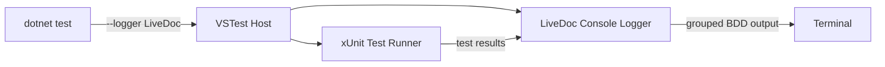

# Configuration

<p className="intro">
LiveDoc xUnit works out of the box with zero configuration. For local development,
auto-discovery connects to the LiveDoc Viewer automatically. For CI/CD and advanced
setups, environment variables let you customize reporting, project metadata, and export behavior.
</p>

```bash
# Local — zero config (auto-discovers viewer on localhost:3100)
dotnet test --logger LiveDoc

# Export + custom project name — all inline
dotnet test --logger "LiveDoc;ExportPath=./results.json;Project=my-app"
```

---

## Reference {#reference}

### Installation {#installation}

Install the NuGet package:

```bash
dotnet add package SweDevTools.LiveDoc.xUnit
```

#### Required Usings {#usings}

```csharp
using SweDevTools.LiveDoc.xUnit;           // Base classes, attributes
using SweDevTools.LiveDoc.xUnit.Core;       // LiveDocContext, StepContext
using Xunit;                                // Assert, xUnit infrastructure
using Xunit.Abstractions;                   // ITestOutputHelper
```

#### Project File {#project-file}

A minimal `.csproj` for a LiveDoc xUnit test project:

```xml
<Project Sdk="Microsoft.NET.Sdk">
  <PropertyGroup>
    <TargetFramework>net8.0</TargetFramework>
    <ImplicitUsings>enable</ImplicitUsings>
    <Nullable>enable</Nullable>
    <IsPackable>false</IsPackable>
    <IsTestProject>true</IsTestProject>
  </PropertyGroup>

  <ItemGroup>
    <PackageReference Include="Microsoft.NET.Test.Sdk" Version="17.*" />
    <PackageReference Include="xunit" Version="2.*" />
    <PackageReference Include="xunit.runner.visualstudio" Version="2.*" />
    <PackageReference Include="SweDevTools.LiveDoc.xUnit" Version="*" />
  </ItemGroup>
</Project>
```

---

### Configuration {#configuration}

LiveDoc uses auto-discovery for local development and supports two ways to configure reporting: **logger parameters** (inline with `dotnet test`) and **environment variables** (for CI/CD pipelines).

#### Auto-Discovery {#auto-discovery}

When no server URL is configured, the reporter automatically pings `http://localhost:3100/api/health` at startup. If the Viewer responds, reporting is enabled. If not, reporting is silently disabled — tests run normally with no errors.

This means **local development requires zero configuration**: start the Viewer, run your tests, and results stream automatically.

#### Logger Parameters {#logger-parameters}

Pass configuration directly on the command line using the `--logger` flag. This is the simplest way to configure reporting for a single test run:

```bash
dotnet test --logger "LiveDoc;ExportPath=./test-results/report.json"

dotnet test --logger "LiveDoc;Project=my-app;Environment=ci"

dotnet test --logger "LiveDoc;ServerUrl=https://viewer.internal.co;Project=my-app;Environment=ci"
```

| Parameter | Default | Description |
|-----------|---------|-------------|
| `ServerUrl` | *(auto-discover on `localhost:3100`)* | Viewer server URL. When set, skips auto-discovery and connects directly. |
| `Project` | Assembly name | Project name displayed in the Viewer. |
| `Environment` | `"local"` | Environment label (e.g., `"local"`, `"ci"`, `"staging"`). |
| `ExportPath` | *(disabled)* | JSON export file path. When set, writes a `TestRunV1` JSON file after the test run. See [Export Configuration](#export-configuration). |

:::tip
Logger parameters take precedence over environment variables. Use parameters for quick one-off runs and environment variables for CI/CD pipelines where `env:` blocks are more natural.
:::

#### Environment Variables {#env-vars-reference}

The same settings are available as environment variables. These are useful in CI/CD pipelines where setting `env:` blocks is standard practice.

| Variable | Default | Description |
|----------|---------|-------------|
| `LIVEDOC_SERVER_URL` | *(auto-discover on `localhost:3100`)* | Viewer server URL. |
| `LIVEDOC_PROJECT` | Assembly name | Project name displayed in the Viewer. Auto-detected from assemblies ending in `.Tests`, `.Test`, or `.Specs`. |
| `LIVEDOC_ENVIRONMENT` | `"local"` | Environment label. |
| `LIVEDOC_EXPORT_PATH` | *(disabled)* | JSON export file path. |

```yaml
# GitHub Actions — env block
- name: Run tests
  run: dotnet test --logger LiveDoc
  env:
    LIVEDOC_SERVER_URL: https://viewer.internal.co
    LIVEDOC_PROJECT: my-app
    LIVEDOC_ENVIRONMENT: ci
```

#### Resolution Order {#resolution-order}

Configuration is resolved in this order (first match wins):

1. **Logger parameter** — `--logger "LiveDoc;Project=my-app"`
2. **Environment variable** — `LIVEDOC_PROJECT=my-app`
3. **Auto-discovery / default** — auto-detect assembly name, discover Viewer on `localhost:3100`

#### Project Name Resolution {#project-name-resolution}

When no `Project` parameter or `LIVEDOC_PROJECT` variable is set, the reporter auto-detects the project name:

1. Entry assembly name (if not `"testhost"`)
2. First loaded assembly whose name ends in `.Tests`, `.Test`, or `.Specs`
3. `"Unknown"` (fallback)

:::tip
For most projects, the auto-detected name is fine — if your test assembly is named `MyApp.Tests`, it just works. Set `Project` only when you need a custom display name.
:::

---

### Test Discovery {#test-discovery}

LiveDoc attributes inherit from xUnit's native `FactAttribute` and `TheoryAttribute`, which means:

- **No custom test adapter is needed** — xUnit discovers tests automatically.
- **All standard runners work** — `dotnet test`, Visual Studio Test Explorer, JetBrains Rider, and CI pipelines.
- **Standard filtering works** — use `--filter` with xUnit's trait system.

```bash
# Run all tests with BDD console output
dotnet test --logger LiveDoc

# Run specific test class
dotnet test --logger LiveDoc --filter "FullyQualifiedName~ShoppingCartTests"

# Run specific test method
dotnet test --logger LiveDoc --filter "FullyQualifiedName~Free_shipping_in_Australia"
```

---

### Console Logger {#console-logger}

The LiveDoc console logger produces BDD-formatted output grouped by Feature and Specification when running from the command line. It activates via the standard `--logger` flag:

```bash
dotnet test --logger LiveDoc
```

**Sample output:**

```
  Feature: Shipping Costs
    ✓ Scenario: Free shipping in Australia
    ✓ Scenario Outline: Calculate shipping (3 examples)

  Specification: Cart Validation
    ✓ Rule: Empty cart cannot be checked out
    ✓ Rule: Cart total must be positive

  Tests: 4 passed (42ms)
```

The logger is **automatically available** when the `SweDevTools.LiveDoc.xUnit` NuGet package is installed — no extra packages or configuration needed. The package's `.targets` file registers the logger with the VSTest adapter system.

#### How It Works



The logger reads each test result's output messages (written by `ITestOutputHelper`) to extract Feature and Specification headings, then groups and formats them into a clean tree view with ANSI color support.

| Output Element | Color | Meaning |
|---|---|---|
| Feature / Specification heading | Yellow | Groups related tests |
| `✓` Passed test | Green | Test succeeded |
| `✗` Failed test | Red | Test failed (error shown below) |
| `○` Skipped test | Cyan | Test was skipped |
| Summary line | White | Total counts and duration |

#### CI/CD Usage {#console-logger-ci}

The logger works in CI pipelines. Combine it with other loggers for machine-readable output:

```bash
# BDD output for humans + TRX for CI systems
dotnet test --logger LiveDoc --logger "trx;LogFileName=results.trx"
```

```yaml
# GitHub Actions example
- name: Run tests
  run: dotnet test --logger LiveDoc --logger "trx;LogFileName=results.trx"
```

:::info Console vs. Test Explorer
The console logger shows the **Feature → Scenario** hierarchy at a glance.
For **step-level detail** (Given / When / Then), use Visual Studio's Test Explorer
detail panel or the [LiveDoc Viewer](../guides/viewer-integration.mdx).
:::

#### Test Explorer Display {#test-explorer}

Tests appear in Visual Studio Test Explorer as:

```
📁 MyApp.Tests
  📁 Checkout
    📁 CartTests
      ✅ Free_shipping_in_Australia
      ✅ Calculate_shipping(country: "Australia", total: 100.00, type: "Free")
      ✅ Calculate_shipping(country: "New Zealand", total: 50.00, type: "Standard")
```

Click any test to see the formatted BDD output in the Test Detail Summary pane.

---

### Export Configuration {#export-configuration}

Export a `TestRunV1` JSON file directly to disk after the test run — no server needed. This is the recommended approach for CI pipelines and for generating [static HTML reports](../../viewer/guides/static-export.mdx).

#### Logger Parameter {#export-logger-param}

The simplest way to enable export — pass the path inline:

```bash
dotnet test --logger "LiveDoc;ExportPath=./test-results/livedoc-report.json"

# With project name and environment
dotnet test --logger "LiveDoc;ExportPath=./test-results/report.json;Project=my-app;Environment=ci"
```

#### Environment Variable {#export-env-var}

Alternatively, use the `LIVEDOC_EXPORT_PATH` environment variable — useful in CI `env:` blocks:

```yaml
# GitHub Actions
- name: Run tests
  run: dotnet test --logger LiveDoc
  env:
    LIVEDOC_EXPORT_PATH: ./test-results/livedoc-report.json
    LIVEDOC_PROJECT: my-app
    LIVEDOC_ENVIRONMENT: ci
```

The reporter creates directories automatically and prints a confirmation:

```
✅ LiveDoc results exported to ./test-results/livedoc-report.json (845.2 KB)
```

#### Programmatic Configuration {#export-programmatic}

For testing or advanced scenarios, pass the export path via the `LiveDocConfig` constructor:

```csharp
var config = new LiveDocConfig(
    serverUrl: "http://localhost:3100",
    project: "my-project",
    environment: "ci",
    exportPath: "./test-results/livedoc-report.json"
);
```

:::info Export runs alongside server publishing
The export writes a JSON file **in addition to** server publishing — it doesn't replace it. When both `LIVEDOC_SERVER_URL` (or auto-discovery) and `LIVEDOC_EXPORT_PATH` are configured, the reporter sends results to the server **and** writes the file concurrently. The `LiveDocTestRunReporter.IsEnabled` property returns `true` when **either** the server URL or export path is set, so data collection happens in both cases.
:::

#### CI/CD Example {#export-ci-cd}

```yaml
# GitHub Actions — using logger parameters
- name: Run .NET tests with JSON export
  run: dotnet test --logger "LiveDoc;ExportPath=./test-results/livedoc-report.json;Project=my-dotnet-app;Environment=ci"

- name: Generate HTML report
  if: always()
  run: npx livedoc-viewer export -i ./test-results/livedoc-report.json -o ./test-results/report.html

- name: Upload results
  if: always()
  uses: actions/upload-artifact@v4
  with:
    name: livedoc-results
    path: test-results/
```

See the [Static Export Guide](../../viewer/guides/static-export.mdx) for the complete pipeline walkthrough.

---

### Namespace Organization {#namespaces}

The C# namespace of each test class determines the visual tree structure in the LiveDoc Viewer. The reporter strips the assembly name prefix and converts namespace segments to a folder-like path.

```
MyApp.Tests.Checkout.CartSpec    → Checkout/CartSpec.cs
MyApp.Tests.Auth.LoginSpec       → Auth/LoginSpec.cs
MyApp.Tests.Shipping.CostsSpec   → Shipping/CostsSpec.cs
```

**Best practices:**
- **Group related tests** under a common namespace segment
- **Mirror domain boundaries** — align namespaces with bounded contexts or feature areas
- **Avoid flat namespaces** — a single namespace produces a flat, hard-to-navigate list in the Viewer

```csharp
// ✅ Good: organized by domain
namespace MyApp.Tests.Checkout
{
    [Feature("Shopping Cart")]
    public class CartTests : FeatureTest { }
}

namespace MyApp.Tests.Checkout
{
    [Feature("Payment Processing")]
    public class PaymentTests : FeatureTest { }
}

// ❌ Bad: all tests in one flat namespace
namespace MyApp.Tests
{
    [Feature("Shopping Cart")]
    public class CartTests : FeatureTest { }

    [Feature("Payment Processing")]
    public class PaymentTests : FeatureTest { }
}
```

---

## Usage {#usage}

### Basic: Zero configuration {#zero-config}

LiveDoc works with no configuration file. Tests run with `dotnet test --logger LiveDoc` and produce formatted BDD output in the terminal. Step-level detail appears in Visual Studio's Test Explorer detail panel:

```csharp
using SweDevTools.LiveDoc.xUnit;
using Xunit;
using Xunit.Abstractions;

[Feature("My Feature")]
public class MyTests : FeatureTest
{
    public MyTests(ITestOutputHelper output) : base(output) { }

    [Scenario]
    public void My_scenario()
    {
        Given("setup", () => { });
        Then("assertion", () => { Assert.True(true); });
    }
}
```

```bash
dotnet test --logger LiveDoc
```

### LiveDoc Viewer integration {#viewer-integration}

For real-time visualization of test results, auto-discovery handles everything for local development:

**Step 1**: Start the LiveDoc Viewer:

```bash
# Start viewer (from repo root)
./scripts/start-viewer.ps1 -KillStale
```

**Step 2**: Run your tests — no extra configuration needed:

```bash
dotnet test --logger LiveDoc
```

Auto-discovery detects the Viewer on `http://localhost:3100` and streams results automatically. Open the Viewer in your browser to watch results appear as tests execute.

:::tip
No code changes, no config files, no environment variables needed for local development. Just start the Viewer and run your tests.
:::

### CI/CD configuration {#ci-cd}

For CI pipelines, pass configuration as logger parameters or environment variables:

```yaml
# GitHub Actions — logger parameters
- name: Run tests
  run: dotnet test --logger "LiveDoc;ServerUrl=https://viewer.internal.co;Project=my-app;Environment=ci" --logger "trx;LogFileName=results.trx"
```

```yaml
# GitHub Actions — environment variables
- name: Run tests
  run: dotnet test --logger LiveDoc --logger "trx;LogFileName=results.trx"
  env:
    LIVEDOC_SERVER_URL: https://viewer.internal.co
    LIVEDOC_PROJECT: my-app
    LIVEDOC_ENVIRONMENT: ci
```

---

## Troubleshooting {#troubleshooting}

### Tests not appearing in Test Explorer {#no-tests}

Verify that:
1. The test class inherits from `FeatureTest` or `SpecificationTest`
2. Test methods have `[Scenario]`, `[ScenarioOutline]`, `[Rule]`, or `[RuleOutline]` attributes
3. The project references `xunit.runner.visualstudio`
4. The project has `<IsTestProject>true</IsTestProject>` in the `.csproj`

### Formatted output not appearing {#no-output}

The constructor must accept `ITestOutputHelper` and pass it to `base(output)`:

```csharp
// ✅ Correct
public MyTests(ITestOutputHelper output) : base(output) { }

// ❌ Missing base call — no formatted output
public MyTests(ITestOutputHelper output) { }
```

### Viewer not receiving results {#viewer-no-results}

1. Confirm the Viewer is running: open `http://localhost:3100` in a browser
2. Check auto-discovery: the reporter pings `http://localhost:3100/api/health` at startup — if it responds, reporting is enabled
3. If the Viewer runs on a non-default port, pass `ServerUrl`: `dotnet test --logger "LiveDoc;ServerUrl=http://localhost:4200"`
4. In CI, set `ServerUrl` explicitly — auto-discovery only checks `localhost:3100`

### Project name shows "Unknown" {#unknown-project}

The auto-detected name depends on your test assembly name. If it doesn't end in `.Tests`, `.Test`, or `.Specs`, pass it explicitly:

```bash
dotnet test --logger "LiveDoc;Project=my-app"
```

---

## See Also {#see-also}

- [`FeatureTest`](./feature-test.mdx) — BDD base class setup
- [`SpecificationTest`](./specification-test.mdx) — MSpec base class setup
- [Attributes](./attributes.mdx) — all LiveDoc attributes
- [Getting Started](../learn/getting-started.mdx) — installation walkthrough
- [Viewer Integration](../guides/viewer-integration.mdx) — detailed Viewer setup guide
- [Static HTML Export](../../viewer/guides/static-export.mdx) — generate shareable reports without a server
- [Troubleshooting](../guides/troubleshooting.mdx) — common issues and solutions
