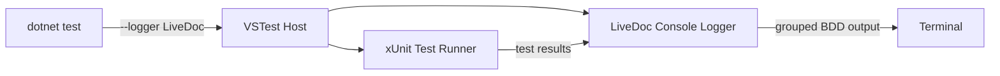

# Configuration

<p className="intro">
LiveDoc xUnit works out of the box with zero configuration. Optional configuration
lets you integrate with the LiveDoc Viewer, set project metadata, and customize
test discovery and reporting.
</p>

```xml
<!-- .runsettings -->
<RunSettings>
  <LiveDoc>
    <ViewerUrl>http://localhost:3100</ViewerUrl>
    <Project>my-app</Project>
  </LiveDoc>
</RunSettings>
```

---

## Reference {#reference}

### Installation {#installation}

Install the NuGet package:

```bash
dotnet add package SweDevTools.LiveDoc.xUnit
```

#### Required Usings {#usings}

```csharp
using SweDevTools.LiveDoc.xUnit;           // Base classes, attributes
using SweDevTools.LiveDoc.xUnit.Core;       // LiveDocContext, StepContext
using Xunit;                                // Assert, xUnit infrastructure
using Xunit.Abstractions;                   // ITestOutputHelper
```

#### Project File {#project-file}

A minimal `.csproj` for a LiveDoc xUnit test project:

```xml
<Project Sdk="Microsoft.NET.Sdk">
  <PropertyGroup>
    <TargetFramework>net8.0</TargetFramework>
    <ImplicitUsings>enable</ImplicitUsings>
    <Nullable>enable</Nullable>
    <IsPackable>false</IsPackable>
    <IsTestProject>true</IsTestProject>
  </PropertyGroup>

  <ItemGroup>
    <PackageReference Include="Microsoft.NET.Test.Sdk" Version="17.*" />
    <PackageReference Include="xunit" Version="2.*" />
    <PackageReference Include="xunit.runner.visualstudio" Version="2.*" />
    <PackageReference Include="SweDevTools.LiveDoc.xUnit" Version="*" />
  </ItemGroup>
</Project>
```

---

### `.runsettings` Configuration {#runsettings}

The `.runsettings` XML file configures LiveDoc's runtime behavior, primarily for Viewer integration. Place it in the project or solution root.

```xml
<?xml version="1.0" encoding="utf-8"?>
<RunSettings>
  <LiveDoc>
    <ViewerUrl>http://localhost:3100</ViewerUrl>
    <Project>my-dotnet-app</Project>
    <Environment>local</Environment>
  </LiveDoc>
</RunSettings>
```

#### Settings {#runsettings-settings}

| Setting | Type | Default | Description |
|---------|------|---------|-------------|
| `ViewerUrl` | `string` | *(none)* | URL of the running LiveDoc Viewer instance. When set, test results are streamed in real-time. |
| `Project` | `string` | Assembly name | Project name displayed in the Viewer. |
| `Environment` | `string` | `"local"` | Environment label (e.g., `"local"`, `"ci"`, `"staging"`). |

#### Using `.runsettings` {#using-runsettings}

Pass the settings file when running tests:

```bash
# Command line
dotnet test --settings .runsettings

# Or configure in the .csproj
```

```xml
<!-- In .csproj -->
<PropertyGroup>
  <RunSettingsFilePath>$(MSBuildProjectDirectory)\.runsettings</RunSettingsFilePath>
</PropertyGroup>
```

In Visual Studio, select the `.runsettings` file via **Test → Configure Run Settings → Select Solution Wide runsettings File**.

---

### Assembly Attributes {#assembly-attributes}

#### `[LiveDocViewerReporter]` {#viewer-reporter}

Configures the LiveDoc Viewer reporter at the assembly level. This is an alternative to `.runsettings` for Viewer integration.

```csharp
// In any .cs file in the test project (commonly AssemblyInfo.cs or a dedicated file)
using SweDevTools.LiveDoc.xUnit;

[assembly: LiveDocViewerReporter("http://localhost:3100")]
```

When this attribute is present, test results are sent to the specified Viewer URL as tests execute.

:::info `.runsettings` vs. assembly attribute
Both approaches configure the same behavior. Use `.runsettings` when you want per-environment configuration (different URLs for local vs. CI). Use the assembly attribute for a simple, always-on setup.
:::

---

### Test Discovery {#test-discovery}

LiveDoc attributes inherit from xUnit's native `FactAttribute` and `TheoryAttribute`, which means:

- **No custom test adapter is needed** — xUnit discovers tests automatically.
- **All standard runners work** — `dotnet test`, Visual Studio Test Explorer, JetBrains Rider, and CI pipelines.
- **Standard filtering works** — use `--filter` with xUnit's trait system.

```bash
# Run all tests with BDD console output
dotnet test --logger LiveDoc

# Run specific test class
dotnet test --logger LiveDoc --filter "FullyQualifiedName~ShoppingCartTests"

# Run specific test method
dotnet test --logger LiveDoc --filter "FullyQualifiedName~Free_shipping_in_Australia"
```

---

### Console Logger {#console-logger}

The LiveDoc console logger produces BDD-formatted output grouped by Feature and Specification when running from the command line. It activates via the standard `--logger` flag:

```bash
dotnet test --logger LiveDoc
```

**Sample output:**

```
  Feature: Shipping Costs
    ✓ Scenario: Free shipping in Australia
    ✓ Scenario Outline: Calculate shipping (3 examples)

  Specification: Cart Validation
    ✓ Rule: Empty cart cannot be checked out
    ✓ Rule: Cart total must be positive

  Tests: 4 passed (42ms)
```

The logger is **automatically available** when the `SweDevTools.LiveDoc.xUnit` NuGet package is installed — no extra packages or configuration needed. The package's `.targets` file registers the logger with the VSTest adapter system.

#### How It Works



The logger reads each test result's output messages (written by `ITestOutputHelper`) to extract Feature and Specification headings, then groups and formats them into a clean tree view with ANSI color support.

| Output Element | Color | Meaning |
|---|---|---|
| Feature / Specification heading | Yellow | Groups related tests |
| `✓` Passed test | Green | Test succeeded |
| `✗` Failed test | Red | Test failed (error shown below) |
| `○` Skipped test | Cyan | Test was skipped |
| Summary line | White | Total counts and duration |

#### CI/CD Usage {#console-logger-ci}

The logger works in CI pipelines. Combine it with other loggers for machine-readable output:

```bash
# BDD output for humans + TRX for CI systems
dotnet test --logger LiveDoc --logger "trx;LogFileName=results.trx"
```

```yaml
# GitHub Actions example
- name: Run tests
  run: dotnet test --logger LiveDoc --logger "trx;LogFileName=results.trx"
```

:::info Console vs. Test Explorer
The console logger shows the **Feature → Scenario** hierarchy at a glance.
For **step-level detail** (Given / When / Then), use Visual Studio's Test Explorer
detail panel or the [LiveDoc Viewer](../guides/viewer-integration.mdx).
:::

#### Test Explorer Display {#test-explorer}

Tests appear in Visual Studio Test Explorer as:

```
📁 MyApp.Tests
  📁 Checkout
    📁 CartTests
      ✅ Free_shipping_in_Australia
      ✅ Calculate_shipping(country: "Australia", total: 100.00, type: "Free")
      ✅ Calculate_shipping(country: "New Zealand", total: 50.00, type: "Standard")
```

Click any test to see the formatted BDD output in the Test Detail Summary pane.

---

### Namespace Organization {#namespaces}

The C# namespace of each test class determines the visual tree structure in the LiveDoc Viewer. The reporter strips the assembly name prefix and converts namespace segments to a folder-like path.

```
MyApp.Tests.Checkout.CartSpec    → Checkout/CartSpec.cs
MyApp.Tests.Auth.LoginSpec       → Auth/LoginSpec.cs
MyApp.Tests.Shipping.CostsSpec   → Shipping/CostsSpec.cs
```

**Best practices:**
- **Group related tests** under a common namespace segment
- **Mirror domain boundaries** — align namespaces with bounded contexts or feature areas
- **Avoid flat namespaces** — a single namespace produces a flat, hard-to-navigate list in the Viewer

```csharp
// ✅ Good: organized by domain
namespace MyApp.Tests.Checkout
{
    [Feature("Shopping Cart")]
    public class CartTests : FeatureTest { }
}

namespace MyApp.Tests.Checkout
{
    [Feature("Payment Processing")]
    public class PaymentTests : FeatureTest { }
}

// ❌ Bad: all tests in one flat namespace
namespace MyApp.Tests
{
    [Feature("Shopping Cart")]
    public class CartTests : FeatureTest { }

    [Feature("Payment Processing")]
    public class PaymentTests : FeatureTest { }
}
```

---

## Usage {#usage}

### Basic: Zero configuration {#zero-config}

LiveDoc works with no configuration file. Tests run with `dotnet test --logger LiveDoc` and produce formatted BDD output in the terminal. Step-level detail appears in Visual Studio's Test Explorer detail panel:

```csharp
using SweDevTools.LiveDoc.xUnit;
using Xunit;
using Xunit.Abstractions;

[Feature("My Feature")]
public class MyTests : FeatureTest
{
    public MyTests(ITestOutputHelper output) : base(output) { }

    [Scenario]
    public void My_scenario()
    {
        Given("setup", () => { });
        Then("assertion", () => { Assert.True(true); });
    }
}
```

```bash
dotnet test --logger LiveDoc
```

### LiveDoc Viewer integration {#viewer-integration}

For real-time visualization of test results:

**Step 1**: Start the LiveDoc Viewer:

```bash
# Start viewer (from repo root)
./scripts/start-viewer.ps1 -KillStale
```

**Step 2**: Configure the reporter (choose one approach):

```csharp
// Option A: Assembly attribute
[assembly: LiveDocViewerReporter("http://localhost:3100")]
```

```xml
<!-- Option B: .runsettings -->
<?xml version="1.0" encoding="utf-8"?>
<RunSettings>
  <LiveDoc>
    <ViewerUrl>http://localhost:3100</ViewerUrl>
    <Project>my-app</Project>
    <Environment>local</Environment>
  </LiveDoc>
</RunSettings>
```

**Step 3**: Run tests:

```bash
dotnet test --settings .runsettings
```

Results appear in the Viewer browser UI as tests execute.

### CI/CD configuration {#ci-cd}

For CI pipelines, use `.runsettings` with environment-specific values:

```xml
<?xml version="1.0" encoding="utf-8"?>
<RunSettings>
  <LiveDoc>
    <ViewerUrl>https://livedoc-viewer.internal.company.com</ViewerUrl>
    <Project>my-app</Project>
    <Environment>ci</Environment>
  </LiveDoc>
</RunSettings>
```

```yaml
# GitHub Actions example
- name: Run tests
  run: dotnet test --logger LiveDoc --settings .runsettings.ci
```

---

## Troubleshooting {#troubleshooting}

### Tests not appearing in Test Explorer {#no-tests}

Verify that:
1. The test class inherits from `FeatureTest` or `SpecificationTest`
2. Test methods have `[Scenario]`, `[ScenarioOutline]`, `[Rule]`, or `[RuleOutline]` attributes
3. The project references `xunit.runner.visualstudio`
4. The project has `<IsTestProject>true</IsTestProject>` in the `.csproj`

### Formatted output not appearing {#no-output}

The constructor must accept `ITestOutputHelper` and pass it to `base(output)`:

```csharp
// ✅ Correct
public MyTests(ITestOutputHelper output) : base(output) { }

// ❌ Missing base call — no formatted output
public MyTests(ITestOutputHelper output) { }
```

### Viewer not receiving results {#viewer-no-results}

1. Confirm the Viewer is running: open the URL in a browser
2. Verify the `ViewerUrl` matches the running Viewer's address
3. Check that `.runsettings` is being loaded: `dotnet test --settings .runsettings`

---

## See Also {#see-also}

- [`FeatureTest`](./feature-test.mdx) — BDD base class setup
- [`SpecificationTest`](./specification-test.mdx) — MSpec base class setup
- [Attributes](./attributes.mdx) — all LiveDoc attributes
- [Getting Started](../learn/getting-started.mdx) — installation walkthrough
- [Viewer Integration](../guides/viewer-integration.mdx) — detailed Viewer setup guide
- [Troubleshooting](../guides/troubleshooting.mdx) — common issues and solutions
