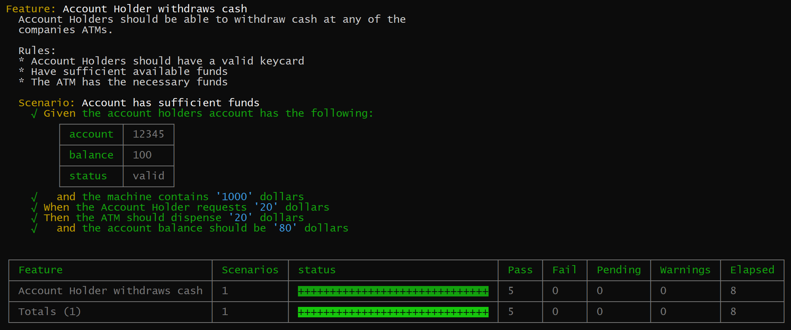

> These docs reference livedoc 0.4.0 Beta X. This beta is nearing a release and should be promoted to stable shortly.
> For docs on the current stable version [click here](https://github.com/dotnetprofessional/LiveDoc/tree/b8ddf23d23ed6b65e7f9f5bb2a9bf14b22809e08/packages/livedoc-mocha) 

# LiveDoc-mocha
LiveDoc-mocha is a library for adding behavior using a language called [Gherkin](https://cucumber.io/docs/reference#gherkin) to the mocha testing library. The [Gherkin](https://cucumber.io/docs/reference#gherkin) syntax uses a combination of keywords and natural language. The specifications are written in plain english and are meant to be read by anyone on your team and used to aid in improving collaboration, communication and trust within the team. These specifications also help to reduce ambiguity, confusion about what needs to be built, the rules and importantly why its being built. This is the first step to the concept of [Living Documentation](https://leanpub.com/livingdocumentation).

> NB: If you are viewing this from npmjs.com, links and images may be broken. Please visit the [project site](https://github.com/dotnetprofessional/LiveDoc/blob/master/packages/livedoc-mocha#readme) to view this document.

* [Installing](#Installing)
* [API reference](docs/API.md)
* [Tutorial](docs/Tutorial.md) 
* [Command line options](docs/comandline-switches.md)
* [Reporters](docs/Reporters.md)
* [livedoc-spec reporter](docs/livedoc-spec-reporter.md)
* [Why another library?](README.md#why-another-library)
* [Release Notes](docs/ReleaseNotes.md)

## Related projects
* [VSCode Plugin](https://marketplace.visualstudio.com/items?itemName=dotNetProfessional.livedoc-vscode)

## So what does this look like?
If we take the following feature which describes an account holder withdrawing money from an ATM. The format is the same as you might use in Cucumber.js, Cucumber, SpecFlow etc.

```Gherkin
Feature: Account Holder withdraws cash

        Account Holders should be able to withdraw cash at any of the
        companies ATMs.

        Rules:
        * Account Holders should have a valid keycard
        * Have sufficient available funds
        * The ATM has the necessary funds

  Scenario: Account has sufficient funds
    Given the account holders account has the following:
        | account | 12345 |
        | balance |   100 |
        | status  | valid |
      And the machine contains 1000 dollars
    When the Account Holder requests 20 dollars
    Then the ATM should dispense 20 dollars
      And the account balance should be 80 dollars
```
When run with livedoc-mocha it will produce the following output:



Converting the original Gherkin to livedoc-mocha looks like this:

```ts
feature(`Account Holder withdraws cash

        Account Holders should be able to withdraw cash at any of the
        companies ATMs.

        Rules:
        * Account Holders should have a valid keycard
        * Have sufficient available funds
        * The ATM has the necessary funds
        `, () => {

        scenario("Account has sufficient funds", () => {
            let atm = new ATM();
            let cashReceived: number;

            given(`the account holders account has the following:
            | account | 12345 |
            | balance |   100 |
            | status  | valid |
        `, () => {
                    const accountHolder = stepContext.tableAsEntity;
                    atm.setStatus(accountHolder.account, accountHolder.status);
                    atm.deposit(accountHolder.account, accountHolder.balance)
                });

            and("the machine contains '1000' dollars", () => {
                atm.addCash(stepContext.values[0]);
            });

            when("the Account Holder requests '20' dollars", () => {
                cashReceived = atm.withDraw(scenarioContext.given.tableAsEntity.account, stepContext.values[0]);
            });

            then("the ATM should dispense '20' dollars", () => {
                cashReceived.should.be.equal(stepContext.values[0]);
            });

            and("the account balance should be '80' dollars", () => {
                atm.getBalance(scenarioContext.given.tableAsEntity.account).should.be.equal(stepContext.values[0]);
            });
        });
    });
```

As can be seen by this simple example the actual test code is small and concise as much of the test setup was included as part of the test narrative. This in turn makes the test easier to understand and makes for excellent documentation.

This is just a small example of what can be done with LiveDoc-mocha. To understand more of what it can do, check out the [API documentation](docs/API.md).

The class used for this sample wasn't shown for brevity, however you can find the example [source code here](_src/test/Sample/Example.Spec.ts).

## Installing
This library builds off the mocha.js library as a custom ui. To setup, follow these steps.

__Mocha__

Livedoc-mocha as the name suggests extends mocha which is a very popular javascript testing library. You will need to install mocha to use livedoc-mocha. You can install mocha with the following command:

``` bat
npm install mocha --save-dev
```

__livedoc__
```bat
npm install --save-dev livedoc-mocha
```
To get the latest code and bug fixes, you can install the current beta, however this version may have bugs. You can find details of the releases on the [releases tab](https://github.com/dotnetprofessional/LiveDoc/releases).
```bat
npm install --save-dev livedoc-mocha@beta
```

__Configuring__

Once you have mocha & livedoc installed you need to configure mocha to run your tests and to use livedoc-mocha, a basic setup would be running this command from the command line:
```bat
mocha --ui livedoc-mocha --reporter livedoc-mocha/livedoc-spec --recursive path-to-my-tests/
```
The `--reporter` switch makes use of livedocs enhanced reporter specifically designed for Gherkin style Specs. While this is optional it is highly recommended that it be used. See the [livedoc-spec reporter](docs/livedoc-spec-reporter.md) docs for more details.

For more details configuring mocha see the official [mocha.js site](http://mochajs.org/).

__Typescript__

If you are using typescript and the keywords are not being recognized add the following import statement to the top of your test file.
```js
import "livedoc-mocha";
```

__Wallaby.js__

If you use [wallaby.js](https://wallabyjs.com/) you can configure livedoc-mocha by adding the following setup to your wallaby.js configuration file. If you already have a setup section then just include the two lines within your existing configuration file, otherwise copy this section to your file.
```js
setup: function (wallaby) {
    require("livedoc-mocha");
    wallaby.testFramework.ui('livedoc-mocha');
}
```

  
# Why another library?
There are a number of different libraries that bring the Gherkin language to javascript and even mocha:

* [Cucumber.js](https://github.com/cucumber/cucumber-js): This is the official javascript implementation of Cucumber which is the Ruby client for Gherkin. It uses a model similar to the Ruby client of .feature files written in plain text, with step files to map to the text representation and provide the implementation of the test/spec.

* [mocha-cakes-2](https://github.com/iensu/mocha-cakes-2): A simple library that provides Gherkin aliases for the default mocha syntax. This library unlike Cucumber.js doesn't use a separate file and keeps the spec description with its implementation, in the same way LiveDoc-mocha does.

There are others too, however they typically fall into the two categories above, either separating the spec from the implementation or combining both.

There are pros and cons to both approaches, however LiveDoc-mocha went with the combining spec and implementation as the additional separation can be hard to maintain. However, if having separate files is your preferred style, then you should consider using [Cucumber.js](https://github.com/cucumber/cucumber-js) for your projects.

While [mocha-cakes-2](https://github.com/iensu/mocha-cakes-2) provides a great starting point, its feature list was limited to simple aliasing. LiveDoc-mocha delivers as much of the full spec as possible. The addition of more advanced features such as Tables, Values, docStrings and Backgrounds and Scenario Outlines, brings the full Gherkin experience without the context switch you can experience with libraries like [Cucumber.js](https://github.com/cucumber/cucumber-js). Livedoc also has additional features around [contexts](docs/API.md#context) that makes using information from the Spec much easier.
