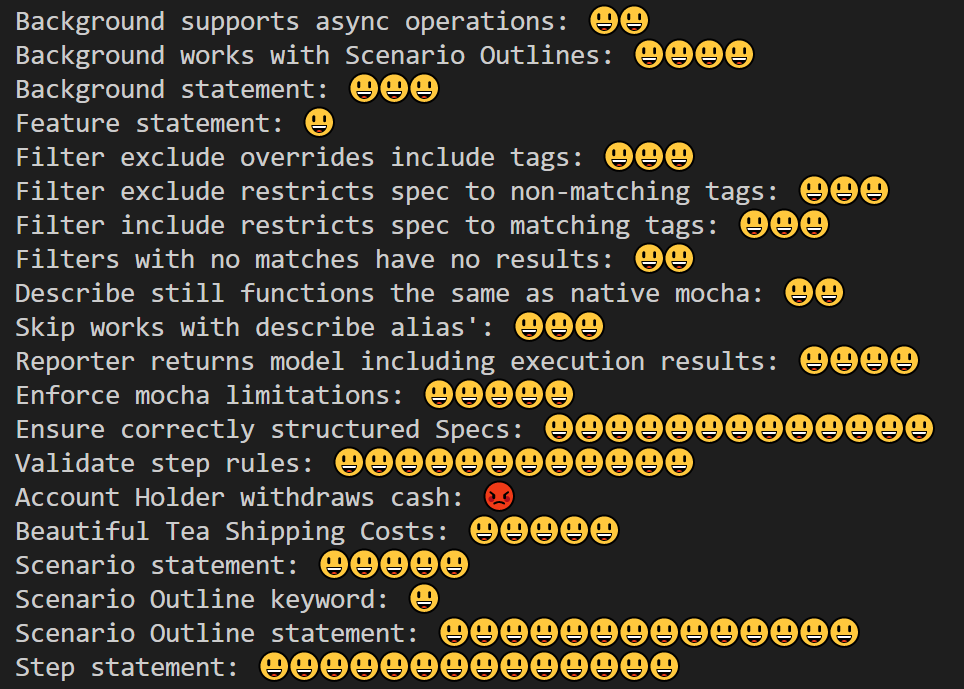

# UI Reporters
Creating a custom UI reporter for livedoc using the default mocha mechanism (mocha refers to them simply as reporters) is challenging and requires quite a bit of work. To resolve this issue, livedoc supplies a custom class that can be inherited from, which provides a clean simple API which understands the Gherkin language.

Rather than hook into events, you override one of the many methods that define the current progress of the running Specs. Each method takes as its parameter the relevant object from the execution model, this provides a rich set of information relevant to the current context. The following code shows the methods that can be overridden and their model objects.


```ts
export abstract class LiveDocReporter {
    protected options: Object;
    protected colorTheme: ColorTheme;

    protected executionStart(): void { }

    protected executionEnd(results: model.ExecutionResults): void { }

    protected featureStart(feature: model.Feature): void { }

    protected featureEnd(feature: model.Feature): void { }

    protected scenarioStart(scenario: model.Scenario): void { }

    protected scenarioEnd(scenario: model.Scenario): void { }

    protected scenarioOutlineStart(scenario: model.ScenarioOutline): void { }

    protected scenarioOutlineEnd(scenario: model.ScenarioOutline): void { }

    protected scenarioExampleStart(example: model.ScenarioExample): void { }

    protected scenarioExampleEnd(example: model.ScenarioExample): void { }

    protected backgroundStart(background: model.Background): void { }

    protected backgroundEnd(background: model.Background): void { }

    protected stepStart(step: model.StepDefinition): void { }

    protected stepEnd(step: model.StepDefinition): void { }

    protected stepExampleStart(step: model.StepDefinition): void { }

    protected stepExampleEnd(step: model.StepDefinition): void { }

    protected suiteStart(suite: model.MochaSuite): void { }

    protected suiteEnd(suite: model.MochaSuite): void { }

    protected testStart(test: model.LiveDocTest<model.MochaSuite>): void { }

    protected testEnd(test: model.LiveDocTest<model.MochaSuite>): void { }
}
```

As many operations are common between reporters, the base class also has a number of methods that can be used to help speed up development. The following protected methods are also included in the base class.

```ts
/**
 * returns the context indented by the number of spaces specified by {number}
 */
protected applyBlockIndent(content: string, indent: number): string

/**
 * Will highlight matches based on the supplied regEx wit the supplied color
 */
protected highlight(content, regex: RegExp, color: Chalk): string

/**
 * Will return the string substituting placeholders defined with <..> with 
 * the value from the example
 */
protected bind(content, model, color: Chalk): string 

/**
 * Returns a formatted table of the dataTable data
 */
protected formatTable(dataTable: DataTableRow[], headerStyle: HeaderType, includeRowId: boolean = false, runningTotal: number = 0): string

/**
 * adds the text to the reporters output stream
 */
protected writeLine(text: string): void

/**
 * adds the text to the reporters output stream
 * without a line return
 */
protected write(text: string): void

```
To demonstrate how easy it is to create your own UI reporter. Only the following code is necessary to create a very basic UI reporter that will print a smiley face for each passing scenario and an angry/rage face for each failing scenario.

```ts
import * as model from "livedoc-mocha/model";
import * as reporter from "livedoc-mocha/reporter";

exports = module.exports = liveDocEmoji;

function liveDocEmoji(runner, options) {
    new LiveDocEmoji(runner, options);
}

export default class LiveDocEmoji extends reporter.LiveDocReporter {

    protected featureStart(feature: model.Feature): void {
        this.write(feature.title + ": ");
    }

    protected featureEnd(feature: model.Feature): void {
        this.writeLine(" ");
    }

    protected scenarioEnd(scenario: model.Scenario): void {
        this.outputEmoji(scenario);
    }

    protected scenarioExampleEnd(example: model.ScenarioExample) {
        this.outputEmoji(example);
    }

    private outputEmoji(scenario: model.Scenario) {
        if (scenario.statistics.failedCount === 0) {
            this.write("😃 ");
        } else {
            this.write("😡 ");
        }
    }
}
```
The output of this reporter prints out the name of the Feature and an emoji for each scenarios based on the results. The output looks like this:



The source for this can be found [here](../../livedoc-emoji-reporter/_src/app/emojiReporter.ts):
