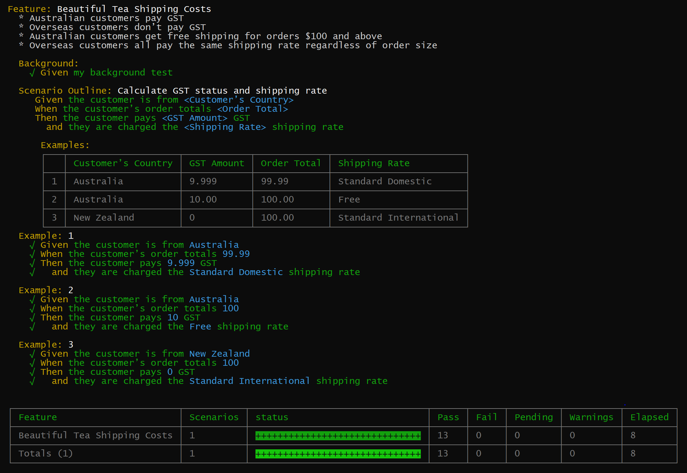
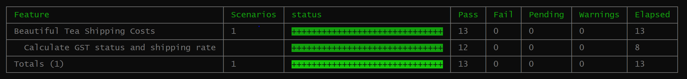

# livedoc-spec reporter
Mocha comes with several built in reporters (formatted output). While livedoc, does its best to make the default reporter look good, its not able to take full advantage of the gherkin language.

As such `livedoc` ships with a custom reporter that is specifically designed to work with the `gherkin` language. Its highly recommended that this be used as your default reporter when using `livedoc`.

The livedoc reporter provides the following features:
* Colorized (optional) output highlighting values and example data when output.
* Better context for failing Specs, by providing the full scenario detail as part of the error output.
* Better support for Scenario Outlines, by outputting the Scenario Outline first then the examples.
* Support for 3 levels of detail
* Output to a file

## Setup
To make use of the livedoc reporter you need to add the following to your command line:

```ps
--reporter livedoc-mocha/livedoc-spec
```
This will provide the default settings which will print out the specs in detail with a summary table at the end, showing just the features.




## Reporter Options
The livedoc reporter can be customized by using the following supported switches:

### --output \<filename>
Write the output of the test run to a file, stripping any ANSI color codes.

### --reporter-options | -O
Supported options are:
* detailLevel: This controls the level of information reported.
    * spec - displays the spec details and is the most verbose (__default__)
    * summary - displays a table of the features with statistics (__default__)
    * headers - adds the folder name(s) the test is in. The folder names are calculated from the test root folder. (__default__)
    * list - provides additional level to summary including scenarios
    * silent - produces no output

The detailLevel options can be combined using a '+' to achieve the desired outcome. To include the spec and summary options you would write:
```
--reporter-options detailLevel=spec+summary
``` 
Regardless of the level selected, when a failure occurs the failure detail will be displayed a the end of the output. For large projects, its recommended to use the `summary` option when running all Specs and the `spec` option when debugging a single Spec.

If not specified the default option will be 
```
spec+summary
```
The output when using list will list out the features as well as each scenario. Note scenario outlines are only listed once.



### Output result as JSON
The test run can also be output as a JSON file. This for example can be used to generate custom reporting such as Living Documentation. The output includes a lot of detail about the test run and the results. This is similar to the detail available when writing a [post-reporter](Post-Reporters.md).

Assuming the use of the `livedoc-spec` reporter you would add the following to your command line:

```
--ld-reporters livedoc-mocha/livedoc-json -O \"detailLevel=summary,json-output=results.json\"
```

Note that the options for the json output are defined in the `json-output` key.


