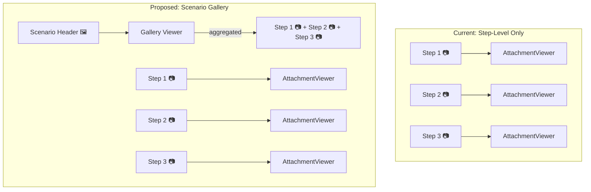
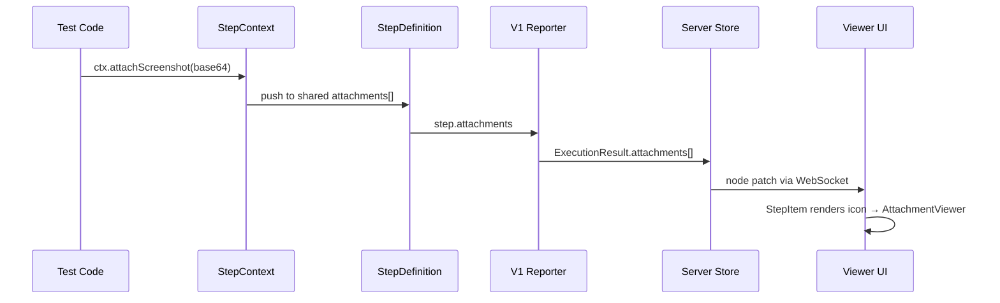
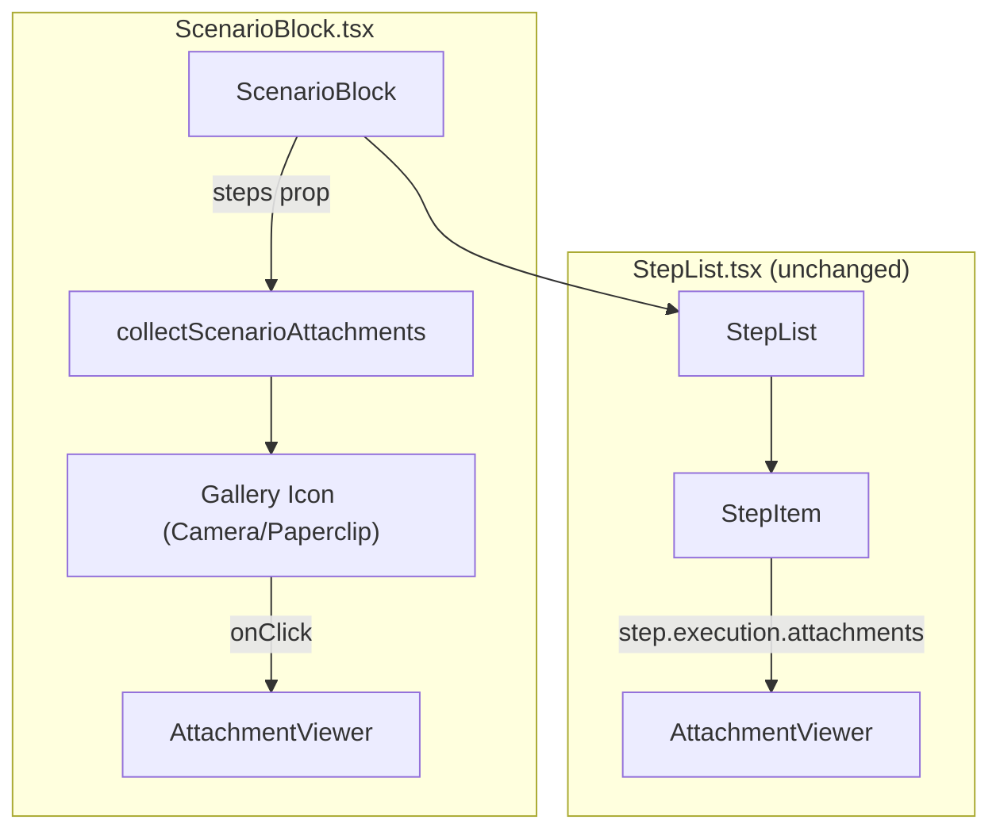

# Scenario-Level Attachment Gallery — Architecture Analysis

## What Is This?

A **scenario-level attachment gallery** that lets users browse ALL attachments from ALL steps in a scenario as a single collection. Instead of clicking each step's attachment icon individually, users see one icon at the scenario header that opens a slideshow-style viewer — particularly valuable for Playwright screenshot flows where PMs want to see the full UX journey without hunting through steps.

## Why This Matters

> **Example: PM reviewing a checkout flow**
>
> A product manager opens the "User completes checkout" scenario. It has 8 steps, each with a screenshot: landing page → cart → address form → payment → confirmation. Today, she must click each step's camera icon individually, mentally stitching the journey together. With a scenario gallery, she clicks one icon and swipes through the entire flow — a coherent visual story.
>
> **Result**: PM review time drops from minutes of clicking to seconds of swiping. The living documentation becomes genuinely useful for non-technical stakeholders.

## The Big Picture



The scenario gallery is an **aggregation view** — it doesn't create new data, it collects existing step-level attachments into a unified browsing experience. Both levels (step and scenario) coexist.

---

## 1. Data Flow Feasibility

### Current Attachment Pipeline



**Code Locations:**
- `packages/vitest/_src/app/model/StepContext.ts` — `attach()`, `attachScreenshot()`, `attachJSON()`
- `packages/vitest/_src/app/model/StepDefinition.ts` — `attachments: Attachment[]` field
- `packages/vitest/_src/app/reporter/LiveDocViewerReporterV1.ts` — `stepExecution()` method (lines ~735-759)
- `packages/viewer/src/client/components/StepList.tsx` — `step.execution?.attachments` access

### Schema Analysis — The Good News

The schema **already supports attachments at every node level**, including scenarios:

```
Scenario extends Container<Step> extends Node
Node.execution: ExecutionResult
ExecutionResult.attachments?: Attachment[]
```

**File**: `packages/schema/src/types.ts`, lines 66-77 and 98-122

However, attachments are currently only **populated** at the step level. The reporter never sets `scenario.execution.attachments`. This means:

- ✅ **No schema changes needed** — the field already exists
- ✅ **No protocol changes needed** — `ExecutionResult` already includes `attachments`
- The question is purely: **where to aggregate?**

### Aggregation Strategy: Client-Side (Recommended)

| Approach | Pros | Cons |
|----------|------|------|
| **Client-side** (flatMap steps) | Zero backend changes, instant ship, data already in memory | Computed on every render (trivially cheap) |
| Reporter-side (pre-aggregate) | Server already has the data | Duplicates attachment blobs in the wire protocol, increases payload |
| Server-side (new endpoint) | Could enable pagination | Over-engineered for v1, adds API surface |

**Recommendation: Client-side aggregation** via a simple utility:

```typescript
// Pseudocode — collect all attachments from a scenario's steps
function collectScenarioAttachments(steps: StepTest[]): AttachmentWithContext[] {
  return steps.flatMap((step, stepIndex) =>
    (step.execution?.attachments ?? []).map(att => ({
      ...att,
      stepTitle: step.title,
      stepKeyword: step.keyword,
      stepIndex,
    }))
  );
}
```

This is a **pure function over data already in the Zustand store** — no new network calls, no schema changes, no server work.

---

## 2. Performance Considerations

### Memory Analysis

Screenshots are base64-encoded strings already loaded into the browser via the Zustand store. The gallery creates **no new memory pressure** — it's a different view over existing objects.

| Scenario Size | Screenshots | Base64 Memory (est.) | Gallery Overhead |
|---------------|-------------|---------------------|-----------------|
| Small (5 steps) | 5 | ~2.5 MB | ~0 (references only) |
| Medium (15 steps) | 15-20 | ~7-10 MB | ~0 |
| Large (30+ steps) | 30-40 | ~15-20 MB | ~0 |

The gallery just creates an array of references to existing attachment objects — it doesn't clone the base64 data.

### Rendering Strategy

The existing `AttachmentViewer` already handles this well:
- Only the **visible** attachment is rendered at a time (single-image lightbox with prev/next)
- Base64 → `data:` URI conversion happens only for the active image
- Framer Motion animates transitions between items

**No lazy loading infrastructure needed for Phase 1.** The data is already in memory; we're just indexing into it differently.

### When to Worry

Performance becomes a concern only if we add:
- **Thumbnail strip** (rendering 30+ `` elements simultaneously) → mitigate with `loading="lazy"` or intersection observer
- **Gallery grid view** (showing all attachments at once) → consider thumbnail generation (resize in a Web Worker or use CSS `object-fit` with constrained dimensions)

These are Phase 2 concerns, not Phase 1 blockers.

---

## 3. Schema / Protocol Impact

### V1 Protocol: No Changes Required

The V1 wire format (`packages/schema/src/reporter-v1-wire.ts`) already includes:

```typescript
V1ExecutionResultSchema = z.object({
  status: V1StatusSchema,
  duration: z.number().nonnegative(),
  error: V1ErrorInfoSchema.optional(),
  attachments: z.array(V1AttachmentSchema).optional(), // ← Already here
});
```

Since `Scenario` inherits `Node.execution: ExecutionResult`, the schema already permits scenario-level attachments. We just haven't been using them.

### What About Scenario Outline?

Scenario Outlines have a different rendering path (`OutlineNodeView.tsx`). Each example row has its own `ExecutionResult` with potential attachments. The gallery would need to aggregate across:
- All example rows × all steps per row

This is more complex but follows the same pattern. **Defer to Phase 2** — regular Scenarios first.

---

## 4. PM Value Assessment

### Who Benefits?

| Persona | Value | Priority |
|---------|-------|----------|
| **PMs reviewing test results** | 🔥 Primary beneficiary. Visual journey through UX flows without clicking each step. | Highest |
| **QA reviewing regressions** | High. Quickly scan for visual differences across a flow. | High |
| **Developers debugging** | Moderate. Prefer step-level detail for pinpointing failures. | Medium |
| **Stakeholder demos** | High. "Look at what our tests verify" — slideshow is compelling. | High |

### Feature Prioritization

| Sub-Feature | Value | Effort | Priority |
|-------------|-------|--------|----------|
| Gallery browse (prev/next through all scenario attachments) | 🔥 High | Low | **Phase 1 — Ship it** |
| Step context labels ("Step 3: When user clicks Submit") | High | Low | **Phase 1** |
| Scenario header icon with attachment count | High | Low | **Phase 1** |
| Keyboard navigation (← → arrows) | Medium | Low | **Phase 1** (already exists in AttachmentViewer) |
| Thumbnail strip at bottom of lightbox | Medium | Medium | Phase 2 |
| Gallery grid view (all thumbnails at once) | Medium | Medium | Phase 2 |
| Auto-play slideshow mode | Low | Low | Phase 2 |
| Export as PDF/image sequence | Low | High | Phase 3 / Maybe never |
| Scenario Outline support (per-example galleries) | Medium | Medium | Phase 2 |

---

## 5. Integration with Existing Architecture

### Reuse AttachmentViewer — Don't Fork It

The existing `AttachmentViewer` component (`packages/viewer/src/client/components/AttachmentViewer.tsx`) already supports:
- ✅ Multi-attachment navigation (prev/next with keyboard)
- ✅ MIME-type dispatch (images, JSON, text, binary)
- ✅ Framer Motion transitions
- ✅ Full-viewport Radix dialog overlay

**What it needs for scenario gallery:**
1. **Step context in the header** — Currently shows `title` from the attachment. For gallery mode, show which step the attachment came from (e.g., "Step 3: When user clicks Submit — screenshot 1 of 2").
2. **Optional `origin` metadata** — Extend `AttachmentItem` with optional `stepTitle?: string` and `stepKeyword?: string` fields for display purposes.

This is a **minor enhancement**, not a rewrite. The component's `AttachmentItem` interface can be extended without breaking existing step-level usage.

### Component Architecture



**Changes needed:**
- `ScenarioBlock.tsx` — Add gallery icon to header row + state management for open/close
- `AttachmentViewer.tsx` — Minor: accept optional step-context metadata for gallery mode labels
- `StepList.tsx` — **No changes** (step-level icons remain)

### VS Code Extension

The VS Code webview (`packages/vscode`) shares the viewer's React components. If ScenarioBlock and AttachmentViewer are updated, the extension gets the feature automatically — **no separate work needed**.

---

## 6. Scope Recommendation

### Phase 1: Ship It (1-2 days effort)

**Goal**: Scenario-level gallery icon that opens a unified attachment browser.

1. **`ScenarioBlock.tsx`** — Add a gallery icon in the header row (right side, before status badge)
   - Collect attachments via `flatMap` over `steps`
   - Show Camera icon (if all images) or Paperclip (mixed), with count badge
   - Opens `AttachmentViewer` with the aggregated list

2. **`AttachmentViewer.tsx`** — Extend `AttachmentItem` with optional `stepTitle` / `stepKeyword`
   - When present, show step context in the viewer header: *"Given user is on login page — Screenshot 1"*
   - No changes to rendering logic, just header label enhancement

3. **Utility function** — `collectScenarioAttachments(steps: StepTest[]): AttachmentItem[]`
   - Pure function, easily testable
   - Preserves step ordering (which matters for chronological flow)

**What's NOT in Phase 1:**
- No schema changes
- No protocol changes
- No server changes
- No thumbnail generation
- No Scenario Outline support (regular Scenarios only)
- No grid view

### Phase 2: Nice to Have

- **Thumbnail strip** at bottom of lightbox for gallery navigation
- **Scenario Outline support** (aggregate across example rows)
- **Auto-play slideshow** with configurable interval
- **Grid view** for quick overview of all attachments
- **Filtering** by step type (show only "Then" step screenshots)

### Risks and Gotchas

| Risk | Likelihood | Mitigation |
|------|-----------|------------|
| Large scenarios with 40+ screenshots slow down gallery | Low | Already single-image rendering; base64 already in memory |
| Users confused by two attachment access points (step vs scenario) | Medium | Clear visual hierarchy — scenario icon is bigger/different style, step icons remain subtle |
| Scenario Outline aggregation complexity | Medium | Defer to Phase 2; regular Scenarios are the 80% case |
| AttachmentViewer's `AttachmentItem` type change breaks imports | Low | Additive change only (new optional fields) |
| Gallery ordering doesn't match step execution order | Low | Use step array index for deterministic ordering |

### Decision: No Schema Changes for Phase 1

The existing `ExecutionResult.attachments` field on `Node` would technically allow us to pre-populate scenario-level attachments in the reporter. We explicitly **choose not to** for Phase 1:

- **Avoids payload duplication** (same base64 blob referenced at both step and scenario level)
- **Keeps the reporter simple** (single responsibility: report what happened at each step)
- **Client-side aggregation is trivially cheap** (flatMap over an array already in memory)

If we later need server-side aggregation (e.g., for performance with very large test suites), the schema is ready — we just start populating `scenario.execution.attachments` in the reporter.

---

## Key Takeaways

- **Architecturally trivial** — the schema, protocol, and viewer all support this already. It's a UI feature, not a platform change.
- **High PM value, low engineering cost** — the rare alignment where the feature is exactly as easy as it looks.
- **Phase 1 is 3 files, ~50-80 lines of code** — ScenarioBlock gets an icon, AttachmentViewer gets optional labels, plus a utility function.
- **No backend changes** — pure client-side aggregation over existing step-level data.
- **VS Code gets it for free** — shared component library.

---

**Last Updated**: 2025-07-25  
**Author**: Mal (Architecture Lead)  
**Requested by**: Garry  
**Related**: [AttachmentViewer decision](.../../.squad/decisions.md#attachmentviewer-multi-mime-rendering-with-raw-radix-primitives), [Screenshot API decision](../../.squad/decisions.md#screenshotattachment-api-design)
